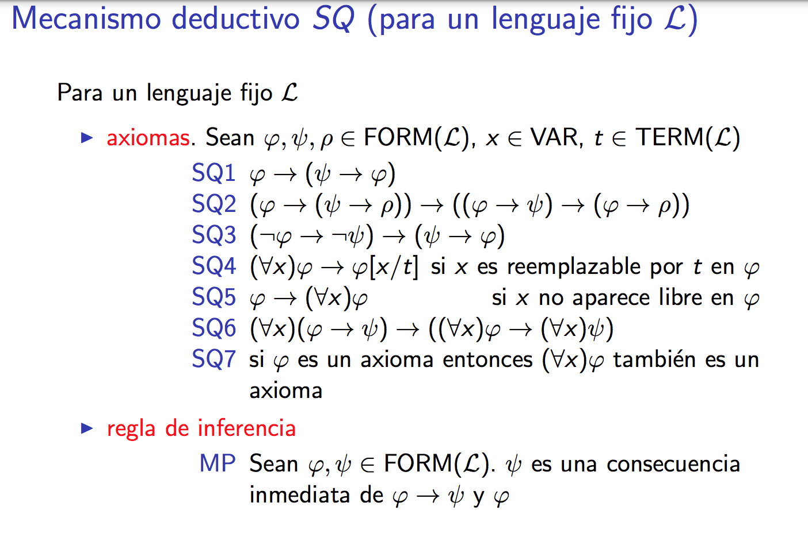

## Turing Machine
La maquina de turing es una maquina de estados con Q estados (Q finito) y un alfabeto \Sigma (finito) + una tira de simbolos con el input.
Por convencion el input es \* input 1 \* input2 ktp. 

Vamos a tener las transiciones del estado Qi al Qj segun que simbolo vemos, que dictan qué simbolo escribir. El simbolo escrito va en la posicion actual de la cabeza, excepto para simbolos R y L que son mover la cabeza.

La Turing Machine es equivalente a otras nociones de computabilidad o de "procedimiento efectivo" como el lenguaje C etc.

## Primitivas Recursivas (& PRC)
Primitiva recursiva: parto de algunas funciones axiomaticamente PR (sucesor, 0, y proyecciones de tuplas) y las compongo mediante:
- Composicion: h(x1...xn) = f(g1(x1...xn), ...,  gk(x1...xn)) 
- Recursion primitiva: 

> h(x1...xn, 0) = f(x1...xn)
> h(x1...xn, t+1) = g(h(x1...xn, t), x1...xn, t)

PRC: Una clase es PRC si es la clausura por composicion y recursion primitiva, de las funciones axiomaticamente PR + posiblemente otras.

PR : Una funcion es **primitiva recursiva** sii pertenece a toda clase PRC. Esto es, la funcion es el resultado de finitos pasos de composicion y recursion primitiva, partiendo de funciones iniciales.

**Minimizacion acotada:** Dado p un predicado en una clase PRC, la minimizacion acotada me da el minimo t tq p(t, X) si existe, o 0 si no.

**Minimización no acotada**: Dado p un predicado, la minimización no acotada me da el mínimo t tq p(t, X) si existe, y no termina si no.

## Numero de Gödel
El número de Gödel codifica una n-upla de naturales \<x1,...,xn> como productoria donde cada factor es el i-ésimo primo a la xi-ésima potencia.

No es una codificación biyectiva, pero solo ignora 0s a la derecha así que si sabemos la dimensión no es un problema.

## Lenguaje S

Solo usa inc, dec y jnz. Usa X para inputs, Zi para auxiliares y devuelve siempre en Y (como rax).

Llamamos descripcion instantanea a la tupla (i, s) donde s es el estado de todas las variables usadas, i la linea en la que estamos.

i==n+1 => programa termino. Para cada estado podemos calcular facil un estado "sucesor", y una sucesion de descripciones instantaneas desde un inicial a un terminal sucesores cada uno del anterior, se llama "cómputo".

Podemos generar el cómputo de un programa P para inputs r1...rn. En particular si existe decimos que el programa termina. Sino, no (la secuencia es infinita).

Funcion parcial f es S-parcial computable si existe un programa que se indefine donde la función se indefine, y vale lo mismo donde está definida.
Si es parcial computable y total, entonces es computable.

## Computabilidad

Podemos mappear cada programa en S a un numero entero: 
- Cada instruccion es [ a, \<b, c>] donde a es el numero de tag o 0 si no hay, b codifica 1 de 4 instrucciones y c el numero de variable.
- Representamos la tupla de triplas (o pares de pares) usando numeros de Gödel.

Hay mas funciones de N-\>N que programas (porque son mas que numeros en N) y no todas las funciones van a ser computables. E.g., halt (que te dice si un programa de numero e con input e termina).

Tenemos psi\_P(x) = resultado de ejecutar programa P con input X
y fi(e, x) = correr programa de numero e con input X.

fi es parcial computable: hacemos un interprete de S y o bien genera el output o bien se tilda si el programa mismo se tildaba.

Definimos **STP** la funcion Step(x1...xn, e, t) que **te dice si el programa e termina luego de t pasos o menos**, con input x1...xn.
STP es P.R.

**SNAP** es como STP pero SNAP(x1...xn, e, t) te da el **estado del programa e en step t**: [z1, ..., zn] y instruction id.

### Teoremas de computabilidad

**Teorema del parametro**: dado un programa con m+n inputs, podemos generar un nuevo programa equivalente a tener los primeros m parametros hardcodeados en ciertos valores, que solo toma los otros n.

**Teorema de la recursion**: Para una funcion g que toma n+1 parametros, podemos siempre encontrar un numero e tq el e-esimo programa con los n parametros devuelve lo mismo que g(e,x1...xn) para todo x.

## Conjuntos
Un conjunto se representa con una funcion A(x) = 1 if x in A else 0.

Un conjunto puede ser computable, p.r., etc. Las operaciones union, interseccion y diferencia de conjuntos preservan la clase de PRC. 

Hay conjuntos computables y no computables (segun si su funcion caracteristica lo es).

Un conjunto es **computablemente enumerable** si hay una función parcial computable g tq g(x) termina sii x en A.
Permiten algoritmos de semi-decisión. 
Son un superset de los computables.

Llamamos Co-c.e. a un conjunto si su complemento es c.e. Ser c.e. se preserva en union e interseccion (usando STEP).

A es computable sii A y Ac son c.e. Izq a der es trivial por def, der a izq sale usando step en ambos: como ambos son c.e. y disjuntos, necesariamente uno de los dos termina.

Wn es el dominio del n-esimo programa (x tq P(x) termina donde P es el n-esimo programa).
Asi que podemos enumerar todos los c.e. (W1, W2... Wn).

Ademas podemos encontrar todo a tq a en A c.e., enumerandolos con una funcion p.r. Esto lo hacemos tratando a cada input u como una tupla \<ul,ur> y viendo: si step(ul,ur) entonces devuelvo ul else devuelvo algun elemento cualquiera del conjunto. 
Esta funcion garantiza generar todos los elementos, aunque no da ninguna garantia de orden y no termina (obviamente).

Llamamos K al conjunto de { n tq n in Wn }. Osea n tq el n-esimo programa con input n termina (sii HALT(n,n) ).
K es c.e. pero no computable. 

Si **A es c.e.**, existe f una funcion p.r. que puede **enumerar todos los elementos de A**. Usa step.

Si f es parcial computable, A tq f termina es c.e.

A es c.e. sii es la imagen de una funcion p.r., la de una funcion parcialmente computable, o la de una computable.

A es c.e. => existe un predicado NxN -> N tq A = {x : Existe t tq P(x,t)}. Particularmente ese predicado puede ser el STP(x, e, t) para un e que compute el while true de siempre.

## Teorema de Rice

A es un conjunto de indices si hay una clase de funciones parciales computables C de N-\>N tq A = { x : fi\_x in C }.

**Teorema de Rice**: Si A es un conjunto de indices no vacio distinto de N, entonces A no es computable.

##  Logica proposicional

Usamos solo -> y ¬ para definir todas las formulas validas en FORM (*and* y *or* se expresan con esos dos), para facilitar inducción estructural y evitar redundancia.

Una valuacion v : PROP -> {0,1} le asigna un valor de verdad binario a cada proposicion (p, p', etc.).

Decimos v\|=F si v vuelve cierta a F. v \|/= F si no. Podemos computar \|= recursivamente. 

Decimos F tautologia si v\|=F para todo v. Podemos corroborarla a fuerza bruta probando los 2^n posibles v.

Decimos F **consecuencia semántica de Γ** si Γ \|= F i.e. si [de valer v\|=P para todo P en Γ entonces necesariamente v\|=F].

Γ **satisfacible** sii existe v tq v\|=P para todo P en Γ.

Una **demostración** de fi es cadena finita no vacía de fórmulas tq la n-esima es fi y fi\_k es axioma o consecuencia directa (i.e., por Modus Ponens) de dos fi\_i fi\_j tq i, j \< k.

fi es **Consecuencia sintáctica** de Γ si Γ \|- fi. i.e., si puedo hacer una demo de fi tq fi\_n=fi y fi\_k es :
- Axioma
- Consecuencia directa de dos fi\_i anteriores (por Modus Ponens)
- Elemento de Γ 

Llamamos a Γ *teoría*, fi_1...fi_n se llama *derivación de fi*, y Γ es una *teoría*.
Si Γ \|- fi entonces Γ \|= fi. Osea si fi es consecuencia sintáctica de Γ , entonces también es consecuencia semántica. 

Lo opuesto no es necesariamente cierto.

Γ **consistente** : No existe fi tq Γ \|- fi && Γ \|- ¬fi.

El conjunto de teoremas de SP es c.e., pues las fórmulas y las demos son numerables (símbolos son finitos) y ver si una fórmula es teorema o no es c.e. (i = 0; ver si demos(i) y i[\|i\|]=X. Si es devolver 1, else i++ jmp back) Luego pruebo cada i-ésima fórmula a ver si es o no teorema.

Más adelante vimos que como \|- ϕ sii \|= ϕ, entonces el conjunto de teoremas es computable (enumerando a la fuerza).

Esto aplica a cualquier sistema axiomático.

SP además es **completo**. 

**Teorema de la deducción**: `[ Γ U {ϕ} \|- ψ ]` entonces `[ Γ \|- ϕ -> ψ ]`

**Proposiciones** : Γ U {¬ ϕ} inconsistente sii Γ \|- ϕ. Análogo negando ϕ.

**Maximal Consistente** : 

Γ maximal consistente si 
- Γ consistente
- Para todo ϕ not in Γ, Existe ψ tq [ Γ U {ϕ} \|- ψ ] Y [ Γ U {ϕ} \|- ¬ψ ]

**Lema de Lindenbaum** :
Si Γ consistente, existe Γ' tq Γ contenido en Γ' y Γ' m.c.

Γ m.c. entonces para toda formula o bien está en él o bien su negación lo está. 

Entonces Γ \|- ϕ sii ϕ in Γ.

Γ consistente sii Γ satisfacible.

**Teorema de completitud** : Γ \|= ϕ entonces Γ \|- ϕ. 

**Teorema de compacidad** : si todo subconjunto finito de Γ es satisfacible, Γ es satisfacible.

## Lógica de Primer Orden

Lenguaje de primer orden: 

**Simbolos logicos y auxiliares** : Los mismos que en lógica proposicional + el cuantificador universal (el para-todo). 

**Simbolos de un lenguaje particular** : L = C U F U P tq:
- C son constantes
- F son funciones de N términos a otro término
- P son predicados (reciben terminos)

Los términos de un lenguaje L son:
- Toda variable
- Todo símbolo de constante
- f(t1,...,tn) es un término sin t1,...,tn son términos

Los llamaremos TERM(L). 

Las formulas de L son:
- Un predicado con sus términos (fórmula atómica)
- Si p1 y p2 son formulas, p1-\>p2 es formula
- ¬ p1 formula
- (∀x)ϕ es formula si ϕ lo es.

Los llamaremos FORM(L)

Una variable está libre en una formula si todas sus apariciones estan libres. Sino, está ligada (al alcance de un cuantificador). 

Llamamos a una formula una **sentencia** si todas sus variables están ligadas.

### L-Estructuras

Llamamos a una L-estructura A de un lenguaje L cuando es un conjunto no vacio que incluye a todas las constantes de L, y las funciones que van de ese conjunto en él (con aridad arbitraria) y relaciones en ese conjunto (aridad arbitraria).

Podemos instanciar a la L-estructura A con un conjunto A arbitrario, por ejemplo los naturales (y usar como funciones la suma, etc. y como constantes el 0 y 1, por decir) o partes de los naturales (y las funciones van de conj(nat) a conj(nat) ).

Las funciones y predicados tienen que estar definidas para TODOS los terminos, o no cuenta como L-estructura (e.g., si usamos naturales y metemos predicado de division, lidiar con el 0).

La nocion de valuacion se extiende para asignarle valores a cada constante y variable en A tq v(x) = K algun valor. 
Luego puedo decir A \|= P(x, y)[v] o generalmente A \|= ϕ[v]. 

Calcularlo es simplemente ir llamando v recursivamente en cada termino usando la descomposicion estructural.

Para un lenguaje L fijo, 

- ϕ **satisfacible** si existe una L-estructura A y una valuacion v de A tq A \|= ϕ[v]
- ϕ **verdadera en una L-estructura A** si para toda valuacion v de A, A \|= ϕ[v]. Decimos que A es un modelo de ϕ.
- ϕ **universalmente valida** si A \|= ϕ para toda valuacion y estructura A de L.

Decimos que ϕ consecuencia semantica de Γ (Γ \|= ϕ) si para toda L-estructura A y toda valuación v de A :

Si A \|= Γ[v] entonces A \|= ϕ[v]

### Reemplazo de variables libres por terminos

ϕ[x/t] es la fórmula obtenida a partir de ϕ sustituyendo todas las apariciones libres de la variable x por t
e.g., 

[ P(x, y)[x/f (z)] = P(f (z), y)]

[ (∀x)(∀y) P(x, y)[x/f (z)] = (∀x)(∀y) P(x, y) ]

Decimos que una variable x es reemplazable por el termino t en ϕ si

- t es un término cerrado (no tiene variables) o
- t tiene variables, pero ninguna queda atrapada por un cuantificador en el reemplazo ϕ[x/t]

**Lema de sustitución**

Si x es reemplazable por t en ϕ entonces
A |= (ϕ[x/t])[v] sii A |= ϕ[v(x = v(t))].

Las nociones de **correctitud y consistencia** son análogas.
Aplica el teorema de deducción, Γ ∪ {ϕ} -> ψ entonces Γ -> ϕ → ψ

Γ satisfacible -> consistente

Γ inconsistente entonces tiene un subconjunto finito inconsistente. 

**Esquemas tautológicos**
- sea ϕ(p1, . . . , pn) una tautología de P con variables proposicionales p1, ... , pn.
- sean ψ1, . . . , ψn fórmulas cualesquiera de primer orden
 ϕ(ψ1, . . . , ψn) es una instancia de un esquema tautológico

Si ϕ es una instancia de un esquema tautológico entonces \|- ϕ.

**Variante alfabética** : reescritura de una formula reemplazando toda instancia de una cierta variable por otra, fresca.

Dos fórmulas variante alfabética mutuas son demostrables una desde la otra, y podes en una reemplazar x por t.

**Teorema de la generalización**: A.k.a., TG, Si Γ \|- ϕ y x no aparece libre en ninguna fórmula de Γ, entonces Γ \|- (∀x)ϕ

**Teorema de Generalización en Constantes (TGC)** : Supongamos que Γ \|- ϕ y c es un símbolo de constante que no aparece en Γ. Entonces existe una variable x que no aparece en ϕ tal que Γ \|- (∀x)(ϕ[c/x]). Mas aun, hay una derivación de (∀x)(ϕ[c/x]) a partir de Γ en donde c no aparece.

Como corolario, esto permite hacer el gran "como no use en ningun lado que Blah vale Bleh, lo probe para todo Blah.". Classic math move.

El conjunto de teoremas del sistema SQ para L es c.e.

Γ es un conjunto consistente sii es satifacible. 

Ademas  $\Gamma \vDash \varphi sii \Gamma \vdash \varphi $ y se cumple teorema de compacidad (si todo subconjunto finito es satisfacible entonces el conjunto tambien lo será).

Compacidad: Todo subconjunto finito es satisfacible, entonces el conjunto tambien lo es.

Como consecuencia, podemos expresar la cardinalidad infinita de un modelo usando una teoría, pero no una fórmula.

## Teorema de Gödel

En el modelo de los naturales, axiomatizados con Peano (\<N, <, +, ., 0, S>) hay sentencias que son ciertas, pero no demostrables.

Particularmente lo demuestra haciendo una sentencia que es "la sentencia x, para toda demostracion y no es cierto que y la demuestre" y la instancia tq la sentencia sea esa misma. Osea que queda "soy m, una sentencia que no es demostrable". 

Efectivamente no es demostrable ni su negacion (para que la negacion no sea demostrable hay que asumir w-consistency que es que el para-todo es posta un para-todo). Pero es cierta, necesariamente porque a) una sentencia siempre tiene valor de verdad si es sintactica y b) claramente falsa no es (o podriamos demostrarla, which we can't and, if we could, wouldn't be false). 

Finalmente, esto se mantiene aun si axiomatizamos Peano sin inducción.

