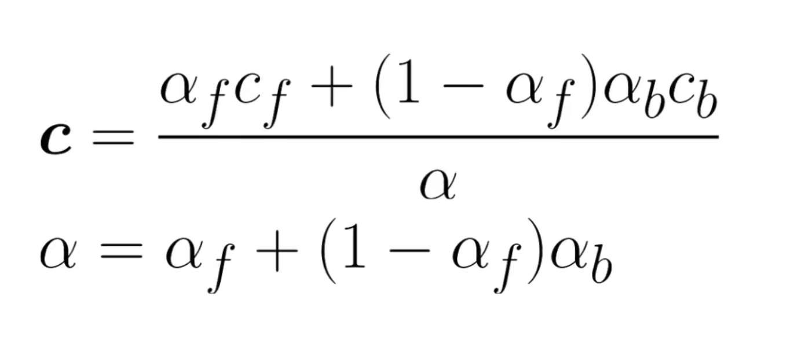
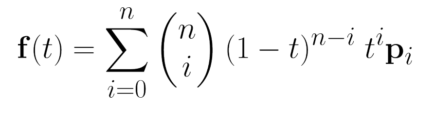

## Computer Graphics Areas

- **Modeling**: representing **shape and appearance** of objects and storing them in the computer.
- **Rendering**: creation of **shaded images** from 3D computer models.
- **Animation**: adds the issue of **movement over time**.

Just an awesome quote from the book:
"Modern architecture suggests that keeping memory use down and maintaining coherent memory access are the keys to efficiency. This suggests using single precision data. However, avoiding numerical problems suggests using doubleprecision arithmetic. The tradeoffs depend on the program, but it is nice to have a default in your class definitions."

> "I advocate doing all computations with floats until you find evidence that double precision is needed in a particular part of the code. —S.M."

---

### Debugging Computer Graphics Programs

**The Scientific Method** : Try an image output, see what's wrong about it. Make a hypothesis as to the reason, change the program accordingly. Repeat until you find the error. According to the book "Typically only a few trials are needed to track things down, and this type of debugging is enjoyable."

**Images as Coded Debugging Output**:  If you want to know the value of some variable for part of a computation that runs for every pixel, you can just modify your program temporarily to copy that value directly to the output image and skip the rest of the calculations that would normally be done. Like painting any pixel that leaves its legal range a bright (255,0,0).

---
## Raster vs Vectorial

**Raster**: We represent an image as a matrix of pixels.

**Vectorial**: We represent the image as a set of geommetric shapes. They are described in HTML or any static language. They are mostly used for simple images, as complex images with shading and such would be hard to represent in a non-rasterized format, and since most displays use a rasterized format, vectorized images necessarily go through a conversion before display.

### Color Representations

RGB is the classic format. 

### Pixel Storage Order

- Sequential -most common one-
- Separate Channels -save all R values, then all G, then all B.
- Z-format -swizzling-: super fun! Make a Z: first four pixels. Then a Z to the right, then down, then diag. Repeat recursively until you cover all of the image.

### Image formats
Few colors: Better use .png or .bmp
Many colors, or real pictures from a camera: Better use JPEG. It compresses with loss, but it's not very noticeable.

formats:
- .bmp and .ppc: compressionless
- .png: has a color dictionary optionally for compression, and has lossless compression
- .jpg and gif: have a very aggressive compressive algorithm, you can choose how much to compress and it uses 8-bits per pixel. 

Error Dithering: uses one of a list of colors for each pixel upon compression, but also takes neighbors into account, and maintains an "average intensity" for each grid of 9.

### Alpha Compositing

Consists of superposing to images, keeping a piece of each as per opacity values.

## Bezier Curves

Bezier curves allow us to model curves in three dimensional or bidimensional space, and parameterize them with a single real number between 0 and 1 (or a bigger range for more ganularity).

They take this form:

### Casteljau's Algorithm

To evaluate what a curve's value is for a certain input t, we could evaluate it directly, or we can iteratively take the interpolation that's `t%` between every two points (in a convex hull's perimeter), this gives us n-1 points. We repeat again and again until keeping only one point, which is our desired value.

This is called Casteljau's algorithm.

## Surfaces

There are many different ways to represent a 3d surface. Here are some we've seen in class:

### Implicit surfaces

Define the surface as any point in 3d-space which
- Fits a set of equations (e.g., (x,y,z) such that (x,y,z)^2 < K is a sphere) or
- Yields a non-positive value on a certain function (similar to previous example).

We can take the intersection of two surfaces as the maximum between two equations, and the union as the minimum.

A sufficiently complex tree of unions and intersects yields a consequently complex surface, and these can be represented by a tree of operations typically called a CSG (Constructive Solid Geometry) tree.

Blending extends these construction methods by adding a soft blending option, where each surface "decays" (usually exponentially or similarly abruptly), so that two surfaces merge in soft ways. 
This way, a sphere would be defined as "e ^ norm(c - p)" for norm == norm 2 and c center of sphere.

We can use a hyperparam alpha to decide how blendy things get. For alpha = 1, everything is a solid and we get back to implicit surfaces.

### Parametric surfaces

We define a set of curves (typically bezier or NURBS or binomial splice curves). Using two params s and t we parameterize the curves: t for how far along the curve we are (from 0 to 1) and s for how far along the list of curves we are (so 0 is 100% first curve, 1/n\*i is the i-th curve, and anything in between falls in an interpolation between two curves).

This yields bezier patches, nurbs patches, and so on.

### Polygonal Mesh

Finally a polygon mesh defines a set of 3d polygons to represent surfces. They need not be all the same amount of sides, though typically we will model everything with arbitrary polygons (usually quads) and then change everything into triangular mesh before storing, for optimization purposes.

Each polygon is a set of vertices v1 ... vn such that v1==vn, and they are planar and without intersection.

A polygon mesh is stored as a list of 3d vertices, followed by a list of faces (sequences of polygon indices from before).

**Catmull-Clark Subdivision** turns a square looking non-differentiable surface into a roundish one that is at least c1 continuous everywhere.
It can be applied iteratively and converges in roundish objects (e.g., cube to sphere sequence).

---
## Good Links

- [Intro to OpenGL](https://engineering.monstar-lab.com/en/post/2022/03/01/Introduction-To-GPUs-With-OpenGL/): a very simple tutorial but contains all the snippets you need to bootstrap a project.

