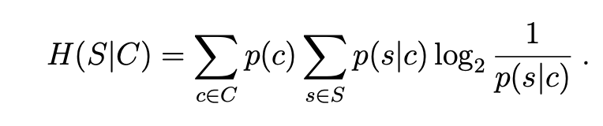
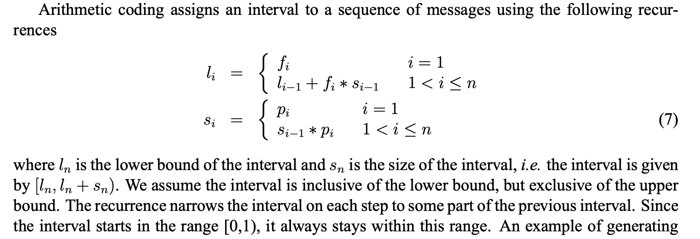
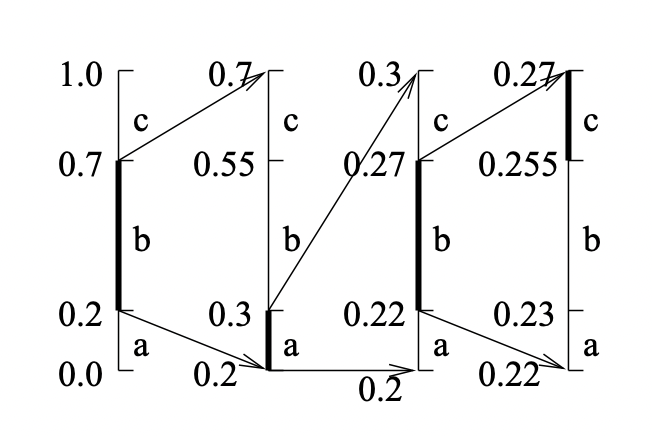
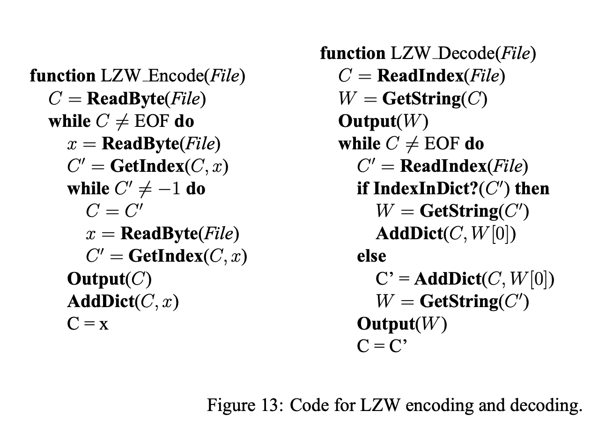

['Introduction to Data Compression' by Guy E. Blelloch.](https://www.cs.cmu.edu/~guyb/realworld/compression.pdf)

Compression algorithms map a message (for example, a file) to a reduced version. They are composed of a pair of encoding and decoding procedures, such that a message is compressed by the former and recovered by the latter. The process can be lossless, where the recovered message is exactly the same as before, or lossy, where a part of the message (hopefully one deemed less important) may be lost in the process.

Commonly, lossless compression is used on text, and lossy is saved for images, audio and other media forms where exact recovery is not as necessary.

"Because one can’t hope to compress everything \[since an isomorphism ould necessarily require the same amount of bits in the end], all compression algorithms must assume that
there is some bias on the input messages so that some inputs are more likely than others, i.e. that
there is some unbalanced probability distribution over the possible messages. Most compression
algorithms base this “bias” on the structure of the messages – i.e., an assumption that repeated
characters are more likely than random characters, or that large white patches occur in “typical”
images. **Compression is therefore all about probability**."

When describing compression algorithms, the paper proposes to distinguish between the *coder* and the *model*. The model refers to an estimation of the distribution for the compressed tokens or characters in the message. For instance when compressing an image, we may assume it is more likely for neighboring pixels to share similar colors. The coder is the procedure that encodes data, typically by assigning shorter codes to more likely tokens, and longer ones to the ones thought to be least likely.

It can be shown that the best compression rate possible would be using only as many bits per token as their entropy. As we chunk more characters into "tokens" we could get more compression per bit (for instance modeling the string AABBBAAAA as using the tokens AA, AB, BA, BB instead of just A and B).

There is also conditional entropy (H(s\|c)): the entropy of the distribution of p(s\|c), weighted by the distribution of c over all possible contexts and s over all possible messages.

{: loading="lazy"}

It can be shown that H(s\|c) <= H(s) and the bound is only tight if context and messages are completely independent. An example of context could be the previous n pixels before the current one, or surrounding n words, etc. 

### Huffman Codes

Huffman codes are optimal prefix codes generated from a set of probabilities by a particular algorithm, the Huffman Coding Algorithm. 

"The Huffman algorithm is very simple and is most easily described in terms of how it generates
the prefix-code tree."

```
Start with a forest of trees, one for each message (=token). Each tree contains a single vertex with
weight wi = pi.

Repeat until only a single tree remains:
	1) Select two trees with the lowest weight roots (w1 and w2). 
	2) Combine them into a single tree by adding a new root with weight w1+w2,
	 and making the two trees its children. 
	 It does not matter which is the left or right child, 
	 but our convention will be to put the lower weight root on the left if w1 != w2.

```

If I'm seeing this correctly, the most likely codes will end up nearer to the final root, and the least likely ones closer to the leaves. The algorithm is greedy in a way, as it always links the two least likely contenders until there is a single tree.

"For a code of size *n* this algorithm will require *n−1* steps since every complete binary tree with
n leaves has *n−1* internal nodes, and each step creates one internal node. If we use a priority queue
with *O(log n)* time insertions and find-mins (e.g., a heap) the algorithm will run in *O(n log n)* time.
The key property of Huffman codes is that they generate optimal prefix codes."

Example: 

```
a .2, b .3, c .3, d .1, e .1

=>
t(d e) .2
a .2

=>
t(a , t(d, e)) .4
t(b, c) .6

=>
t( t(a , t(d, e)) , t(b, c) )
```

Even though all Huffman codes have the same average (minimum) length, it can be good if average message variance is also reduced (for buffering, speed guarantees, etc.). 

To ensure this, a simple modification is breaking ties when picking which trees to merge using the two earliest created nodes. All leaves are assumed to have been created first. So if 3 nodes tie in weight, we join the two that were created earlier first. This way, trees diverge less from the average length.

### Arithmetic Coding

{: loading="lazy"}
{: loading="lazy"}


This method seems impractical due to floating point arithmetic's quirks.

### Applications of Probability Coding

The simplest message distribution model we can make is based on counting. This is unsophisticated and most likely suboptimal.

More sophisticated models are used in real-world applications. All these techniques take advantage of the “context” in some way.

This can either be done by
- **Transforming the data before coding** (e.g., run-length coding, move-to-front coding, and residual coding)
- **Directly using conditional probabilities based on a context** (JBIG and PPM).

**Run Length Coding**: In this coding procedure, a sequence is coded as a sequence of tuples, repetitions where repeated symbols are summed up. E.g. aaaabb => a;4,b;2. The tuples are usually Huffman encoded later, to compress things even further.

**Move-To-Front Coding**: We start with a preordered alphabet, and for each character in the message we a) shift that character to the beginning of the alphabet and b) output how many positions it moved. Hopefully the same characters tend to cluster together and therefore most times we will output small values.

*Example* : Think of an image, where characters are channel values. The alphabet has 256 values, and since similar pixels have similar colors channels may repeat. Maybe if we combine it with run-length so it goes closer to 0? It wouldn't work with 256\^3 values for colors, I guess, since it's such a big alphabet.

### Residual Coding: JPEG-Lossless (LS)

In residual coding, our model outputs a guess for the correct value of the next message, and then we store only the residual (by how much we missed the mark). Hopefully the model will be good, and then the residuals will tend to gather close to 0, reducing entropy. Finally we do a pass of Huffman encoding after this step, and it's all done.

For images, we typically divide them into their three channels and compress each separately (as channel values are more correlated and less varied than pixel values).

**Context Coding: JBIG** is a very naive autoregressive algorithm, but only scales well to black and white (like fax) images or very low entropy greyscales (think 6 bits). Again, we output probability residuals and huffman encode them first.

### Context Coding: PPM - Prediction by Partial Matching

Variants of this algorithm have consistently given either the best or close to the best compression ratios recently.

We keep a table of last j characters seen, for each j from 0 to k, and occurrences of next character for each (like in a markov chain model). For each character we are encoding, we output its probability given the current model and previous k characters, and then update it with the new information. However if this character has never been seen within this context, we output a probability of finding a new character (estimated as #different characters / total occurrences of this context) and move one level below in the table, to contexts of length k-1. And so on until we reach context 0, which is just individual character probabilities up to now.

### Lempel-Ziv Algorithms

The Lempel-Ziv algorithms code groups of characters of varying lengths by building a dictionary of previously seen strings.

At the highest level the algorithms can be described as follows. *Given a position in a file,
look through the preceeding part of the file to find the longest match to the string starting at the
current position, and output some code that refers to that match. Now move the finger past the
match.*

This is the algorithm used in gzip, except it also includes information about probabilities for each substring.

**Lempel-Ziv 77** is the one used in gzip, and it involves a sliding window.

The LZ77 algorithm and its variants use a sliding window that moves along with the cursor. The
window can be divided into two parts, the part before the cursor, called the dictionary, and the part
starting at the cursor, called the lookahead buffer. The size of these two parts are parameters of the
program and are fixed during execution of the algorithm. The basic algorithm is very simple, and
loops executing the following steps:

- Find the longest match of a string starting at the cursor and completely contained in the lookahead buffer to a string starting in the dictionary.
- Output a triple *(p, n, c)* containing the position p of the occurence in the window, the length
n of the match and the next character *c* past the match in the buffer.
- Move the cursor n + 1 characters forward.

A possible improvement is called LZSS variant, which uses two formats: if no match of length >2 is found, it turns on a bit and then outputs the character alone. Else it keeps it off. This way we avoid wasting two fields on an empty match.

Gzip uses separate huffman codes for the offset, the length and the character. Each uses adaptive Huffman codes.

It also makes matching **non-greedy**: It tries matching the string beginning from the next character besides the current one, then if that match is longer than the greedy one, it will append a single character and the second, longer match's tuple. 

Pseudocode for LZW is as follows (note that this version doesn't do LZSS, or non-greediness).

{: loading="lazy"}


