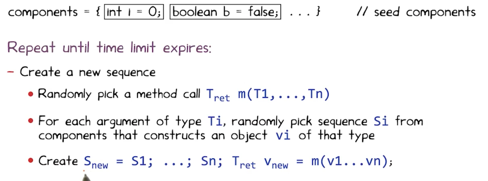

## Program Analysis

**Program Analysis**: Discover useful facts about a program. 

- Dynammic : Execute a program and learn about it
- Static: compile-time

Analysis can be complete (we find every useful fact) or sound (every fact we find is true). Typically static analysis is more complete, but dynammic analysis is more sound. 

## Iterative analysis

Armamos el control flow graph donde cada nodo es un statement y un nodo lleva a otro si puede precederlo. Vamos mappeando los valores posibles de variables si los sabemos, de nodo a nodo. Con eso podemos concluir, por ejemplo, si una variable siempre vale lo mismo en un cierto esstado.

El grafo usa statements del *while language* que es solamente un while; if ; y assignment. (con && y !). 

### Chaotic iteration

Iteramos los nodos del grafo en un orden aleatorio. Por cada nodo:

- Out[n] = intersection/union( x for x in IN[n] ) - kill(n) + gen(n). 

Elegir si intersection o union, y si out o in, te define 1 de 4 algoritmos. Repetimos hasta convergencia y entonces termina.

Siempre termina, pues los sets nunca se achican y hay un tamaño máximo finito.

**Very busy expressions**: Out[n] = intersection(in[n'] for each n' in SUCC)  - kill(n) + gen(n) (mide expresiones que se usan en todos los sucesores! Y que en el medio ninguna variable que aparece en ella cambió de valor)

**Reaching definitions** : Out[n] = union(in[n'] for each n' in PRE) - kill(n) + gen(n) (dónde se hizo la ultima asignacion no overwritten?).

**Available Expressions** : Out[n] = intersection(in[n'] for each n' in PRE) - kill(n) + gen(n) (expresiones que ya se computaron, y no se modificaron luego, en todos los caminos a este program point.)

**Live Variables Analysis**: Out[n] = union(in[n'] for each n' in SUCC) - kill(n) + gen(n) (A variable is live if there is a path to a use of the variable that does not redefine the variable (the current value *might* be useful!) )

## Pointer Analysis

Queremos trackear si dos pointers podrian o deberian aliasear entre ellos (el may-analysis suele ser mas interesante y comun que el must).

E.g., tengo v = new Color(); u = v; luego may-alias(u, v).

Para eso pasamos el programa en lenguaje while++ (le agregamos new, assignments, indexar con ., e indexar con \[\*\]), removelos el control flow (todos los while, for e if se mueren) y con el nuevo grafo resultante, aun si es bastante primitivo, metemos flechas azules cuando var -> cosa y rojas cuando cosa.attr = cosa'. 
Asignamos las flechas azules por **allocation site**, no solo por clase.

Por cada statement de while++-flow, siempre agregamos nodos y flechas, nunca removemos: por cada assignment e = new X(); agregamos flecha azul de e a X, donde hay un nodo X por cada allocation site. Por cada assignment v1 = v2; hacemos flechita de v1 a cada nodo tq v2-> ese nodo. 

 Si el statement pinta v1.a = v2 entonces flechita roja de v1 a cada nodo tq v2 -> nodo, con un label == a en la flechita.

**Flow abstraction**: como abstraemos el flujo. Podemos ser flow-insensitive (remover todo el control de flujo) o flow-sensitive (dejarlo).

**Heap abstraction**: Refiere a la granularidad de cómo representamos los objetos para los que se aloca memoria y generan referencias. i.e., como particionamos un conjunto no acotado de objetos concretos a uno finito de objetos abstractos. Basicamente qué añadimos como nodo al grafo. Hay muchos sound schemes, podemos cambiar la precision y eficiencia. 

- **Allocation site based**: cada allocation site (new X();) tiene un nodo propio. Finitely many abstract objects.
- **Type based**: Menos granulado, menos costoso. Cantidad de tipos es finito, cantidad de objetos abstractos tambien. Al menos te dice el tipo de cada variable.
- **Heap insensitive**: Un solo abstract object que es simplemente la heap. Todas las variables le apuntan con azul, y todos los atributos en rojo tambien.

### Modeling Aggregate Data Types: Records

- **Field Insensitive**: merge all fields of each record.
- **Field based**: merge each field for all records.
- **field sensitive**: keep each field of each record object separate.

## Constraint-Based analysis

Nos deja separar implementacion del analisis, de declaracion de constraints (what de how) y abstraernos de la primera para concentrarnos en la segunda.

Puede ser interprocedural o intraprocedural. Ejemplo constraint language: datalog.

Es un lenguaje como prolog. Le pasas tu control-flow graph como un set de constraints por edges, le pasas como son las relaciones de kill y gen, y boom te genera analisis como live-variables o reaching definitions. 

Tambien puede manejar may-alias analysis flow-independent si le pasas las reglas de qué hacer en los assignments, en los new y estas hecho.

## Testing

- Tester != Developer (porque asi errores no coinciden tanto). 
- Recursos finitos
- Especificaciones compartidas por tester y developer, ya que el tester las necesita para ver que el programa es consistente, y el developer para saber qué programar.

Los approaches de testing caen en 4 categorias, como 4 cuadrantes en 2 ejes ortogonales: manual vs automatic y black- vs white-box.

Por ejemplo, manual y black box: no miro codigo y pruebo la UI de algo a mano clickeando todo.

Whitebox seria si miro el codigo y veo de cubrir todas las branches tocando botones a mano.

Automatico: Podriamos activar lugares al azar de la UI sucesivamente, sin mirar el codigo ni nada. O podriamos hacer un analisis estatico del codigo antes de automaticamente triggerear UI events, en cuyo caso esto es whitebox y automatico. 

### Automated vs Manual testing

**Automated**
- Finds bugs more quickly
- No need to write tests (cheaper)
- Less maintenance cost when software changes

**Manual**
- Potentially better coverage
- Code less bloated

Idealmente queremos combinar ambos.

### Black-box vs White-box

**Black-box**: Basado en mirar inputs y outputs del programa.
- Works for code that can't be modified
- Code can be in any operable format

**White-box**: Basado en mirar el codigo fuente directamente.
- Efficient
- Can have a much better coverage

Usamos pre y post condiciones, idealmente escritos en el mismo lenguaje del codigo.

### Testing quality

**Code Coverage**: Can be measured in functions, statements, branches, lines and blocks. Pro: easy to measure. Con: doesn't imply robustness.

**Mutation Analysis**: Assumes the programmer wrote a close to right code. Tests variations of the program (e.g., replace x < k with x > k, or w + 1 to w - 1). If the testsuite is good, it should break on mutants. If it doesn't, then we add a test that covers that case. As a possible problem: what happens when mutation generates equivalent programs?

### Mutation Analysis

Tomo el codigo de una funcion y le aplico operadores de mutacion. Hacen un solo pequeño cambio al codigo, e.g. cambiar un + por un -, una expr por abs(expr), o por 0, intercambiar argumentos de funcion, etc. Luego le corro el testsuite. Si rompe por los bugs introducidos en el cambio, decimos que "la testsuite mata al mutante", de lo contrario decimos que no. Llamamos el **mutation score** al % de mutantes que mueren sobre el total, para un total prefijado (y configuramos que mutaciones queremos usar, etc.).

Algunos mutantes pueden ser equivalentes: para todo input tienen el mismo output, aun si hay o no un defecto en su comportamiento.

Notar que hay muchisimos mutantes posibles para un solo programa pequeño (aun para un solo statement). Algunas formas de resolver esto para ganar escalabilidad son: ejecutar para cada mutante, solo los inputs que tienen covertura de ese statement mutado. Mutacion debil: veo si modifique el valor de una variable del estado luego de mutar un statement, en vez de mirar si modifique el output mismo del programa. 

### Random Testing (Fuzzing)

**Monkey Testing (for Android)**: Generate a sequence of tapping events (down and up, or down, drag and up), then generate many different random sequences and check if any one sequence crashes the program.

**Concurrency testing**: Simulate different thread schedules by adding artificial delays between threads, appending "Sleep()" calls randomly on different threads' code. Shown to be a lot better than stress testing.

We call a bug's "depth" the quantity of ordering constraints needed to guarantee the bug takes place. E.g., "statement1 before statement 2 and statement 2 before statement 3". These constraints imply scheduler behaviour, and transcend thread boundaries (inside a thread, two statements will always go in the same order, obv).

Cuzz and other frameworks say most bugs have small depth.

Pros: Can be a lot easier to use than manual testing, cheaper and more efficient. Con: uses more tests per coverage point and may find useless bugs (like weird unsanitized inputs). Also makes many tests that simply don't pass preconditions.

> Automatic testing should complement, not replace manual testing.

Podemos usar alguna [gramática formal](/wiki-articles/computer-science/tleng-final) para generar inputs aleatorios que sean validos. De esta forma, especialmente en programas de mayor complejidad, los inputs generados tienen mas chances (idealmente 100%) de cumplir las precondiciones del programa a testear, siendo mucho mas eficiente la generacion de tests.

## Automated Testing

A diferencia de Random testing, hacemos white-box testing y buscamos generar casos de test relevantes usando el codigo de forma directa.

Algunos ejemplos:

### Korat

Korat testea mayormente estructuras de datos algebraicas/linkeadas, enumerando para un cierto tamaño n todos los posibles candidatos no isomorficos de ese tamaño (e.g., toda lista linkeada de n nodos, o arbol binario de n nodos).

Enumera haciendo un vector de todos los fields de todos los nodos + una lista de valores posibles, y va "expandiendo" el vector en un orden dictado por una funcion "repOK" que es el invariable de representacion de la estructura. Va a ir probando todos los valores posibles del vector (que univocamente describe una estructura) y viendo: si cumplen la precondicion los deja como test, sino no. Lo interesante es que prunea el espacio de valores posibles agresivamente, eliminando isomorfismos, y siguiendo un orden de stack con la precondicion: siempre expande el ultimo campo en ser accedido por repOK hasta que no quedan valores para expandirlo, y ahi el campo anterior, y asi.

Funciona mejor para estructuras de datos linkeadas, no para tipos dificiles de enumerar (e.g., enteros o floats).

### Randoop
Feedback-directed random test generation.

Hace un test con muchas operaciones de seetup de estado (Crear un objeto, modificarlo etc.) y finalmente un assert de una propiedad que deberia holdearse (una post condicion de alguno de los metodos usados), e.g., o1.equals(o1).

Resuelve el problema de uniform random testing usando una secuencia: usa una secuencia de metodos, y si no rompen y no son ilegales los resultados, entonces la recuerda y luego puede extenderla llamando a otro metodo de la clase. Tiene que tener como input un budget de tiempo, y post-condiciones para los objetos testeados y sus metodos.

El output son contract-violating test-cases (method sequences). Estos casos no pueden romper ninguna precondicion ni lanzar excepciones en el camino, y cada uno tiene al final un assert que rompe.

Randoop algorithm:

Luego de generar una secuencia, decide si la descarta, conserva y outputea como test, o la descarta por redundancia.
- if preconditions broke (exception thrown before assert): *discard*.
- if preconditions worked but assertion broke: *output as failing test* (happy path).
- if preconditions worked but sequence redundant (simply do an equals between a generated object and any other object in the current generated universe): *discard*.
- if assertion passed but object not redundant: add to universe of generated objects.

### Greybox Fuzzing

Fuzzeo sin mirar el codigo, pero viendo la coverage. El algoritmo toma una serie de "seeds" (inputs predefinidos) y mutaciones (operaciones que transforman las seeds y sus mutaciones). 

Lo que hace el algoritmo es probar los path cubiertos por cada seed y, para los que no crashean ni vulneran precondiciones, los muta y genera nuevos inputs, y asi hasta K ejecuciones de inputs (K un budget provisto por el usuario).  

Si un input aumenta la coverage, lo agregamos al set de seeds, para que pueda seguir mutando etc. En "boosted" greybox fuzzing, cada input será elegido como una siguiente seed con probabilidad proporcional a su "energia" que es 1/f(p(input)) donde f(p(x)) es "cuantas veces un input recorrio este path en el codigo antes?" asi un input que recorre un path por primera vez tiene energia = 1, uno que recorre un camino visto 1000 veces tiene energia 1e-3, etc.

Defecto, propagacion, infeccion y falla (defecto es algo salio mal, propagacion es que afecto otras partes del programa, infeccion es que el defecto cambio un comportamiento y falla es que el programa efectivamente da un output distinto). (e.g., si mi programa es accidentalmente cuadratico, puede nunca fallar pero tiene un defecto por su mala performance. Lo mismo si indexo un puntero fuera de bounds pero no tengo segmentation fault porque justo estoy dentro de mi area.).

Basicamente, con blackbox fuzzing genero seed o seed+mutacion pero nunca agrego un mutante a mis seeds. Con greybox fuzzing voy agregando a mi corpus los mutantes efectivos, y tengo una metrica de efectividad con la que seleccionarlos.

## Dynamic symbolic execution

Tenemos **symbolic execution** desde los '70s: por cada conjunto de ifs anidados, meto en un theorem prover todos, y si hallo un input que los cumpla, reporto que ese bloque de codigo es alcanzable. En particular si el bloque de codigo genera un error, asumimos que el error es posible.

Luego si el prover prueba que tal input no existe, ignoramos ese codigo aun si tiene fallas.

Pero si no somos capaces de probar existencia ni inexistencia, entonces erramos del lado de soundness: asumimos que hay un bug y reportamos que es alcanzable, aun si no sabemos como. Otro problema que tiene este algoritmo es que escala mal a codigo muy grande.

DSE comienza con un set de inputs aleatorio, y lo ejecuta. Luego backtrackea en el arbol de condiciones y toma un camino anteriormente no tomado, usando un theorem prover para hallar valores que cumplan todas las constraints. Genera el camino negando la ultima condicion que haya sido evaluada, luego backtrackeando.

Esto lo vuelve incomplete theorem prover: podria declarar insatisfactible una constraint satisfactible, pero nunca va a pensar que una insatisfactible tiene solucion. 

Dynamic symbolic execution is akin to dynamic analysis itself: it is never reporting an error that no input can reach, and therefore it is complete. However it will be unsound, as it may fail to find inputs that trigger a certain failure.

### SBST Search Based Software Testing

Cuando las condiciones en los if son suficientemente complejas, usar un theorem prover para resolverlas puede ser lento o impracticable. En estos casos, recurrimos a algoritmos de hill climbing, [metaheurísticas](wiki-articles/computer-science/algo3-final) o genéticos para generar inputs que satisfagan una cierta condición.

Usan **hill-climbing**, **algoritmos geneticos** o **metaheuristicas**.

Como funcion de costo / fitness usamos una "branch distance", que idealmente será continua y derivable.

Como forma de mejorar branch distance podemos tener en cuenta dominators y post-dominators. Eventualmente guiamos nuestra busqueda con una mezcla del "approach level" (cuan cerca estoy del predicado, a cuantos if estoy) y la branch distance (la que definimos antes, cosas como "a == b" seria abs(a-b).

Usamos una suma entre el "approach level" (cuandos nodos dependientes - ejecutados) y branch distance al predicado mas cercano (menos profundo), y tomamos la minima suma entre todos los path desde el root del cfg hasta el nodo que queremos alcanzar. Eventualmente es mejor sumar una normalizacion de la branch distance, para que no overwhelmee el approach level.

Se normaliza para que sea entre 0 y 1, pero no veo que usen un maximo, es mas v := v/(v+1)

## Programacion concurrente

3 niveles de concurrencia: concurrencia, paralelismo y distribucion.

Para modelar sistemas concurrentes usamos **LTS (Labelled Transition Systems)**: [automatas finitos deterministicos](/wiki-articles/computer-science/tleng-final) tq hay n estados y entre dos estados la transición es un evento (el alfabeto es un set de eventos). Llamamos una ejecución valida a toda cadena de eventos+estados resultantes que sea aceptada por el automata. Una traza, en cambio, es meramente la cadena de eventos pura aceptada.

**FSP (Finite Sequential Processes)**: Nos deja describir un LTS a traves de una gramatica formal. e.g., CONTROLLER = INACTIVE; INACTIVE = (on -> ACTIVE)\|(burn -> ONFIRE);&c.

Para demostrar una propiedad de LTL, vamos a tomar el predicado P a demostrar, y crear A\_{¬P} el automata que genera todas las trazas que no cumplen P. Luego hacemos interseccion entre este, y el automata correspondiente al programa (su LTS). Si da vacío, es porque no hay instancia que no cumpla P. De no dar vacío, nos genera nuestro contraejemplo.

Cada transición del FSP añade un estado al LTS y una transicion de ese nuevo al source del referido. El FSP permite describir recursivamente procesos de finitos estados que aceptan cadenas infinitas de transiciones. En cada transicion puedo anotar los procesos (los no-terminales) o no, y ahi se deja implicito y anonimo (e.g., ON -> (off -> on -> ON).

Si desde un estado tengo dos transiciones (x -> A\|x -> B) tenemos que x es no deterministico. Si sale x, no deterministicamente elijo A o B.

Syntactic sugar: BUFF = (in\[i:1..N\]-\>out\[i\]-\>BUFF). (equivalente a (in[1]-\>out[1]-\>BUFF|in[2]...). 

Also podemos count\[i:0..N\] = (when \(i\<N\) inc -\> COUNT\[i+1\]\)

Tenemos el estado magico **Stop** que es un estado sin salida.

Finalmente el operador \|\| efectua una composición paralela: \|\|A = (B\|\|C) A es la union de ambos B y C, y arranca en el start de ambos.

Podemos agregar acciones compartidas: acciones que figuran en mas de un LTS, y que solo pueden llamarse si estan disponibles en todos los LTS a la vez. Basicamente si una accion esta en el alfabeto de dos LTS, entonces bloquea a ambos a menos que ambos la tengan disponible (de lo contrario nadie puede tomarla).

Strong bisimulation: Una relacion binaria R es bisimulacion fuerte sii para toda accion a, PRQ sii (P -\>a  P') =\> existe Q' tq Q -\>a Q' y P'RQ', y analogo para el otro lado (Q, P).

Strong bisimilarity: Dos LTS P, Q son bisimilares sii hay una bisimulacion fuerte R tq (P,Q) in R. Osea, cada uno puede simular al otro. Dos procesos son no bisimilares si existe un observador externo uqe puede distinguirlos. Se representa "Q simula a P" con P <= Q.

Se agrega la nocion weak bisimulation: es igual pero incluye transiciones tau (como transiciones lambda) para trabajo interno de un proceso que no es input/output.

### Logica Temporal

Usamos la logica proposicional, mas dos operadores modales: [] y <>: uno para "siempre" y el otro para "a veces". 

La logica temporal lineal usa estructuras de kripke y valuaciones que dan valores TorF a los mundos.

v \|= []a sii para todo mundo w' tq vRw' pasa que w'\|=a. !, && y \|\| se definen intuitivamente.

v \|= <\>a sii existe un mundo w' tq vRw' tq w'\|=a.

**Logica Temporal**: razona sobre el tiempo, adecuadas para un programa reactivo, caso particular de logica modal. Puede variarse de modelo de tiempo.

Una formula LTL debe interpretarse en una estructura de kripke (W, R) tq W numerable y R orden total de W. 

Decimos que M \|= P sii para toda traza s \|= P. 

Safety: M \|= []!(cosa mala) 

Liveness: M \|= []\(cosa buena\)

Los LTS no son estructuras de kripke, pero interpretamos una traza t como estructura de kripke, donde el conjuntode proposiciones es el alfabeto del LTS, p true en i sii p es la accion en posicion i de t. 

Traza usa solo acciones observables.

**Automatas de Buchi**: Reconocen cadenas infinitas, w-regulares tq tienen un estado de aceptacion y reconocen toda cadena que pase por ese estado infinitas veces.
Las cadenas que acepta estan en Sigma ^ Omega. 

Podemos traducir una traza a un automata de Buchi, cuyo tamaño es exponencial en el tamaño de la clausula a probar. El algoritmo a usar se llama "LTL2Buchi".

Expandimos new a next, cuando new vacio miramos next+old si matchean y linkeamos. Hay regla para cada operador. Los Old definen las transiciones: solo te moves hacia un estado si tu config actual satisface toda clausula del OLD.

Arrancamos con un nodo con new = {P}, y despues por cada nodo que new!={}, expandimos el new. Los criterios de expansion son complejos, bizantinos y exceden el scope de este apunte.

Para probar P aplica a un LTS m, pasamos LTS a otro automata de büchi usando LTS2Buchi (es una conversion muy directa: dejo todo casi igual y el conjunto F =Q).

Luego tomamos el producto entre el LTS2Buchi y el LTL2Buchi (Q = Q1xQ2, Q0 = Q01xQ02, F = F1xQ2 U Q1xF2 y los delta son un cartesiano de ambos filtrado por que ambas transiciones tengan sentido. El lenguaje del producto es la interseccion de los lenguajes. Basta con verificar su vacuidad para probar P (de lo contrario, probamos ¬P).

Para hallar que es no vacio, buscamos un ciclo que contenga un estado final y sea alcanzable desde S.

