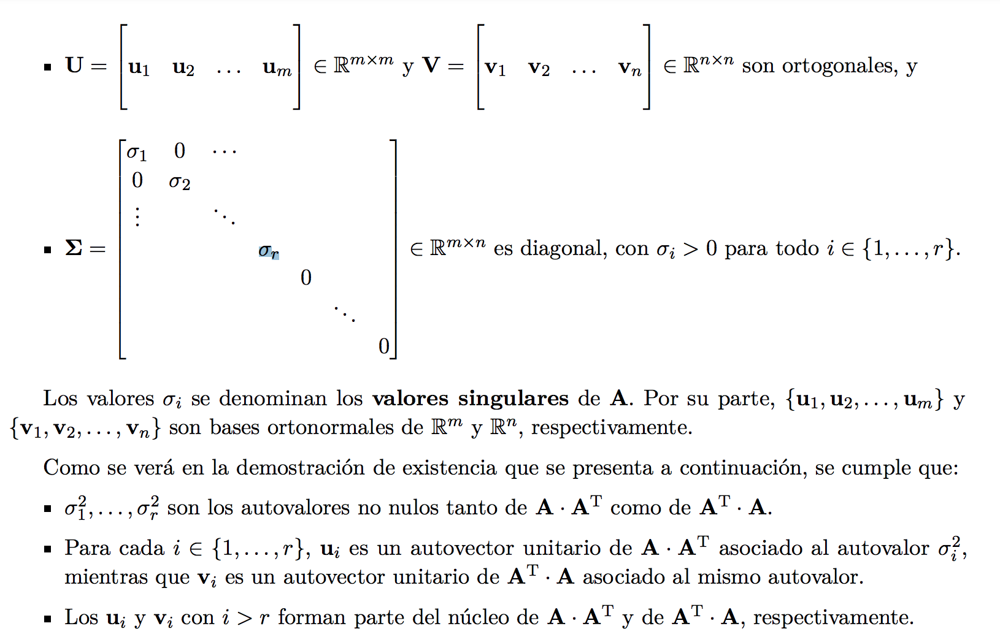
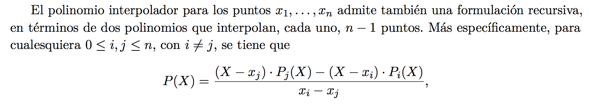

### Eliminacion Gaussiana

La eliminación Gaussiana convierte a una matriz en otra que representa ecuaciones con el mismo conjunto de soluciones, pero triangular superior (para que resolverla solo requiera forward substitution).

Lleva O(n^3) y se hace como lo hacemos a mano.

### Condición de una matriz -error numérico-

En una matriz mal condicionada, un pequeño error en el resultado de una ecuación, genera una solución de mierda.

A x = b,

pero yo tengo que 

A x = ~b, y resulta que aunque 
||~b - b|| < \epsilon,
 ~x muy lejos de x.

Error hacia adelante: el error en x.

Error hacia atras: el error en b.

Tipicamente partimos de un error hacia atras, y eso nos genera un error hacia adelante (la veniamos cagando y eso promueve cagadas futuras).

Numero de condición de la matriz

Si A es **simetrica, inversible y tiene LU**, entonces **tiene LDL**.

### Descomposición de Cholesky:

**L es triangular inferior** con positivos en la diagonal (no necesariamente 1).

A tiene **Cholesky** <-> A es **definida positiva**.

A es **definida positiva** si

para todo x.

A definida positiva -> su diagonal es toda positiva, y A inversible.

### Descomposición QR

A = QR tq Q ortogonal, R triangular superior.

Toda matriz tiene QR.

Q ortogonal -> Q^-1 = Q^t.

Q1, Q2 ortogonales -> Q1Q2 = Q3 ortogonal.

Es única para inversibles, si pedimos R diagonal positiva.

Si tenemos una ecuación  Ax = b, podemos hacerla QRx=b.

De ahi podemos ir a Rx = Q^tb, y Q es numericamente muy estable y R es triangular.

Las matrices ortogonales conservan la norma 2 de los vectores.

### HouseHolder:

Si quiero hacer una serie de transformaciones ortogonales tal que al final me quede una matriz triangular superior, puedo llenar de 0s todo debajo de la diagonal para una columna iterativamente en cada paso.

Para hacer esto, uso reflexiones: muevo el vector de la columna de diagonal hacia abajo, hacia un vector de misma norma, pero con un solo componente no nulo (el primero, que corresponderia a la diagonal de la matriz anterior).

Si tengo el vector ortogonal al hiperplano en el que hago la reflexion, mi matriz ortogonal para esta transformación será:

Pero cómo obtengo u? Simplemente parto de un vector que quiero que se refleje a otro. Sean v que quiero reflejar en w, obtengo u:

Luego si tengo mi columna, como la quiero mappear conservando la norma, mis v y w serán:

Y repito esto iterativamente. No ahorro complejidad pero tengo mas estabilidad numérica.

### Transformación de Givens

Puedo hacer rotar un vector por un ángulo theta. Con un vector de R^2 eso me permite llevarlo a un vector con un 0 en la segunda componente.

{: style="height: 80%; width:80%"}

Esto generaliza a R^mxn, pero tengo que por cada columna, hacer una rotación por cada 0 que quiero agregar, así que son potencialmente O(n^2) rotaciones. La rotación se hace mirando los 2 componentes que querés rotar, y completando con la identidad en todos los otros.

La complejidad termina siendo la misma que con HouseHolder, pero con un factor constante mayor (4/3 vs 2/3), pero al ir 0 por 0 es muy eficiente en matrices ralas -información que HouseHolder no aprovecha-.

### SVD - Singular Value Decomposition

Descompongo a A tq:

Donde 

{: style="height:90%; width:90%"}

Toda matriz tiene SVD.

Para generarla, tengo que computar  A^t * A.

Los PC (sigma_i) son las raíces cuadradas de los eigenvalues de A^t * A (que son todos no negativos por ser A^t * A semi definida positiva).

Los vectores de V son los eigenvectors -de norma 1-.

Los vectores de U salen por esta ecuación:

Si la matriz no era cuadrada, U_i para i > r, se definen para hacer una base ortonormal de Nul(A^t). Asi cumplimos todas las propiedades.

## Resolución iterativa de ecuaciones lineales.

### Método de Jacobi

{: style="height:90%; width:90%"}

Podemos garantizar que converge para matrices edd.

Para funcionar, A no puede tener 0s en la diagonal.

### Método de Gauss - Seidel

Igual que el de Jacobi, pero usamos los valores que ya computamos para los primeros k componentes de x en vez de los de la x anterior.

{: style="height:90%; width:90%"}

Podemos garantizar que converge para matrices sdp, y además converge más rápido que Jacobi.

## Autovalores

Para el método de la potencia, multiplicamos un vector inicial aleatorio x_0 por A repetidas veces hasta convergencia. 

El ratio entre el vector obtenido x, y Ax, en normas será el modulo del autovalor de modulo mas alto en la matriz. Al restar \mu\* u u^t (producto externo) para mu el autovalor y u el autovector, obtenemos una nueva matriz cuyo autovalor de modulo mas alto ya no es el mismo.

## Interpolación

Tengo un conjunto de puntos, quiero hallar una función que pase por todos ellos y tenga ciertas propiedades deseables. 

Tipicamente usamos un polinomio, o varios juntos, porque son bonitos, derivables y compoutables facilmente, y en general muy estudiados.

### Polinomio interpolador de Lagrange

Defino un polinomio que toma los valores de los puntos en los x correctos.

{: style="height: 90%; width:90%"}

Ademas, podemos acotar el error de la interpolación si tenemos una idea de la n+1-ésima derivada de la función (imagino que es difícil de obtener en la práctica), evaluandola en algun punto E entre [x0, xn].

El polinomio de Lagrange es el unico polinomio de grado n que interpola estos n puntos.

### Diferencias divididas

Con diferencias divididas puedo computar un polinomio de Lagrange de forma recursiva para n puntos desde los anteriores n-1, en tiempo lineal. Esto permite agrandar el polinomio para ir fitteando mas puntos a medida que surgen.

{: style="height:90%; width:90%"}

También se le dice método de Newton.

El método de Newton es el de diferencias divididas.

### Método de Neville

{: style="height:90%; width:90%"}

Otra escritura recursiva del polinomio de Lagrange. Igual me hace computar n polinomios anteriores.

### Interpolación fragmentaria

Interpolo entre dos puntos consecutivos usando un polinomio, pero la funcion total está "partida" concatenando varios polinomios de grado bajo. Esto previene el overfitting y la inestabilidad numérica, especialmente si tengo muchos puntos.
-   **Interpolación fragmentaria lineal**: entre dos puntos consecutivos interpolo con una recta (de Lagrange). Solo garantiza interpolar, y es no derivable.
-   **Interpolación fragmentaria cuadrática**: hago lo mismo pero interpolo con una cuadrática en cada sección. Esto me permite garantizar que sea derivable en todos los puntos de "choque" de cuadráticas, además de interpolar correctamente.
-   **Interpolación fragmentaria con splines cúbicos**: interpolo entre los puntos con funciones cúbicas. Esto me permite, dada la cantidad de ecuaciones vs variables que tengo, pedir que en cada union de secciones coincidan en valor, derivada y segunda derivada. Esto hace que sea derivable y dos veces derivable en todos los puntos.

## Ceros de funciones

Buscamos generar una sucesión que converja a x\*, tq h(x\*) = 0. 

Si mi ecuación tiene la pinta f(x) = g(x) , entonces defino h(x) = g(x) - f(x), y el 0 de h es la solución de g.

### Orden de convergencia

Una sucesión que converge a _x\*_ tiene orden de convergencia _p_ si se cumple la ecuación:

Si para casi todo k, una sucesión Ai está más cerca de su límite A, que una Bi de su límite B, decimos que Ai converge al menos tan rápido como Bi.

### Criterios de parada

-   Parar luego de **N iteraciones**, regardless of results.
-   Parar cuando la **diferencia absoluta entre dos términos** consecutivos es < \epsilon.
-   Parar cuando la **diferencia relativa entre dos terminos** es < \epsilon.
-   Parar cuando la función tome un valor menor a epsilon -**f(x) < ε**- (por cercanía al 0).
-   Parar cuando la **diferencia relativa o absoluta entre dos valores de f** sea < ε.

En la práctica lo mejor es definir criterios según cuál es el problema que tenemos.

### Método de bisección

_Basado en el teorema de Bolzano_.

Comienzo con un intervalo [a,b] en el que sé que f(a) * f(b) < 0. Osea, un extremo positivo y otro negativo, sin mirar orden.

Necesariamente en el medio la función pasa por el 0 (si es continua).

Entonces 

* Parto el intervalo a la mitad.
* Miro cual de los dos intervalos resultantes cumple la misma propiedad. 
* Repetir hasta convergencia.

Converge linealmente.

### Punto Fijo

Dada una funcion g, x tq g(x) = x es un punto fijo de g. Luego para hallar un x tal, es facil si simplemente itero haciendo x := g(x) una y otra vez, partiendo de un x0 aleatorio.

### Metodo de Newton

Se basa en iteración de punto fijo.

Tengo que poder calcular f y f' en un intervalo [a,b]. 

En particular hallo un punto fijo de la función

Usando el método del punto fijo, mi iteración es simplemente:

Es importante que g esté bien definida en un entorno de x\*. Esto es, **f' no puede ser 0 en x\*\.**

La convergencia es cuadrática, pero solo en un entorno de x\*. Por esto, se suele inicializar el algoritmo en un buen lugar con un par de iteraciones del metodo de la bisección, ya que necesitamos **comenzar cerca de una aproximación relativamente buena de la raiz**.

El otro problema es cómo computar la derivada de f, que puede ser computacionalmente costoso o directamente inviable.

### Método de la secante

Similar al de Newton, pero en vez de computar la derivada la aproximo como el cociente entre los dos ultimos valores de y, y los ultimos dos de x.

Los problemas son: resta de valores cada vez más cercanos puede ser numéricamente catastrófica. Convergencia un poco más lenta (de orden fi) que el método de Newton.

### Regula Falsi

Muy similar al método de bisección, pero en cada punto en vez de elegir como punto medio el promedio de a y b, usa el cero de la recta secante entre los extremos (a,f(a)) y (b, f(b)). 

Converge linealmente igual que la bisección, pero en la práctica es más rápido, y evita la cancelación catastrófica del método de la secante.

### Complejidades

Factorizacion de Cholesky : O(n^3) -aunque mas rápida-

Factorizacion LU : O(n^3)

Eliminacion Gaussiana: O(n^3) -similar a LU-

Forward Substitution (en una triangular): O(n^2)

Factorización QR por HouseHolder: O(n^3)

Pero al ser QR es numericamente mas estable que otras.

1.2, 1.3, 2.1, 2.2, 2.3, 6.1, 6.2, 6.5

6.6 (cholesky y estrictamente diagonal dominante), 9.2 (método potencia), 3.1, 3.2, 3.4 (interpolación), 4.3, 4.4, 4.6 (integración), 7.3, 7.4, 7.5 (métodos iterativos)

