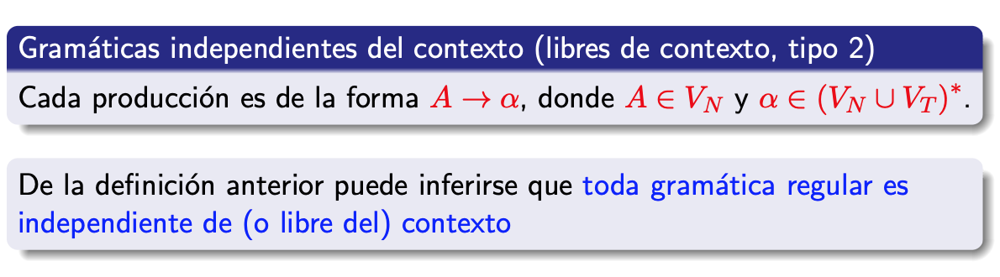
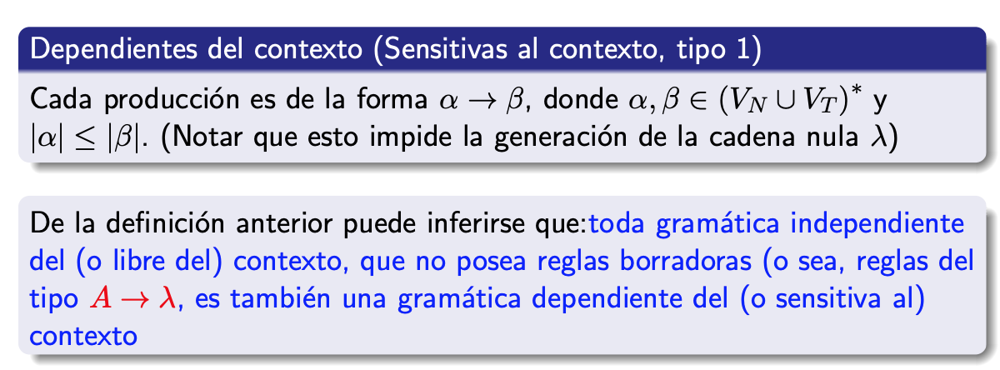
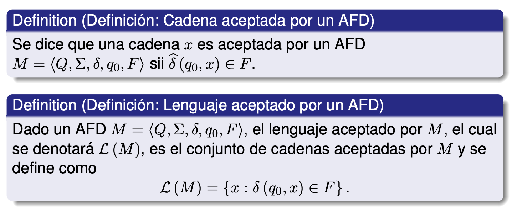
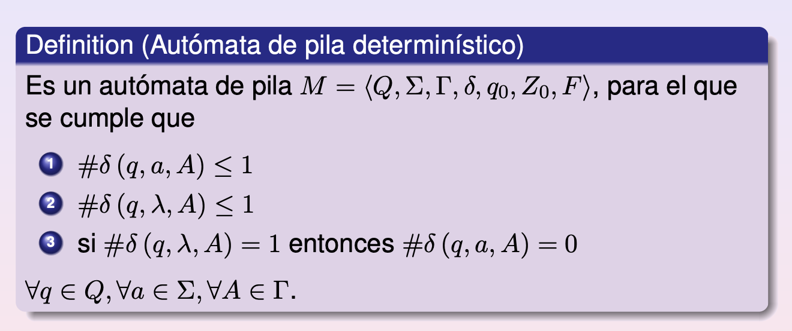
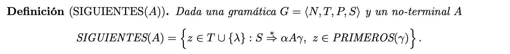
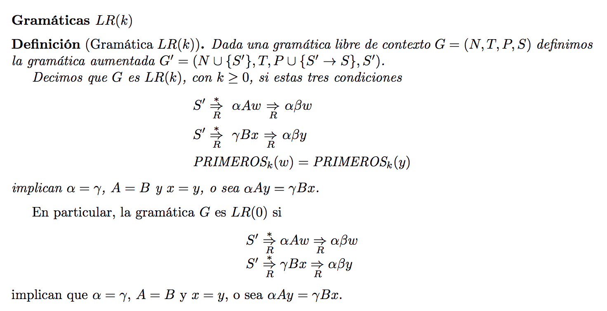

## Definiciones

## Lema de Pumping

Sii un lenguaje es finito (tiene finitas cadenas) todo automata que lo reconoce será acíclico.

Lema de pumping para regulares:

Existe n, para todo w, tq (w in L AND \|w\| >= n) -> Existe x,y,z tq
- w = xyz
- \|xy\| <= n
- \|y\| <= 1
- Para todo i >= 0, xy^iz in L.

Osea existe algun n, tq para todo w en L de longitud al menos n, existe una manera de tomar los primeros hasta n caracteres, tq tomo un sufijo no vacio de ese prefijo, lo pumpeo i veces para i >= 0, y siempre ese pumpeado esta en el lenguaje.

---

## Equivalencias
Si tengo una **gramatica regular**, existe un **AFND** que genera el mismo lenguaje (es straightforward la conversion).

Si tengo un **AFD**, hay una **gramatica regular** equivalente.

Dada una **expresion regular** r, existe un **AFND-l** M tq #qf = 1, y L(M) = L(r). 

Estas 3 se demuestran por induccion en la longitud de la cadena. En las primeras dos probamos la equivalencia entre As -> wa y d(s, wa) = qf. 
En la tercera vamos por induccion en la longitud de la regex (cantidad de operadores) e induccion estructural.

Ademas, dado un **AFD** existe una **regex** que acepta el mismo lenguaje. 

---

## Propiedades de lenguajes regulares

> Son cerrados en complemento, union e intersección finitas (no infinitas, ver \{ a^kb^k \}).

### Problemas decidibles en lenguajes regulares
- **pertenencia (dado w, está en L?)
- vacuidad (L = {}?)
- finitud (#L) 
- equivalencia (se resuelve por diferencia de conjuntos, que es regular por lo visto mas arriba)**.

## Automatas de pila

Aceptación puede ser por estado final (si al terminar de procesar la cadena, llegué a un estado en F, acepto la cadena independientemente del contenido de la pila) o por pila vacía (si al terminar de procesar la cadena la pila está vacía, acepto independientemente de en qué estado estoy).

Para cualquier automata con aceptacion por estado final, podemos facilmente construir uno de aceptación por pila vacia (en todos los estados finales ponemos transicion lambda a un nodo que simpemente desapila todos los elementos hasta vaciar la pila. Inicialmente pusheamos a la pila un caracter distinguido que el automata anterior nunca poppeaba, para evitar vaciar la pila en el medio por error).

Para el otro lado tambien es facil construir un automata de aceptacion por estado partiendo de uno de pila vacia: podemos agregar a todos los nodos una transición si la pila tiene un cierto simbolo distinguido agregado, que lleve a un nuevo nodo final adicionado. Luego al comienzo partimos de un q0' que pushea ese distinguido inicial, entonces corre todo el otro automata, deja la pila vacia salvo por el simbolo nuevo X0, y ahi salta por transición lambda a un Qf que lo poppea y termina.

Las gramaticas libres de contexto pueden modelarse con un automata de pila que acepte el lenguaje que genera. Puede pushear tanto Vn como Vt a la pila, el resto es intuitivo. Tiene un solo nodo q0. 

"Si en el tope de la pila hay un símbolo no-terminal t, el automata lo reemplazará por el lado derecho α de alguna produccion del mismo de tal manera que el símbolo mas a la izquierda en el lado derecho de dicha produccion quede en el tope de la pila. 

Si en el tope de la pila hay un símbolo terminal t, el automata constatara que es igual al próximo símbolo en la cadena de entrada y lo desapilará. 
Este automata acepta L por pila vacía."

### Automata de pila deterministico

Tiene para cada tripla q, a, A de estado, caracter y tope de pila, como mucho una transición posible. Y en particular si tiene transición lambda para un estado y tope, entonces no tiene transición no-lambda.

Si un idioma no es libre de prefijos (x en L entonces xy no en L), entonces todo automata de pila M que acepta L necesariamente será no-deterministico. (Sino, vacio la pila y termino, porque necesito aceptar x, y nunca podria aceptar xy).

## Gramáticas libres de contexto

Una gramatica G es ambigua si para una cadena w, existen dos árboles de derivación distintos.

Un lenguaje L independiente de contexto es **intrinsecamente ambiguo** si para toda G tq L(G) = L, G es ambigua.

Si una cadena w tiene un árbol de derivación en G tq su altura = h, sea a = max( {\|b\| tq A -> b in P} ), \|w\|<= a^h.

Hay un pumping para indep de contexto. 

Si L1, L2 son indep de contexto, también lo son:
- L1 U L2
- L1L2
- L1+

Sin embargo L1 AND L2 no siempre será indep de contexto. 

Si L1 regular y L2 indep de contexto, entonces L1 AND L2 es indep de contexto.

L1 indep de contexto deterministico, entonces L1^c tambien. Si L1 no-det, entonces L1^c puede ser cualquier cosa.

Llamamos a w **forma sentencial** de G gramática, si G -\*> w. Llamamos a A alcanzable en G si existe una forma sentencial que lo contiene. Llamamos a A activo si existe w tq A =\*> w. 

Una gramática G es reducida si todo no-terminal es alcanzable y activo. Decimos que una gramática es propia si no tiene producciones borradoras (A -> lambda).

**Forma Normal de Chomsky**: si G es una gramática y genera un lenguaje L indep de contexto que no contiene lambda, hay una G' cuyas todas producciones son de la pinta:

`A -> BC | a`

Para A,B,C Vn y a Vt, tq L(G') = L(G).

**Forma normal de Greibach** : Dado un mismo lenguaje (indep de contexto, sin cadena vacia), existe una gramatica que lo genera tq todas sus prod tienen pinta:

`A -> a w`

Tq w in Vn\*, a in Vt.

Existe un lenguaje recursivo, que no es independiente del contexto.

El lenguaje aceptado por una maquina de Turing (que en cada transicion pasa de un estado a otro,y tiene una cinta en la que va leyendo un caracter, escribiendo otro y moviendose a izquierda o derecha a la vez que cambia de estado), es cualquier w tq q0w \|-\* w1 p w2 con p in F y w1, w2 cadenas de gamma. 

Sea M una MT-no-deterministica. Existe una M deterministica que genera el mismo leguaje. Esto se logra probando a fuerza bruta cada una de las posibles combinaciones de transiciones: si cada nodo tiene maximo r salidas, entonces numeramoslas y generamos con eso una secuencia, que luego simulamos. Podemos hacer esto usando 3 cintas (o escribiendo todo en la segunda y leyendo y escribiendo mas adelante a la LyC). 

Si G es gramatica sin restricciones, hay una MT que acepta L(G). 

## Gramaticas

**Tipo 0**: Todas las gramaticas que generan lenguajes recursivamente enumerables (reconocibles por una turing machine, pero que puede devolver false o loopear cuando no pertenece). Son todas las gramaticas formales.

**Tipo 1**: Lenguajes dependientes del contexto. Las reglas son w -> v tq \|w\|\<=\|v\|. Todos los lenguajes generados por automatas linealmente acotados: máquinas de Turing deterministicas cuya cinta de memoria es acotada por un multiplo de la longitud de la entrada. (memoria lineal en el tamaño de la entrada).

Reconocer una cadena de este lenguaje es PSPACE-complete.

**Tipo 2**: Gramáticas independientes del contexto. Todas sus reglas son de forma A -> w. A no terminal, w una cadena cualquiera. Generan todos los lenguajes aceptados por un autómata de pila. 

Pueden ser lenguajes aceptados por un automata de pila determinístico o no-determinístico. Si pertenecen al primer tipo, pueden ser reconocidos en tiempo lineal en el tamaño de la entrada, y se llaman lenguajes LR. Un subconjunto de los LR son los lenguajes LL (que tienen gramaticas LL). 
Por ultimo, los lenguajes libres de contexto no determinísticos tienen un algoritmo que los reconoce en tiempo cúbico. 

**Tipo 3** : Gramáticas regulares. Las reglas son de la forma A -> aB o A -> a, con A, B no-terminales y a un terminal. Estas gramáticas generan todos los lenguajes aceptados por un automata determinístico finito. Los llamamos lenguajes regulares. Pueden definirse por expresiones regulares.

Ver si una cadena pertenece o no a un lenguaje regular es lineal en el tamaño de la entrada, usando un automata finito (vemos si la cadena termina llevando a un estado final o no). 

> El problema de decidir si una gramática libre de contexto es ambigua no es decidible.

**Lenguaje inherentemente ambiguo**: Toda gramática que lo genera es ambigua (tiene una cadena que tiene mas de una derivación a izquierda). 

Dada una gramática ambigua, podemos intentar cambiar la gramática, o descartar árboles de derivación dando reglas de precedencia. 

**Gramáticas recursivas a izquierda** : Una gramática es recursiva a izquierda si tiene un no-terminal A tq A =\+> Aw para w alguna cadena de terminales y no terminales. Puede ser inmediatamente recursiva a izquierda (e.g., tiene A -> Ab) o no (A -> Bc. B -> Ad).

> Todo lenguaje libre de contexto tiene una gramática que no es recursiva a izquierda.

**Gramática sin ciclos**: Una gramática es libre de ciclos si no hay un no-terminal A tq A =\*> A. 

En las libres de contexto, los ciclos surgen por A -> lambda, o A -> B tq B otro no-terminal. Pueden remediarse con algoritmos de eliminación de la recursión. 

Hay un algoritmo de eliminacion de la recursion a fuerza bruta (por cada simbolo no terminal, si tiene una produccion que empieza con otro no terminal, lo cambio por todas las producciones de ese otro y elimino esa - A -> B, B -> a entonces cambio por A -> a). Pero esto en el peor escenario agrega (\|P\|/n)^n producciones nuevas, explotando exponencialmente.

## Gramaticas LL y LR

Las gramaticas libres de contexto que generan lenguajes que pueden analizarse sintacticamente en manera deterministica en tiempo lineal en el tamaño de la entrada, pueden ser LL o LR. Ambas se leen de izquierda a derecha, la primera usando leftmost derivation, la segunda rightmost derivation.

### Gramáticas LL

Una gramática es LL si es LL(k) para algun k >=1. 

Las LL(k) son libres de contexto, no-ambiguas, para las cuales la derivación más a la izquierda está determinada por los simbolos ya leidos, y k simbolos mas.
El parsing es top-down, yendo de S a la cadena paso a paso de derivación.

Si w in L(G) tq w = a1...an y S = w0 y w\_m = w, wi -L> wi+1, entonces la secuencia w0...wm es el parsing de w a izquierda. 

Una gramatica LL(k) cumple wi = a1...ajAv entonces wi+1 es determinable conociendo a[1:j+k].

Dado w in (Vt U Vn)\*

Primeros\_k(w) = conjunto de prefijos de k caracteres de todas las cadenas de terminales que pueden formarse desde w  (w =\*> zv tq \|z\|<=k).

Una gramatica LL(k) cumple que si tengo S => wAv => wuv => wx y S => wAv => wu'v => wy, y primeros\_k(x) =primeros\_k(y) entonces u==u'.

Osea: si tengo dos cadenas que empiezan igual, tienen a la mas izquierda al mismo no-terminal, y terminan en dos cadenas que comparten los primeros k caractres (+ el prefijo compatido) entonces ese mismo no-terminal tiene que haber mutado a la misma cadena en su derivación mas a la izquierda.

> Una gramática G libre de contexto es LLk sii para todo wAv tq S =\*\>L wAv y todo par de producciones A -> u y A -> u', u!=u', primeros\_k(uv) AND primeros\_k(u'v) == {}. 

**Simbolos directrices (SD)** : SD(A -> v) : primeros(v) si v no anulable; primeros(v) U siguientes(A) si v es anulable.

> Una gramática libre de contexto G es LL(1) sii para cada A, a hay a lo sumo una unica producción tq A -> v y a in SD(A -> v).

Osea, por cada no-terminal A, puede tener una sola producción tq su SD sea cada caracter terminal.

Toda gramatica LL(1) **no es recursiva a izquierda**. Además, toda gramática LL(k) es no-ambigua.

## Gramáticas LR(k)

Las gramáticas LR(k), con k un número entero mayor o igual que 0, son gramáticas libres de contexto no ambiguas para las cuales dada una expresión del lenguaje se puede encontrar su derivación más a la derecha de manera “bottom-up”, de modo tal que en cada paso de la derivación está determinada por los símbolos ya leídos de la cadena de entrada y k símbolos más.

**Definicion**

LR(k) -> LR(k+1). Lo opuesto no es cierto.

Toda gramatica LR es no ambigua. LL C LR. 

Un lenguaje es **reconocible con automata de pila deterministico sii es un lenguaje LR(1)**.

Para toda gramatica LR(k), k >= 0, G, hay una gramática G' LR(1) tq L(G) = L(G'). 

> Nota: Repasar definicion de LR!!!
