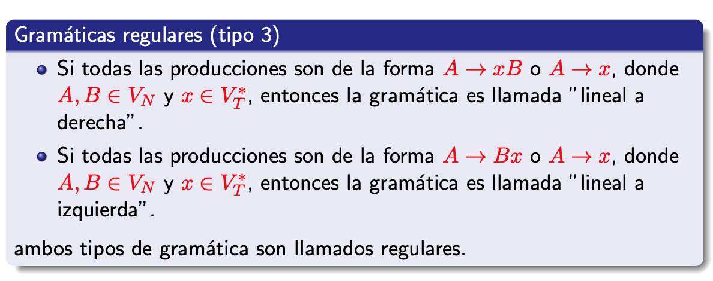
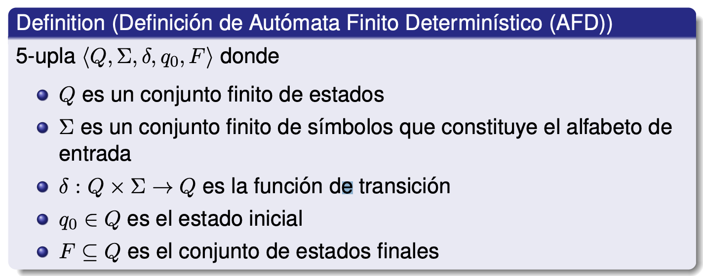
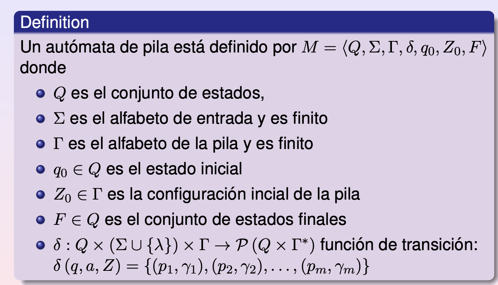

## Definiciones







## Lema de Pumping

Sii un lenguaje es finito (tiene finitas cadenas) todo automata que lo reconoce será acíclico.

Lema de pumping para regulares:

Existe n, para todo w, tq (w in L AND \|w\| >= n) -> Existe x,y,z tq
- w = xyz
- \|xy\| <= n
- \|y\| <= 1
- Para todo i >= 0, xy^iz in L.

Osea existe algun n, tq para todo w en L de longitud al menos n, existe una manera de tomar los primeros hasta n caracteres, tq tomo un sufijo no vacio de ese prefijo, lo pumpeo i veces para i >= 0, y siempre ese pumpeado esta en el lenguaje.

## Equivalencias

Si tengo una **gramatica regular**, existe un **AFND** que genera el mismo lenguaje (es straightforward la conversion).

Si tengo un **AFD**, hay una **gramatica regular** equivalente.

Dada una **expresion regular** r, existe un **AFND-l** M tq #qf = 1, y L(M) = L(r). 

Estas 3 se demuestran por induccion en la longitud de la cadena. En las primeras dos probamos la equivalencia entre As -> wa y d(s, wa) = qf. 
En la tercera vamos por induccion en la longitud de la regex (cantidad de operadores) e induccion estructural.

Ademas, dado un **AFD** existe una **regex** que acepta el mismo lenguaje. 

---

## Propiedades de lenguajes regulares

> Son cerrados en complemento, union e intersección finitas (no infinitas, ver \{ a^kb^k \}).

### Problemas decidibles en lenguajes regulares
- **pertenencia** (dado w, está en L?)
- **vacuidad** (L = {}?)
- **finitud** (#L) 
- **equivalencia** (se resuelve por diferencia de conjuntos, que es regular por lo visto mas arriba).

## Automatas de pila



Aceptación puede ser por estado final (si al terminar de procesar la cadena, llegué a un estado en F, acepto la cadena independientemente del contenido de la pila) o por pila vacía (si al terminar de procesar la cadena la pila está vacía, acepto independientemente de en qué estado estoy).

Para cualquier automata con aceptacion por estado final, podemos facilmente construir uno de aceptación por pila vacia (en todos los estados finales ponemos transicion lambda a un nodo que simpemente desapila todos los elementos hasta vaciar la pila. Inicialmente pusheamos a la pila un caracter distinguido que el automata anterior nunca poppeaba, para evitar vaciar la pila en el medio por error).

Para el otro lado tambien es facil construir un automata de aceptacion por estado partiendo de uno de pila vacia: podemos agregar a todos los nodos una transición si la pila tiene un cierto simbolo distinguido agregado, que lleve a un nuevo nodo final adicionado. Luego al comienzo partimos de un q0' que pushea ese distinguido inicial, entonces corre todo el otro automata, deja la pila vacia salvo por el simbolo nuevo X0, y ahi salta por transición lambda a un Qf que lo poppea y termina.

Las gramaticas libres de contexto pueden modelarse con un automata de pila que acepte el lenguaje que genera. Puede pushear tanto Vn como Vt a la pila, el resto es intuitivo. Tiene un solo nodo q0. 

"Si en el tope de la pila hay un símbolo no-terminal t, el automata lo reemplazará por el lado derecho α de alguna produccion del mismo de tal manera que el símbolo mas a la izquierda en el lado derecho de dicha produccion quede en el tope de la pila. 

Si en el tope de la pila hay un símbolo terminal t, el automata constatara que es igual al próximo símbolo en la cadena de entrada y lo desapilará. 
Este automata acepta L por pila vacía."

### Automata de pila deterministico


Tiene para cada tripla q, a, A de estado, caracter y tope de pila, como mucho una transición posible. Y en particular si tiene transición lambda para un estado y tope, entonces no tiene transición no-lambda.

Si un idioma no es libre de prefijos (x en L entonces xy no en L), entonces todo automata de pila M que acepta L necesariamente será no-deterministico. (Sino, vacio la pila y termino, porque necesito aceptar x, y nunca podria aceptar xy).

### Los APD se tildan?

Un AFD o AFND-l no se puede tildar. En cambio:

La cantidad de transiciones que realiza un AP determinístico no está acotada por el tamaño de la entrada. La ejecución depende no solamente de la entrada sino también del contenido de la pila.

Es posible que un autómata de pila determinístico realice una cantidad infinita de λ-movimientos desde alguna configuración. Decimos que estas configuraciones ciclan.

E.g., dos nodos que se vinculan mutuamente con lambda, uno pushea a si top ==b, el otro pushea b si top ==a.

Formalmente, una configuracion (q, w, α) con \|α\| > 0 cicla si existen infinitas (qi, w, αi) tq \|αi\| >= \|α\|. Osea, infinitas transiciones lambda, que no achican la cadena ni los contenidos de la pila.

Notar que la pila podria crecer indefinidamente, o ciclar entre varias cadenas (e.g. arranca en a, y despues cicla entre abcd y acdb). 
## Gramáticas libres de contexto

Una gramatica G es ambigua si para una cadena w, existen dos árboles de derivación distintos.

Un lenguaje L independiente de contexto es **intrinsecamente ambiguo** si para toda G tq L(G) = L, G es ambigua.

Si una cadena w tiene un árbol de derivación en G tq su altura = h, sea a = max( {\|b\| tq A -> b in P} ), \|w\|<= a^h.

Hay un pumping para indep de contexto. 

Si L1, L2 son indep de contexto, también lo son:
- L1 U L2
- L1L2
- L1+

Sin embargo L1 AND L2 no siempre será indep de contexto. 

Si L1 regular y L2 indep de contexto, entonces L1 AND L2 es indep de contexto.

L1 indep de contexto deterministico, entonces L1^c tambien. Si L1 no-det, entonces L1^c puede ser cualquier cosa.

Llamamos a w **forma sentencial** de G gramática, si G -\*> w. Llamamos a A alcanzable en G si existe una forma sentencial que lo contiene. Llamamos a A activo si existe w tq A =\*> w. 

Una gramática G es reducida si todo no-terminal es alcanzable y activo. Decimos que una gramática es propia si no tiene producciones borradoras (A -> lambda).

**Forma Normal de Chomsky**: si G es una gramática y genera un lenguaje L indep de contexto que no contiene lambda, hay una G' cuyas todas producciones son de la pinta:

`A -> BC | a`

Para A,B,C Vn y a Vt, tq L(G') = L(G).

**Forma normal de Greibach** : Dado un mismo lenguaje (indep de contexto, sin cadena vacia), existe una gramatica que lo genera tq todas sus prod tienen pinta:

`A -> a w`

Tq w in Vn\*, a in Vt.

Existe un lenguaje recursivo, que no es independiente del contexto.

El lenguaje aceptado por una maquina de Turing (que en cada transicion pasa de un estado a otro,y tiene una cinta en la que va leyendo un caracter, escribiendo otro y moviendose a izquierda o derecha a la vez que cambia de estado), es cualquier w tq q0w \|-\* w1 p w2 con p in F y w1, w2 cadenas de gamma. 

Sea M una MT-no-deterministica. Existe una M deterministica que genera el mismo leguaje. Esto se logra probando a fuerza bruta cada una de las posibles combinaciones de transiciones: si cada nodo tiene maximo r salidas, entonces numeramoslas y generamos con eso una secuencia, que luego simulamos. Podemos hacer esto usando 3 cintas (o escribiendo todo en la segunda y leyendo y escribiendo mas adelante a la LyC). 

Si G es gramatica sin restricciones, hay una MT que acepta L(G). 

## Gramaticas

**Tipo 0**: Todas las gramaticas que generan lenguajes recursivamente enumerables (reconocibles por una turing machine, pero que puede devolver false o loopear cuando no pertenece). Son todas las gramaticas formales.

**Tipo 1**: Lenguajes dependientes del contexto. Las reglas son w -> v tq \|w\|\<=\|v\|. Todos los lenguajes generados por automatas linealmente acotados: máquinas de Turing deterministicas cuya cinta de memoria es acotada por un multiplo de la longitud de la entrada. (memoria lineal en el tamaño de la entrada).

Reconocer una cadena de este lenguaje es PSPACE-complete.

**Tipo 2**: Gramáticas independientes del contexto. Todas sus reglas son de forma A -> w. A no terminal, w una cadena cualquiera. Generan todos los lenguajes aceptados por un autómata de pila. 

Pueden ser lenguajes aceptados por un automata de pila determinístico o no-determinístico. Si pertenecen al primer tipo, pueden ser reconocidos en tiempo lineal en el tamaño de la entrada, y se llaman lenguajes LR. Un subconjunto de los LR son los lenguajes LL (que tienen gramaticas LL). 
Por ultimo, los lenguajes libres de contexto no determinísticos tienen un algoritmo que los reconoce en tiempo cúbico. 

**Tipo 3** : Gramáticas regulares. Las reglas son de la forma A -> aB o A -> a, con A, B no-terminales y a un terminal. Estas gramáticas generan todos los lenguajes aceptados por un automata determinístico finito. Los llamamos lenguajes regulares. Pueden definirse por expresiones regulares.

Ver si una cadena pertenece o no a un lenguaje regular es lineal en el tamaño de la entrada, usando un automata finito (vemos si la cadena termina llevando a un estado final o no). 

> El problema de decidir si una gramática libre de contexto es ambigua no es decidible.

**Lenguaje inherentemente ambiguo**: Toda gramática que lo genera es ambigua (tiene una cadena que tiene mas de una derivación a izquierda). 

Dada una gramática ambigua, podemos intentar cambiar la gramática, o descartar árboles de derivación dando reglas de precedencia. 

**Gramáticas recursivas a izquierda** : Una gramática es recursiva a izquierda si tiene un no-terminal A tq A =\+> Aw para w alguna cadena de terminales y no terminales. Puede ser inmediatamente recursiva a izquierda (e.g., tiene A -> Ab) o no (A -> Bc. B -> Ad).

> Todo lenguaje libre de contexto tiene una gramática que no es recursiva a izquierda.

**Gramática sin ciclos**: Una gramática es libre de ciclos si no hay un no-terminal A tq A =\*> A. 

En las libres de contexto, los ciclos surgen por A -> lambda, o A -> B tq B otro no-terminal. Pueden remediarse con algoritmos de eliminación de la recursión. 

Hay un algoritmo de eliminacion de la recursion a fuerza bruta (por cada simbolo no terminal, si tiene una produccion que empieza con otro no terminal, lo cambio por todas las producciones de ese otro y elimino esa - A -> B, B -> a entonces cambio por A -> a). Pero esto en el peor escenario agrega (\|P\|/n)^n producciones nuevas, explotando exponencialmente.

## Gramaticas LL y LR

Las gramaticas libres de contexto que generan lenguajes que pueden analizarse sintacticamente en manera deterministica en tiempo lineal en el tamaño de la entrada, pueden ser LL o LR. Ambas se leen de izquierda a derecha, la primera usando leftmost derivation, la segunda rightmost derivation.

### Gramáticas LL

Una gramática es LL si es LL(k) para algun k >=1. 

Las LL(k) son libres de contexto, no-ambiguas, para las cuales la derivación más a la izquierda está determinada por los simbolos ya leidos, y k simbolos mas.
El parsing es top-down, yendo de S a la cadena paso a paso de derivación.

Si w in L(G) tq w = a1...an y S = w0 y w\_m = w, wi -L> wi+1, entonces la secuencia w0...wm es el parsing de w a izquierda. 

Una gramatica LL(k) cumple wi = a1...ajAv entonces wi+1 es determinable conociendo a[1:j+k].

Dado w in (Vt U Vn)\*

Primeros\_k(w) = conjunto de prefijos de k caracteres de todas las cadenas de terminales que pueden formarse desde w  (w =\*> zv tq \|z\|<=k).

Una gramatica LL(k) cumple que si tengo S => wAv => wuv => wx y S => wAv => wu'v => wy, y primeros\_k(x) =primeros\_k(y) entonces u==u'.

Osea: si tengo dos cadenas que empiezan igual, tienen a la mas izquierda al mismo no-terminal, y terminan en dos cadenas que comparten los primeros k caractres (+ el prefijo compartido) entonces ese mismo no-terminal tiene que haber mutado a la misma cadena en su derivación mas a la izquierda.

> Una gramática G libre de contexto es LLk sii para todo wAv tq S =\*\>L wAv y todo par de producciones A -> u y A -> u', u!=u', primeros\_k(uv) AND primeros\_k(u'v) == {}. 


**Simbolos directrices (SD)** : SD(A -> v) : primeros(v) si v no anulable; primeros(v) U siguientes(A) si v es anulable.

> Una gramática libre de contexto G es LL(1) sii para cada A, a hay a lo sumo una unica producción tq A -> v y a in SD(A -> v).

Osea, por cada no-terminal A, puede tener una sola producción tq su SD sea cada caracter terminal.

Toda gramatica LL(1) **no es recursiva a izquierda**. Además, toda gramática LL(k) es no-ambigua.

## Gramáticas LR(k)

Las gramáticas LR(k), con k un número entero mayor o igual que 0, son gramáticas libres de contexto no ambiguas para las cuales dada una expresión del lenguaje se puede encontrar su derivación más a la derecha de manera “bottom-up”, de modo tal que en cada paso de la derivación está determinada por los símbolos ya leídos de la cadena de entrada y k símbolos más.

**Definicion**


LR(k) -> LR(k+1). Lo opuesto no es cierto.

Toda gramatica LR es no ambigua. LL C LR. 

Un lenguaje es **reconocible con automata de pila deterministico sii es un lenguaje LR(1)**.

Para toda gramatica LR(k), k >= 0, G, hay una gramática G' LR(1) tq L(G) = L(G'). 

## Parsing LL(1)

Para parsear un lenguaje LL(1) dada su gramatica G:

- generamos la tabla LL(1): Esta tabla tiene Vn en filas, Vt en columnas, y M(A,a) = A -> v tq SD(A -> v) == a. Este elemento, si existe es unico, o el lenguaje no seria LL(1). Si no existe, dictará cadenas no aceptadas.
- Una vez hecha la tabla, tenemos una pila que arranca con $S y la cadena en una queue. Vamos desapilando de a un caracter y:
- Si es un No-terminal, miramos el frente de la queue y buscamos M(A,a). Luego apilamos en orden inverso el RHS de la produccion correspondiente.
- Si es un terminal, comparo con el tope de la queue. Si matchean, desencolo y desapilo. Si no matchean, raise ValueError().
- Repito hasta que tope de pila == $. Ahi devuelvo True.

El runtime es O(n) donde n es \|w\| ya que por cada caracter de la cadena, a lo sumo pasamos L^k veces por transformaciones antes de matchearlo, donde L es el maximo size de una RHS de produccion, y k = \|Vn\|.

## Parsing LR(1)

> G es LR(k), k>=0, Hay G' tq G' es LR(1) y L(G') == L(G).

> Los lenguajes LR(1) son los reconocibles por automatas de pila deterministicos.

**Reducción** : Si αAw =\> αβw, entonces decimos que αβw puede ser reducida usando la producción (A -> β) a αAw.

**Pivote** : Si αAw =\> αβw, el pivote es el par (A -> β), \|α\|+1. Te dice, dado auw, donde ubicarte y qué prod usar para revertir la ultima transformación más a la derecha. 

> *La técnica de parsing determinista “bottom up” que opera linealmente consiste en identificar unívocamente el pivote y hacer una reducción.*

**Prefijo viable**: Si αAw =\> αβw, todo prefijo de αβ es un prefijo viable de la gramática G. En general, un prefijo es viable si no va mas alla del extremo derecho del pivote. (que es UNICO por cadena, o no sería LR!).

El algoritmo de parsing es, dada una cadena:

- Busco el pivote, hago reduccion. loop.

En más palabras: voy apilando caracteres a una pila y viendo, cada vez, por cada sufijo del contenido de la pila si es una RHS de una prod. Si lo es, es la prod que quiero y reduzco. Si no lo es, sigo apilando. Sigo reduciendo hasta volver a S'.

> El conjunto de prefijos viables de una gramática LR(k) es regular.

**item**: Un item de una gramatica LR(k) es una produccion, un . a la derecha y una cadena de terminales de longitud <=k.

**Item válido LR(k)**: Fijemos una gramática G = (N,T,P,S) libre de contexto. 
Supongamos A → αβ ∈ P. Un item [A → α.β, u], con u ∈ T\* y |u| ≤ k, es un item LR(k) válido para el prefijo viable ηα, si existe una derivación a derecha tq
- S =\> ηAw =\> ηαβw. 
- u ∈ primeros\_k(w)

Si el lenguaje es LR(0), obviamos la segunda condición. Notar que si voy moviendo el punto, tengo 1 prefijo viable por cada posicion, entonces para A -> αβ voy teniendo \|αβ\| prefijos viables por cada η.

Para parsear una cadena LR(1) primero construimos un AFND-lambda que acepta el lenguaje de **prefijos viables** de G. Este se comporta tq q0 = [S' -> .S, $], y hacemos la clausura lambda (que es agregar todos los [A -> .u, $] si S -> A). Y despues d([A -> α.Xβ, u], X) = [A -> αX.β, u], pero ademas hacemos clausura lambda de ambos lados!

Este automata te genera los prefijos viables de G (todos los qi son finales).
(d(q0, g) = q = [A -> α.Xβ, u] =\> g = ηα un prefijo viable.

Para parsear agregamos un M' automata de prefijos viables, pero tambien una tabla de accion (desplazar q, reducir A -> β, Aceptar, Error). 

La tabla ACCION toma un estado y un terminal, y se define:
- if [A -> α.aβ, b] en qi, con a ∈ T y IR(qi, a) = qj => ACCION(qi, a) = *desplazar qj*.
- if [A -> α., a] en qi y A != S' con a ∈ T U {$} => ACCION(qi, a) = *Reducir A → α*.
- if [S' -> S., $] en qi  => ACCION(qi, $) = *Aceptar*.
- Else: Accion(qi, $) = **Error**.

El algoritmo de parsing LR(1) es : 
- Pila = q0, sea q estado en tope de pila y a el primer caracter apuntado del input (el pointer arranca en 0).
- Loop hasta Accion(q, a) in {Accept, Error}
- if [ACCION(q, a) = Desplazar p] : push a, push p, pointer++.
- if [ACCION(q, a) = Reducir A -> α] : pop \|α\| times. Let p = tope de pila. push A, push IR(p, A) -como IR es d, esto solo settea el proximo estado!-. Print(A -> α).

> Para todo autómata de pila determinístico, hay otro P' tq L(P) = L(P') pero P' no tiene configuraciones que ciclen. 

El algoritmo tiene complejidad lineal en el tamaño de entrada. Podemos asignar a una configuracion una funcion V(C) = \|pila\| + 2\*(\|w\| - i) donde i es mi posicion actual de la cadena w input.

Luego cada transición o bien el valor baja 2 (porque comió un caracter de la cadena), o baja >=1 si reduje, o mas. Entonces si mi input tiene n caracteres, mi peor escenario es pasar por como mucho 2\*n configuraciones. Como las LR no son ambiguas (ergo no tienen ciclos), mi automata de pila no va a ciclar infinitamente (no hay derivacion a derecha arbitrariamente larga). Hay una cota a cuantas operaciones puede hacer el automata de pila antes de cambiar de configuracion, y eso lo multiplicamos por n y ganamos. Entonces es lineal.

## Gramaticas con Atributos

Una gramática de atributos es una tupla (G, A, V, R) donde G es una gramatica (libre de contexto, no ambigua, sin Vn no alcanzables), A conjunto de atributos (A(X) es el cjto de atributos de X en NUT), V los dominios de los valores y R el conjunto de reglas asociadas a una produccion+atributo.

Un atributo X.a es sintetizado si hay una producción p : X -> α y una regla para p donde ocurre X.a. Un atributo X.a es heredado si hay una producción p : Y -> αXβ y una regla para p donde ocurre X.a.

Start no puede tener heredados. 

Dado el árbol de derivación, el valor de un atributo sintetizado en un nodo se obtiene de los nodos hijos, y el valor de un atributo heredado en un nodo se obtiene del nodo padre o de los nodos hermanos.

**Semantica de una cadena** : Dada una cadena α, y una gramatica GA, el significado de α en L(G) es el conjunto de valores de A(S). Esto es el conjunto de valores que toma el simbolo start S. 

El orden de evaluación, si existe, queda parcialmente determinado por las dependencias entre los atributos. Si hay dependencias circulares, la evaluación podría no ser posible. Para esto construimos un **grafo de dependencias** de una **produccion** tq si una regla define a en función de b, decimos Xi.b -> Xi.a. 

Llamamos **arbol atribuido** al arbol de derivación con etiquetas para atributos de A. 

**Grafo de dependencias**: Para cada produccion p, damos un grafo DP(p) de dependencias. Luego el de un arbol atribuido se forma mediante la composición de grafos de dependencias DP(p) para todo p.

**Gramática de Atributos Circular**: una GA será circular si su grafo de dependencias lo es.

**Gramática bien definida**: Una GA está bien definida si no tiene ninguna forma sentencial con atributos que dependan circularmente de si mismos.

**Orden topológico de un grafo**: Todos los nodos aparecen exactamente una vez, y si (u, v) en G entonces u aparece antes que v. (Vamos de los source a los sink).

> Una gramática GA está bien definida si todo orden topológico de su grafo de dependencias es orden de evaluación consistente con las dependencias.


**GA Completa**: 
- Para toda producción p, A -> αXß, todos los atributos heredados de X se definen en p.
- Para toda producción p, A -> α, todos los atributos sintetizados de A se definen en p.

A fin de cuentas, completa sii todos los atributos heredados y sintetizados definibles se definen.

GA Completa AND DP(GA) aciclico -> GA bien definida.

Para testear si GA tiene un grafo de dependencias ciclico:
- Generamos G'
- Generamos sus producciones
- Vemos la admisibilidad de las producciones revisando el grafo de dependencias de G.
- Quitamos de G' las producciones inutiles (las que no generan terminales desde start)
- Si en G' hay una **producción que es un arco admisible**^^, contestar G es circular. Sino, contestar GA bien formada.

Si GA es bien definida, podemos generar GA' tq todos sus atributos son sintetizados.

X → αtY Y → βZγ

**Gramaticas s-atribuidas**: Una gramatica s-atribuida no tiene atributos heredados, y el grafo de dependencias directas de cada prod p es acíclico. Pueden evaluarse en un solo recorrido ascendente.

**Gramática l-atribuida**: 1-pass grammar. X -> X1X2X3...Xn => si (Xi.a, Xj.b) en grafo de dependencias, i < j. Y el grafo es acíclico.


## Ultimas 2 clases

- Hay un algoritmo para pasar cualquier gramática G libre de contexto a forma normal de Chomsky.

Por cada producción de forma A -> a o A -> BC la dejo como está. Si es A -> X1X2 tq X1 o X2 en T, genero A -> X1'X2'. Si A -> X1...Xk la desenvuelvo:
- A -> X1'\<X2...Xk>
- \<X2...Xk> -> X2'\<X3...Xk>

Finalmente, si Xi es un T entonces Xi' -> Xi. Si Xi en Vn, reemplazo Xi' por Xi.

Notar que \|N'\| <= \|N\| + \|T\| + l \* \|P\| donde l es la máxima longitud de un RHS.

La cantidad de operaciones es lineal en P.

### Cocke Younger-Kasami (CYK)

Construyo tabla T tq Tij = { A tq A =+\> ai...ai+j-1 }. Osea todos los no-terminales que derivan ai...ai+j-1. (La tabla se indefine si i+j-1 > n).

Luego w en L(G) sii S en T1,n.

Para construir la tabla de CYK:

- Partimos de G una gramatica en forma normal de Chomsky sin lambda producciones, y con w como cadena de input.

Definimos ti, 1 = {A : A -> ai en P}, para i in 1...n.

Una vez computados ti,j' para i en 1...n y j' en 1...j-1, definimos:

tij = {A : A -> BC en P, y para algun k, 1 <= k < j, B en tik y C en ti+k,j-k}

Notar que tik y ti+k,j-k se computan antes. (Es un Floyd's Algorithm de derivaciones!).

Complejidad para construir la tabla en cadena de n caracteres es n^3. Se hace como reconstruir un camino con el Floyd's Algo.

(Pido gen(1, n, S) y en general gen(i, j, A) es A -> wi si A -> wi es una produccion, sino por cada k entre i, i+j pruebo si hay una prod A -> BC tq B in ti,k, C in ti+k,j y devuelvo esa y llamo a ambos gen.)

### Parsing de Earley

Un item de Earley para G, w es [A -> X1X2...Xk·Xk+1...Xm, i] tq i entre 1...\|w\| y A -> X1...Xm en P. 

Construimos las listas de items l1...ln tq [A ->  α·β, i] ∈ j sii para algún γ y δ S
- S =\*> γAδ, 
- γ =\*> a1 . . . ai 
- α =\*> ai+1 . . . aj 

Osea: el item [A ->  α·β, i] en lj se lee "puedo generar hasta w[:i], luego una A, y α genera w[i:j]. 

En particular si [A -> α., 0] está en lj, ganamos (w in L(G)).

El algoritmo de Earley genera las listas li. En 6 pasos.

- Si S -> α, agregar [S -> ·α, 0] a l0.
- Si [A -> α · Bβ, 0] ∈ l0 y [B → γ·, 0] ∈ l0 (en particular γ puede ser λ) entonces agregar a l0, [A -> αB · β, 0]. (Agrego no terminales que no aportan, adelantando el puntito).
- Si [A → α·Bβ, 0] ∈ l0, agregar a l0 para toda B → γ en P, (si es que aún no está), [B → ·γ, 0]. (Clausura lambda!)
- Supongamos que ya hemos construido l0, . . . lj−1. Si [B → α·aBβ, i] en lj−1 tal que a = aj, agregar a lj [B -> αa · β, i]. (adelantar el puntito trivial)
- Paso 5 Si [B -> α · Aβ, k] ∈ li y [A -> γ·, i] ∈ lj , agregar a lj [B → αA · β, k]. (ahi sale el Floyd).
- Si [A → α · Bβ, i] ∈ lj , agregar a lj , para todo B → γ en P, [B → ·γ, j].

Si la gramatica es no ambigua, la construcción de las listas es n^2 en tiempo, si n == \|w\|.

Luego, la derivación mas a la derecha se encuentra en tiempo cuadratico, haciendo lookups en la tabla de listas (Hacemos R([A -> X1...Xk., 0], n) partiendo de ln y vamos moviendo el puntero j a la izquierda si es un terminal, o hallando items tq forman substrings de w si no. 
- Encontrar un item [Xk -> γ·, i'] en lj' para algun i' tq [A -> X1...Xk-1 · Xk...Xm, i] en li'. Luego ejecutar R([Xk -> γ·, i'], j'). Luego k--, j' = i'.

El algoritmo es cuadratico porque, a fin de cuentas, a lo sumo pasa una cantidad constante de veces por cada i', j' (\|P\|\*M donde M es máx size de RHS).

## DFA (AFD) minimization
Tengo un AFD y lo quiero convertir en uno equivalente que tenga el minimo numero de estados.

Primero removemos estados redundantes:
- Removemos unreachable states (estados inalcanzables desde S).
- Removemos estados muertos (los que no pueden alcanzar un estado final bajo ninguna configuracion).
- Nondistinguishable states son los que no pueden distinguirse entre si para ningun input. Tambien son removibles.

Normalmente armar al automata se hace en 2 pasos:
- Remover redundantes
- Mergear indistinguibles

El estado qi es inalcanzable si no existe w tq d(q0, w) = qi. 

Los reachable salen facil: comenzas por q0 y, por cada estado en la frontera, por cada simbolo, agregas todos los adyacentes. Luego esos son tu frontera, los agregas a reachable y repetis. Luego los nuevos son la frontera, etc. 

Dos estados p, q son indistinguibles si para toda cadena w, d(p, w) in F sii d(q, w) in F. Ademas si dos estados son indistinguibles, todos los alcanzables desde ellos tambien lo seran. 

Para particionar los estados de un AFD por clase de distinguibilidad (y luego crear el AFD minimo) partimos con {F, ¬F} y hacemos

``` 
for each X in P:
        for each e in X such that ¬marked(e): 
            X' = {e}
            for each e' in X:
                if [d(e',a)]==[d(e,a)] for every a in alphabet:
                    X' += {e'}
                    (mark(e'))
            X -= X';
            P+=X;
repeat until convergence;
```
.
## Preguntas
.
- Algoritmo para ver si dos AFD reconocen el mismo lenguaje (o si un lenguaje regular es finito) √ 
- Ver que dada una gramatica con atributos puede crearse una con todos sus atributos sintetizados ~
- Ver que si tengo un automata de pila deterministico con ciclos, se puede generar uno que reconozca el mismo lenguaje sin ciclos ~
- Enunciar (no demostrar) pumping para lenguajes libres de contexto. 
- repasar automata de pila no-det. cuantos posibles hay dado un alfabeto de simbolos? 
- repasar estos: <https://www.cubawiki.com.ar/index.php/Finales_Virtuales_Tleng:_Diciembre_de_2020>
