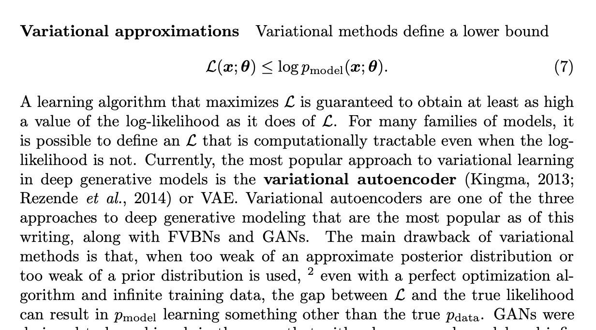
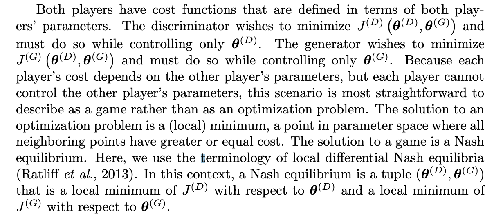
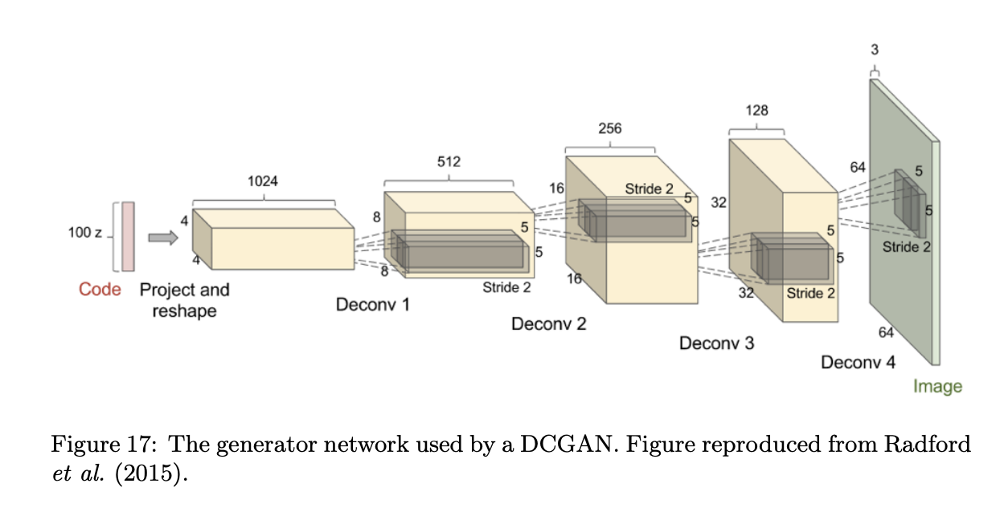

## Resources I already read
[DC-GAN TensorFlow tutorial (it works fine) with MNIST](https://www.tensorflow.org/tutorials/generative/dcgan)

## Reading
[Goodfellow GAN Survey 2016 NIPS](https://arxiv.org/pdf/1701.00160.pdf)

GANs were designed to be unbiased, in the sense that with a large enough model and infinite data, the Nash equilibrium for a GAN game corresponds to recovering pdata exactly. In practice, variational methods often obtain very good likelihood, but are regarded as producing lower quality samples. There is not a good method of quantitatively measuring sample quality, so this is a subjective opinion, not an empirical fact."

In summary, GANs were designed to avoid many disadvantages associated with other generative models:
- They can generate samples in parallel, instead of using runtime proportional to the dimensionality of x. This is an advantage relative to FVBNs.
- The design of the generator function has very few restrictions. This is an advantage relative to Boltzmann machines, for which few probability distributions admit tractable Markov chain sampling, and relative to nonlinear ICA, for which the generator must be invertible and the latent code z must have the same dimension as the samples x.
- No Markov chains are needed. This is an advantage relative to Boltzmann machines and GSNs.
- No variational bound is needed, and specific model families usable within the GAN framework are already known to be universal approximators, so GANs are already known to be asymptotically consistent. Some VAEs are conjectured to be asymptotically consistent, but this is not yet proven.
- GANs are subjectively regarded as producing better samples than other methods.

At the same time, GANs have taken on a new disadvantage: training them requires finding the Nash equilibrium of a game, which is a more difficult problem
than optimizing an objective function.

"we can also think of them as
cooperative, in the sense that the discriminator estimates this ratio of densities
and then freely shares this information with the generator. From this point of
view, the discriminator is more like a teacher instructing the generator in how
to improve than an adversary. So far, this cooperative view has not led to any
particular change in the development of the mathematics."

## Read Later
[Survey on Computer Vision (1 decade later)](https://www.gwern.net/docs/ai/2008-golle.pdf)

[Diffusion models beat GANs](https://arxiv.org/abs/2105.05233#openai)

[Diffusion models intro](https://yang-song.github.io/blog/2021/score/)

[BigGAN](https://arxiv.org/abs/1809.11096#deepmind)
