Deep Learning + NLP
_Based on the Stanford MOOC_
[http://web.stanford.edu/class/cs224n/index.html](http://web.stanford.edu/class/cs224n/index.html#schedule) # Syllabus
## Word2Vec

Word2Vec optimizes for dot product between similar words (softmax(UWi)).

But you can also make it sigmoid(WiUj) for each word, for each context embedding Uj in a window, and then that + sigmoid(-WiUk) for k chosen randomly. Similar to a Boltzmann Machine’s unlearning, in a way.

Hyperparam magics: performance plateaus at d=300 (but doesn’t fall apart, even at 10k!! -nips, 2018-). Seems to have something to do with PCA.

Then another thing: data quality matters like crazy. Model with "small" Wikipedia dataset outperforms model with BIG news scraped dataset.

Evaluating Word Embeddings: You can evaluate analogies (with accuracy over premade datasets, using semantic or syntactic analogy), or cosine distance/similarity vs psych-undergrad-driven mechanical turk similarity.

## Language Modeling:
Train a model to predict the t+1th word based on the previous n words.

**Fixed-window:**

predict using the previous fixed k words. E.g., use a Markov chain or a co-occurrence matrix. You can train a fully connected MLP using one-hot encoding of the words (super sparse vectors as inputs -actually passed as indices in any sane implementation-).

**Insight:**

Semantically similar words should produce similar "next word" distributions, but normal window models don’t leverage that! Let’s add some embeddings into the mix.

**Arbitrary length window:** 

Train an RNN. This means divide your dataset into sequences (usually sentences, paragraphs, or whole texts from your corpus).
For every sequence, you initialize a hidden state h with zeroes (or a reasonable prior). You take each i-th word in order, get its embedding, concat that with h, make that go through an affine layer, plus bias, and use that to predict the i+1-th word (through your typical affine + softmax layer). After doing this for every word in your batch, you backpropagate the binary cross entropy loss of the generated probabilities, for every word, and thus get a better W matrix for both the hidden state and the embeddings (you can train h0 too. You could also train the embeddings if your corpus was large enough).

**Perplexity:**

Defined as the inverse of the probability of the corpus, normalized by ^1/N. Another way to look at it: take the geometric average of the inverse probability your model gives to each t+1-th word, given the previous t of them.
GPT-3 gets about 20 as a perplexity value (so mean probability is about .05. Not bad).

**Vanishing vs Exploding Gradient:**

The gradient for the t-th word is the productorial of the gradients of the previous t-1 words, which means if the norm of the Jacobian is <1 then it will be exponentially small on the amount of words, and the opposite will happen for a Jacobian >1.
This means a word a few spaces in the future, won’t make a big enough impact in decisions in the past.
We solve exploding gradients with clipping gradient: if gradient norm > e, then scale it down to norm e, for e a hyperparameter.

To solve vanishing gradients, two architectures were invented: LSTM and GRU, which is just a streamlined LSTM (a few less gates, converges faster and has less parameters). They usually perform similarly, or LSTM a bit better since it has more parameters.

**LSTM**
LSTMs have Cell States aside from hidden states, and they save information in the cell state and decide which parts to pass along with hidden states.
They have forget, input and output gates, each a sigmoid of an affine transformation of the concatenation of the inputs (for word t) and the hidden state (t-1).
You make your cell state^ be tanh(another affine transform from input and hidden state t-1).
Then your actual cell state is input gate * that cell state + forget gate * last cell state.
Finally, you update your hidden state as output_gate * tanh( cell).

{: style="height:70%; width:70%"}

**GRU**
They work similarly, but have less gates. Instead of output gate and tanh of cell, you just make a convex sum between update gate times previous hidden state, and 1- update gate times tanh of affine of inputs + hidden state t-1 (times a reset_gate that’s kinda like a forget gate).

{: style="height:70%; width:70%"}

## Seq2Seq for Neural Machine Translation

{: style="height:70%; width:70%"}

{: style="height:70%; width:70%"}

{: style="height:70%; width:70%"}

{: style="height:70%; width:70%"}

You train an encoder RNN (With the usual chirimbolos: Word Embeddings, usually you could use an LSTM or GRU etc.) on the source language, and then train a different decoder RNN that has as its starting hidden state not a random or 0s vector, but the hidden state for the last word in the source sentence.
It then has to generate all the words in the target sentence. You backpropagate the error in each word using cross entropy on softmax (with the same tricks you used for, say, word embeddings for the big vocab size).

{: style="height:70%; width:70%"}

On the feedforward/test phase, you can sample the most likely word every time (greedy approach) or sample the top k most likely words, then keep expanding the top k most likely sequences of words, always stopping whenever you reach an end of sentence token.

Since log likelihood necessarily decreases as more words are added, and the most likely sentence ever is just empty sentence, you normalize sentences by 1/N for N size of sentence in words, to get a normalized score and not penalize long sentences.

{: style="height:70%; width:70%"}

But how do we solve for the fact that the last hidden state may not contain all the information, especially from words far away in the beginning of the sentence?

{: style="height:70%; width:70%"}

We add attention! Here’s how it works:
* You take the hidden state for your i-th word on the target sentence.
* Take dot product with each hidden state on the source sentence.
* Take vector of inner products (they’re each a scalar) and do softmax on it. You now have a probability (attention) distribution.
* Take the convex sum of encoder hidden states weighted by the attention each one gets. Concatenate that with the decoder hidden state and use that for the affine layer before softmax.
It can also get more general: instead of convex sum of dot products, you could do dot product between the states and a matrix in the middle, or do crazy things with tanh and a different vector for attention allocation.

{: style="height:70%; width:70%"}

{: style="height:70%; width:70%"}

## Question Answering.

A few quotes I liked:

"A lot of the last two years of NLP can be summed up as "people have found a lot of clever ways to use attention and that’s been pairing just about all the advances." "

"Many times in research, you get the best performance with a simple model, then over time people come up with more complex architectures and they perform even better, and eventually someone realizes if you tune the parameters for the simpler model just right you can beat them again." [paraphrased by me]

### Question Answering definition

In question answering we provide a passage and a question, and the model needs to select a substring of the passage that answers the question. This means we cannot answer yes or no questions, counting questions, etc.

Biggest datasets are made with mechanical turk + carefully selected rather simple texts. Most famous one is SQuAD. F1 score is usually the reported metric, where you look for precision+fpr of words vs mechanical turk answers.

Models were bad at noticing if no answer was present, until researchers came up with a solution to that (either use a threshold, or get a "noAnswer" token for answers.)

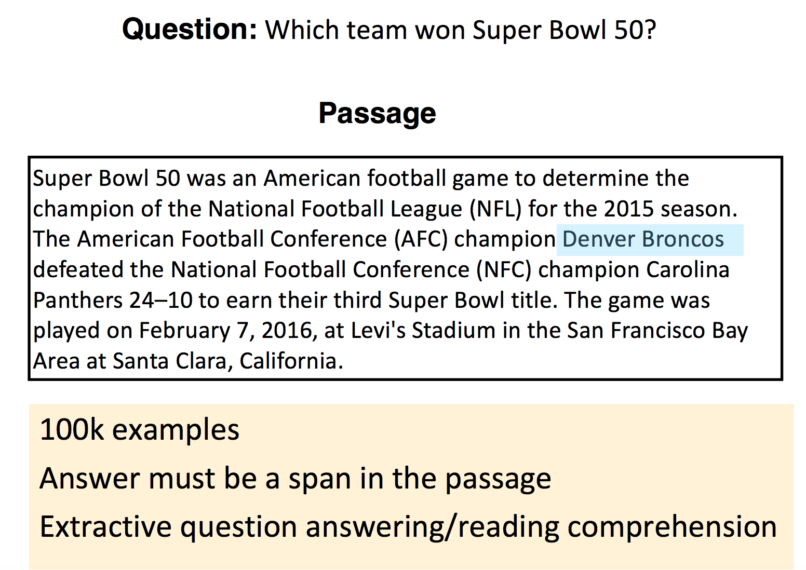{: style="height:70%; width:70%"}
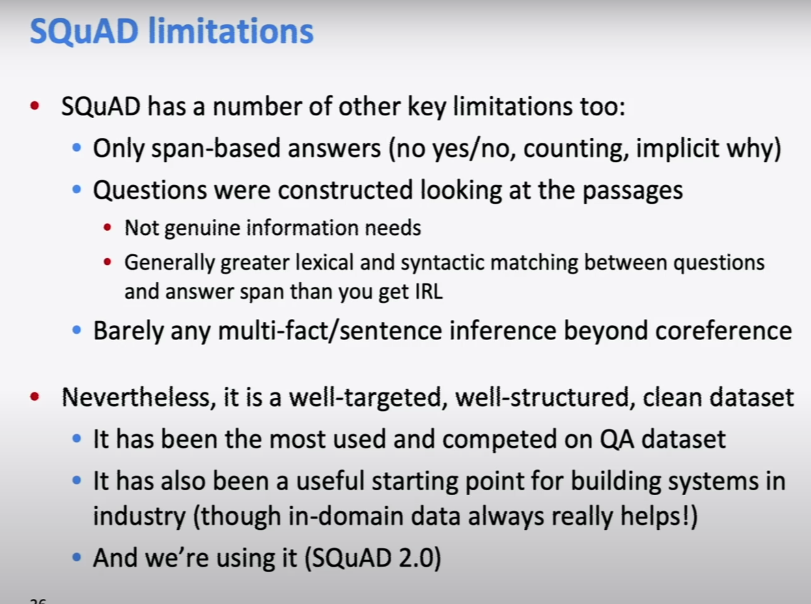{: style="height:70%; width:70%"}

### Stanford attentive reader

This model beats traditional (non-neural) NLP models by a factor of almost 30 F1 points in SQuAD. It loses to BERT &c. But it's kind of simple.

- Feed the Question through a bi-directional LSTM with word embeddings. 
- Concatenate both end states (one for each network, so one for first word of reverse and one for last of right way).
- Feed another LSTM bidirectionally and with word embeddings, this time on the passage.
- We use attention to find where the answer is. What we do is work out an attention score between question vector and passage states for each word, and use that to define a start and end word for the substring. 

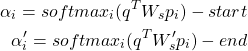

You may say we're missing the information about words in the middle, but actually we're training the LSTM to push that information to the edges (and this is bidirectional so it works both ways).

Here's what we actually gained by using neural networks:

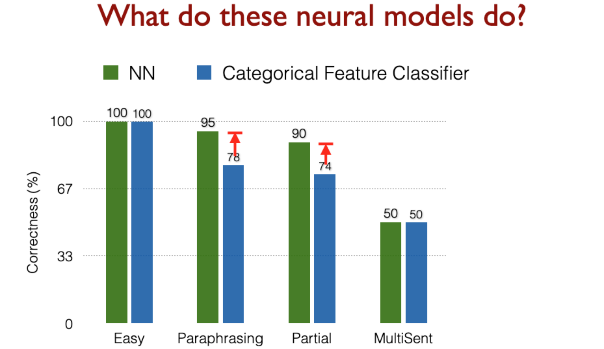{: style="height:70%; width:70%"}

### BiDAF

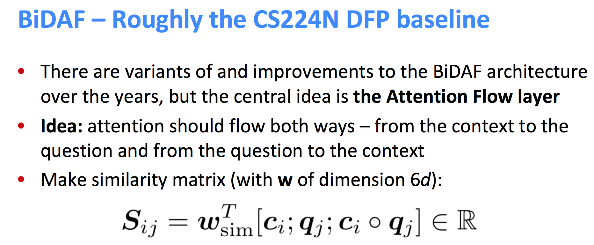{: style="height:70%; width:70%"}
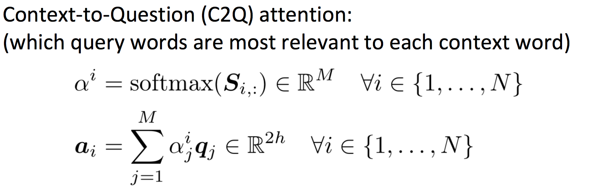{: style="height:70%; width:70%"}
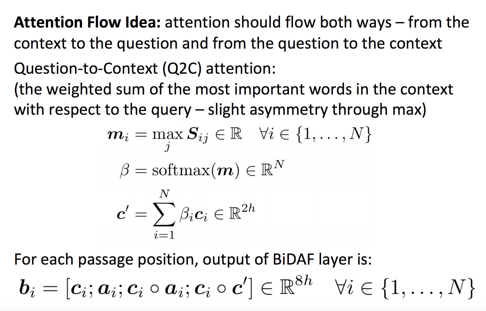{: style="height:70%; width:70%"}
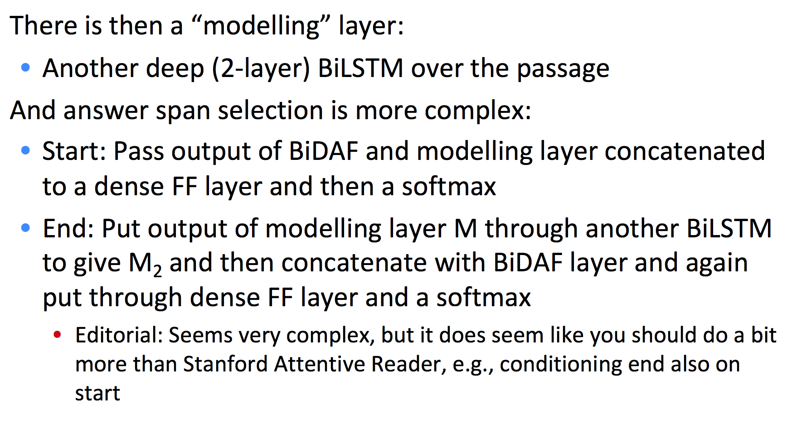{: style="height:70%; width:70%"}

## Subword Models

### Character-Level Models

Word embeddings can be composed from character embeddings:

* Generates **embeddings for unknown words**. 
* Similar spellings share similar embeddings. 
* Solves **OOV problem** (usually you'll keep your word embeddings, and use average of character embeddings when OOV.

**Connected language** (such as Japanese) can be processed as characters.

Both methods have proven to work very successfully!

A seq2seq on character-level using LSTM was tested for Czech-English NMT. It slightly beat a baseline of word-level LSTM. 

Char-level works especially well on connected and agglutinative languages, but it's mega slow -3 weeks to train back in 2018-.

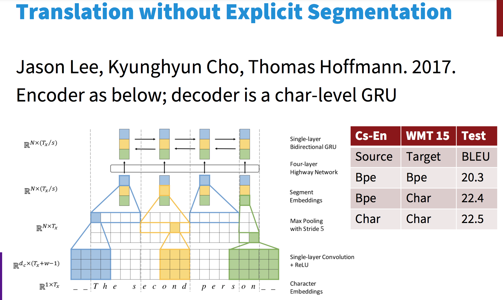{: style="height:70%; width:70%"}

Two trends appear:

* **Hybrid models**: word-level model that defaults to char-level for unks.
* **Same architecture** as a word-level model, but with **char or word-piece embeddings**.

BERT uses a variant of the wordpiece model 

* (Relatively) common words are in the vocabulary:  at, fairfax, 1910s.
* Other words are built from wordpieces:

hypatia = h ##yp ##ati ##a 

*  If you’re using BERT in an otherwise word based model, you have to deal with this.

### Highway Network (2015)

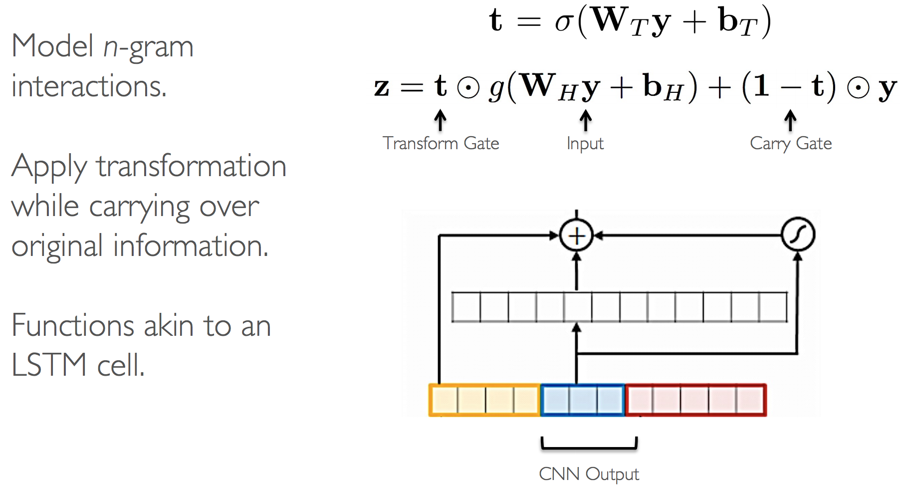{: style="height:70%; width:70%"}

### Character level language model (2015, more complex)

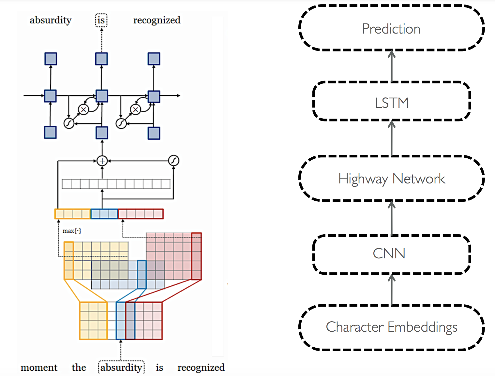{: style="height:70%; width:70%"}

Almost reached SOTA, and also understood semantics of transformed words -good vs gooood-.

### Char-level word representations

Run bidirectional LSTM on both directions over characters of a word, concat both final hidden states as new representation.

### Hybrid NMT

* 2- stage decoding: use aggregated char-embeddings when decoding UNK.
* bidirectional LSTMs, 8 stacks.

# tmp

## Contextual Word Representations: ELMo, Bert, etc.

Word embeddings are the basis of deep learning for NLP.

**Problem**: Word embeddings are applied in a **context free manner**

**Solution**: Train **contextual representations** on text corpus.

We sort of did this with hidden states on RNNs/LSTMs: their values depend on previously seen words (or seen in the future).

### TagLM

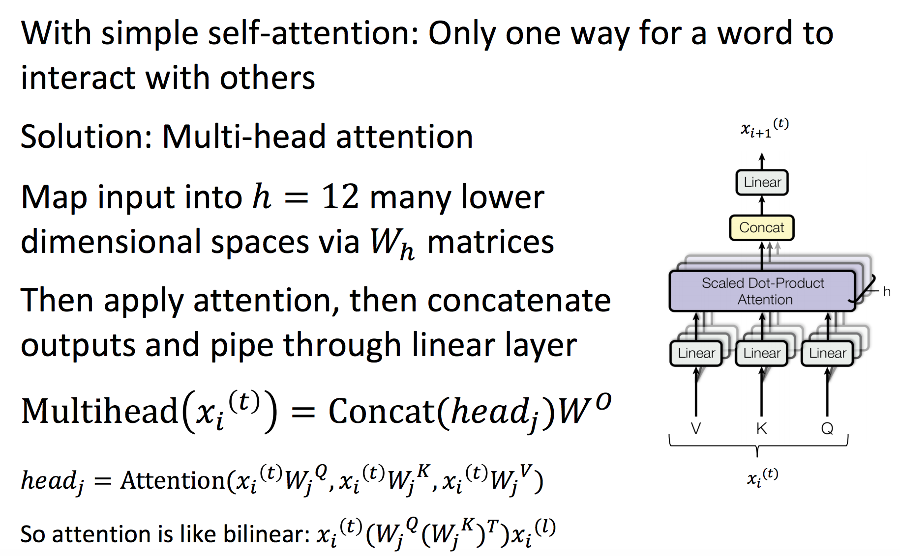

Train a separate Language Model in an unsupervised manner, which allows you to use a huge corpus (say, Wikipedia). Also derive your word embeddings from it.

Then feed to your main model both a char-RNN rep'n, a word embedding and, after going through a bi-directional LSTM, concatenate hidden states with the concatenated hidden states of the (now pre-trained and frozen) language model.

This beat SOTA by a narrow margin (0.3) but it was a much simpler model than the competition. 

### ELMo

ELMo beat SOTA in a wide range of tasks by a big margin, whereas most academics work all year to beat SOTA on a single task by about 1%. 

This was ground-breaking, and the paper won Best Paper Award at NAACL 2018 (maybe read the best paper awards from the last few years?).

ELMo works similarly to TagLM, but:

* Use 2 Bi-LSTM layers
* Use only a char-CNN to build initial word representations (only): 2048 char n-gram filters, 2 highway layers, 512 dim projection space.
* Use 4096 hidden state cells with 512 dim projections for next layer.

Then they added:

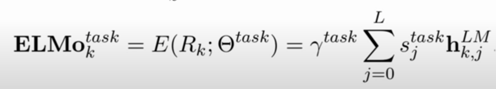{: style="height:70%; width:70%"}

Different weights per LSTM layer's hidden state. Different weight to the whole LM's hidden states per task. This way ELMo only uses the LM where it matters, and assigns different importance to each layer (reportedly the lowest layer is better for syntactic information, and is more useful for NER or POS-tag, whereas the second layer carries more semantic data, and works better for Question Answering, Sentiment Analysis, etc.).

## Transformers

### GPT

"Attention is all you need": What if we drop the Recurrent part, and just keep the attention to maintain long-term information and context?

This is how a transformer's Encoder works:

You take the whole sentence, and make each word go through an "atttention head". 

All words in a same sentence can run through an attention head in parallel, making transformers train a lot faster in GPU.

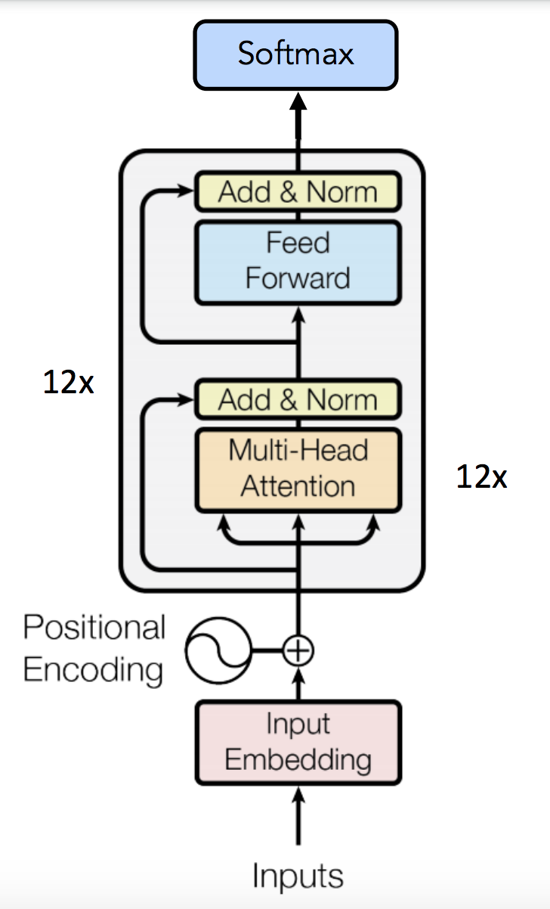{: style="height:70%; width:70%"}

The attention mechanism can be scaled horizontally to add more semantic/syntactic interpretations of a word in-context.

Here's the attention function for embeddings Q, K, V:

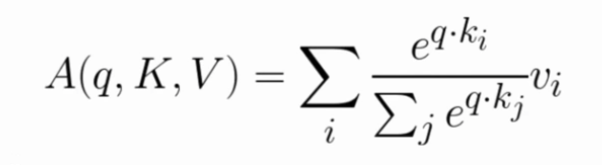{: style="height:70%; width:70%"}

The FF layer is a 2-layer MLP with ReLU.

{: style="height:70%; width:70%"}

Where Wi are learned matrices, each of them projecting the Q,K,V word-embeddings into different spaces.

Typically, we'll make Q,K,V be the word embedding for the current word, concatenated to **positional encoding**, so same words at different locations have different overall representations:

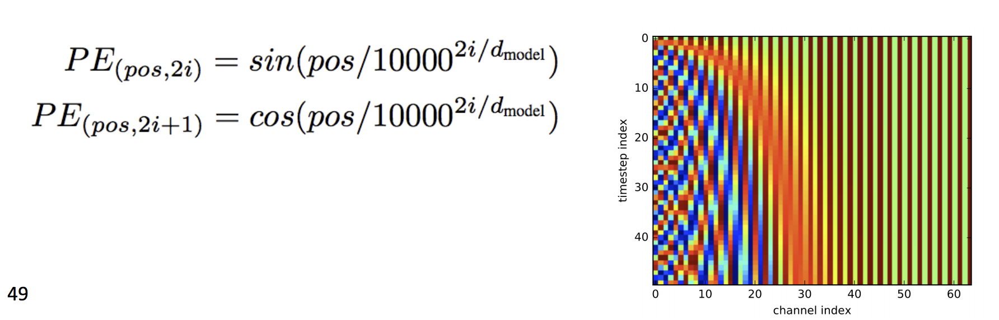{: style="height:70%; width:70%"}

Multi-headed attention nodes are composed (vertically) and finally you can run your supervised task on the output.

The decoder is left as an exercise for the reader. For LM you can skip it.

### BERT (Bidirectional Encoder Representations from Transformers)

Problem: LM's are unidirectional, but language understanding is bidirectional.

Why? Because you can't learn to predict the future by seeing it.

Solution: Train a LM by removing k=15% (they never change this) of words from each sentence and predicting them from bidirectional context. 

Setting k is a trade-off: too much and you don't see context, too little and you train too slowly.

In a way, OpenAI's GPT used unidirectional transformers, and ELMo took advantage of bidirectionality with its pre-trained LM.

This mixes both approaches by training a model that's inherently bidirectional. 

They also train it on **next sentence prediction**: given sentence A and sentence B, **can sentence B come after A**?

**First Layer**: Combine token embeddings -typical word/char embeddings-, position embeddings -as in GPT- and segment embedding -whether word belongs to sentence A or B-.

They trained a transformer encoder on Wikipedia+BookCorpus, similar size to GPT beat it by a couple points on most benchmarks.

After training the encoder, it can be used in other tasks by **removing last layer (classification) and fine-tuning** -as opposed to ELMo which just gave frozen representations-.

