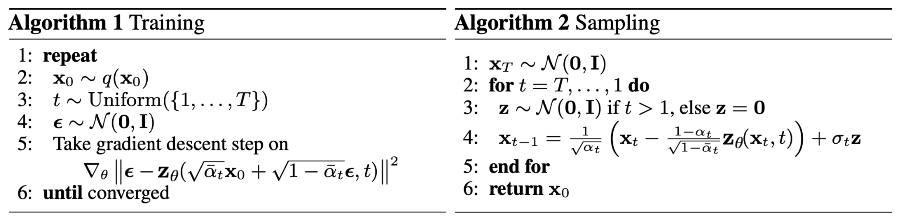
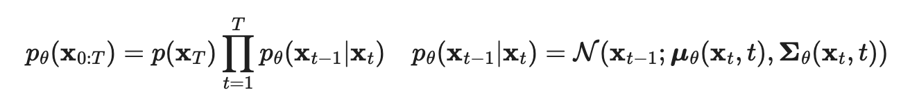
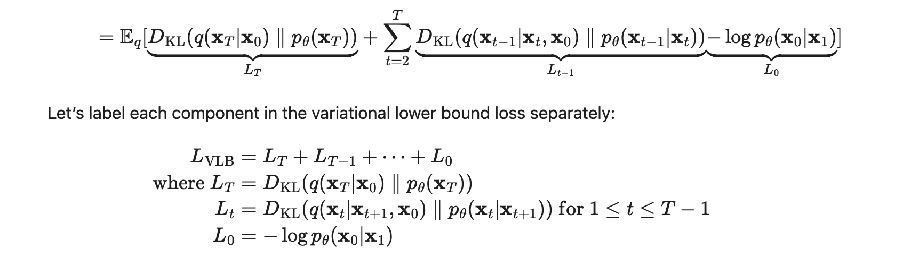

<https://arxiv.org/pdf/2112.10741.pdf>

GLIDE combines a diffusion model with CLIP embedding conditioning to generate photorealistic images, conditioned on text prompts, that compare favorably to DALL-E when judged by humans. Images can also be initialized as a rough sketch in a zero-shot regime, and iteratively improved through extra prompts and "inpainting", where a piece of the image is masked and only that is filled.

In a **diffusion model**, an image is iteratively added Gaussian noise ~N(0, (1 − αt)I), and then a model is trained to reconstruct mu and sigma for the step xt-1 given xt, iteratively (sharing weights) until x0 is the image. In practice, the model fits both mu and sigma, and the loss function takes the distance between predicted and actual noise for each step.

[Source](https://lilianweng.github.io/lil-log/2021/07/11/diffusion-models.html)

**Guided diffusion** additionally conditions reconstruction on a label y, using a classifier so that  \\\( µ_θ(x_t\|y) = µ_θ(x_t\|y) + s · Σ_θ(x_t\|y)∇_{x_t} · log p_φ(y\|x_t) \\\)  . 

**Classifier free guidance** additionally masks out X% of the labels for a null label (in CLIP this is replaced with the embedding for empty sequence) and trains on the difference between the classifier predicting y vs empty.

 \\\( e_θ(x_t\|c) = e_θ(x_t\|∅) + s · (e_θ(x_t\|c) − e_θ(x_t\|∅)) \\\) 

Where s is always >1.

For **CLIP guidance**, they do the same as in guided diffusion but use the cosine similarity between image encoding and text encoding instead of a classifier's log odds.

They get very good results and beat DALL-E.

## Additional Reading

- [Good explanation of diffusion models](https://lilianweng.github.io/posts/2021-07-11-diffusion-models/#reverse-diffusion-process)

In a diffusion model, you assume your noise sample N(0, I) corresponds to the result of a diffusion process: a markov chain where you added gaussian noise with a sd = beta \_t iteratively over the real sample. Then you fit a model (DDPM):

- [Denoising Diffusion Probabilistic Models](https://arxiv.org/pdf/2006.11239.pdf)

The gaussian added at each step of the Markov chain is predicted using a [PixelCNN++ neural network](https://arxiv.org/pdf/1701.05517.pdf) to generate the whole vector (which has the same dimensionality as the picture) given the input and conditioned on t.

Interestingly, DDIM makes the process faster by only taking some S steps out of the T diffusion iterations, and then multiplies by a whole jump (scaled by a hyperparameter) making everything faster. Better explanation under [DDIM](/wiki-articles/machine-learning/ddim).

