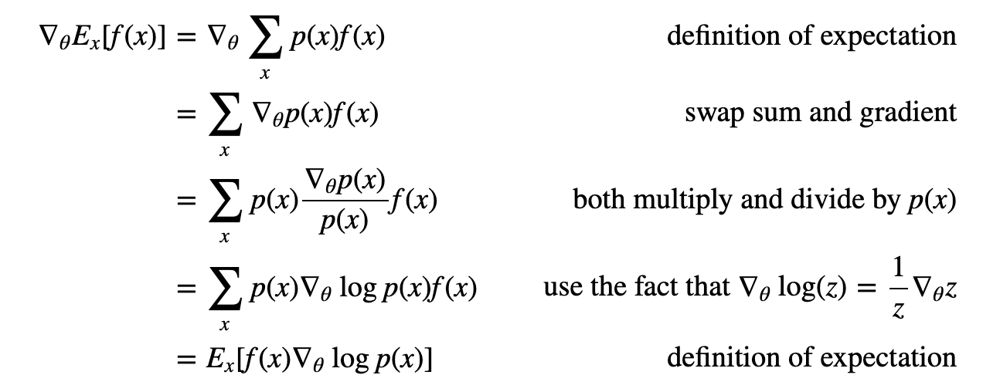

## Karpathy 2016: Pong with Policy Gradients

I began my Reinforcement Learning studies by reading [Karpathy](http://karpathy.github.io/2016/05/31/rl/) (May 31, 2016).

This article explains policy gradients used for solving games like pong.

In the case of pong, we take a matrix of pixel diffs between two consecutive timesteps and run backprop over a reward of 1 if game ended in win for agent, -1 if it didn't, over every single timestep + decision of going up or down (sampled from a bernoulli where _p_ is output of a 2 layer fc DNN which takes whole screen as input).

This, simple as it is, amazingly works.

{: alt="" loading="lazy"}

"For a more thorough derivation and discussion I recommend [John Schulman’s lecture](https://www.youtube.com/watch?v=oPGVsoBonLM)."  [🌱]

The current consensus is that PG works well only in settings where there are a few discrete choices so that one is not hopelessly sampling through huge search spaces.

For example [AlphaGo](https://deepmind.com/alpha-go)[🌱] first uses supervised learning to predict human moves from expert Go games and the resulting human mimicking policy is later finetuned with policy gradients on the “real” objective of winning the game.

## Additional Reading:

- [Richard Sutton’s book](http://incompleteideas.net/book/RLbook2020.pdf)[🌿]: I finished this book and found it extremely clear, entertaining and illuminating. Probably the book that taught me the most in a while, and one of my favorite reads in 2022. Spawned my [notes on Sutton's Reinforcement Learning book](/wiki-articles/machine-learning/reinforcement-learning-sutton).
- [My notes on Proximal Policy Optimization](/wiki-articles/machine-learning/proximal-policy-optimization)[🌿]: The current state of the art in Reinforcement Learning, developed by OpenAI, consisting of policy gradient + regularization that limits how much the policy can vary from epoch to epoch.
- [David Silver’s course](http://www0.cs.ucl.ac.uk/staff/d.silver/web/Teaching.html)[🌱]
- [John Schulmann’s lectures](https://www.youtube.com/watch?v=oPGVsoBonLM)[🌱]
- [Building Machines That Learn and Think Like People](https://arxiv.org/abs/1604.00289)[🌱]
- [Mnih et al. (2015)]()[🌱]: A paper where a Q-Learning algorithm is trained on ATARI 2600 dataset and beats human level performance. They used Q-learning with experience replay, where a "tape" of experiences is kept, storing (St, At, Rt+1, St+1) and those are replayed by sampling uniformly from the tape in a planning manner.