In 2022, through late june and early july I read the book "Reinforcement Learning" by Richard S. Sutton and Andrew G. Barto.

I hadn't been exposed to RL before except as that esoteric area of Deep Learning (which I now know is a wrong classification: RL doesn't need to be deep) of which I knew nothing about, but which was often mentioned as getting benefits downstream from unsupervised learning tasks, representation learning, etc.

I only knew it involved winning at Go and training an agent ot get some kind of rewards (and knew about it very tangentially from my forays into Control and Directed Controller Synthesis, which I studied for my dissertation).

My first introduction to Reinforcement Learning came from [Karpathy's blog post](http://karpathy.github.io/2016/05/31/rl/) and that prompted me to create a [reading list and my first note on Reinforcement Learning](/wiki-articles/machine-learning/reinforcement-learning-base).

All in all I found Sutton's explanations very intuitive, not needing any very specific brackground besides being used to mathematical notation, linear algebra and multivariate calculus. Most of the chapters had quite concrete examples and very clear explanations, and I don't think I had a hard time understanding anything that wasn't marked with a '\*'. I was so fascinated by this book that I don't really have any negative criticisms. For any reader's sake, here's where [Sutton has uploaded his Reinforcement Learning book for free](http://incompleteideas.net/book/RLbook2020.pdf).

What follow are my notes for this book, which summarize parts I and II (Tabular Reinforcement Learning and Approximate Learning), mostly for my own memory and eyes as this is my personal wiki, but also for anyone who may find it useful. All images are partial screenshots of the book, part of the text is quotes and other parts are my rephrasing.

## Book Summary

"Introduction to Reinforcement Learning" has two parts.

Part I covers [tabular methods](/wiki-articles/machine-learning/reinforcement-learning-sutton#part-i-tabular-solution-methods), and concepts applicable to Reinforcement Learning in general. 

It defines an agent and environment and a [Markov Decision Process](/wiki-articles/machine-learning/reinforcement-learning-sutton#finite-markov-decision-processes). This is the model used for the environment, where only the current state and the taken action are enough to predict the following state and reward, or their distribution if stochastic.

There is a short coverage of [muti-armed bandit problems](/wiki-articles/machine-learning/reinforcement-learning-sutton#multi-armed-bandits), where we only take actions with no state memory (one could say, in a single unchanging state) and try to maximize total reward by estimating each action's value.

It then introduces [Bellman's equations](/wiki-articles/machine-learning/reinforcement-learning-sutton#optimal-policy-state-value), which dictate the optimum value for each state or state-action pair. **The goal of an agent is to always take the action that maximizes value (total expected rewards).** The bellman equations set the value for each state as the expected return, which is the convex sum of the values of the next states (each weighted by their probability of being reached under a certain policy).

**Tasks can be _episodic_ or _continuing_**, where episodic tasks have a beginning and an end, like playing chess matches, and continuing ones are ongoing (like managing a business). In the former ones, reward can be delayed until the end of the episode and undiscounted, whereas in the latter returns are a sum of discounted rewards, each multiplied by a power of a discounting factor. E.g., if the factor is 0.9, the return of taking 5 actions with reward 1 would be 1+0.9+.81...etc.

The algorithms presented for tabular Reinforcement Learning all fall into the **GPI** (generalized policy iteration) paradigm: they **estimate the value of each state under a certain initial policy, and then iteratively improve upon it by switching the chosen action for a certain state to one that has a higher expected value.** This iterative greedy improvement guarantees convergence to a global optimum due to an improvement in one state never leading a different state to see its expected returns reduced.

There are **Dynamic Programming methods**, which take as part of the input a model of distributions for each state and reward given a state and taken action. They solve the Bellman Equations directly using an iterative method like Gauss-Seidel (solving them in closed-form should be possible, but intractable for large enough state space).
[_More on dynamic programming methods_](/wiki-articles/machine-learning/reinforcement-learning-sutton#dynamic-programming)

**Monte-Carlo methods** estimate the value of a certain state or state-action pair by repeatedly sampling trajectories under a given policy, and aggregating the returns. They then improve the policy using these new values, and so on until convergence. They do away with the  requirement for a model of next-state distributions for each current state, which makes them more fitting for arbitrary systems for which a probability distribution is not easy to calculate, but simulation is viable. They basically operate like Dr. Strange in _Infinity War_.
[_More on Monte-Carlo methods_](/wiki-articles/machine-learning/reinforcement-learning-sutton#monte-carlo-methods)

**Temporal Difference methods** stop depending on finishing the episode or having a model of state probabilities. They use _bootstrapping_, where for each action _a_ taken from a state _s_, the value _q(s,a)_ of taking it on that state is updated with a target called 'TD-error' (Temporal Difference error): we use the reward obtained, plus the discounted value of the next state as an estimate for the return, and calculate the difference between this return and the current estimated _q(s,a)_.
[_More on Monte-Carlo methods_](/wiki-articles/machine-learning/reinforcement-learning-sutton#temporal-difference-methods)

**n-Step Methods** are similar to Temporal Difference ones, but they use a TD-error where multiple steps are taken into account (each reward appropriately discounted, plus the n-th state visited). [_More on Monte-Carlo methods_](/wiki-articles/machine-learning/reinforcement-learning-sutton#n-step-temporal-difference-methods)

The book then covers [planning](/wiki-articles/machine-learning/reinforcement-learning-sutton#planning-and-learning-with-tabular-methods), where state-values are repeatedly updated using already seen TD returns to reutilize gathered information.

Part II covers [approximate methods](/wiki-articles/machine-learning/reinforcement-learning-sutton#part-2-approximate-solution-methods), where state-spaces are too big for tabular ones, and generalization is desirable and possible. This approach maps states to a feature vector space, and uses function approximators to estimate each state's (or state-action pair's) value. These approximators can be linear regressors (the ones most covered by the book) or Deep Neural Networks (not discussed a lot as there are less theoretical results for them, but of practical importance). 

The parameters for the value estimation model are updated using gradient descent with the difference between currently estimated value and the found return. Many approaches are presented but they are esentially similar to the tabular ones, shifted to an approximate version.

Finally [Policy Gradient methods](/wiki-articles/machine-learning/reinforcement-learning-sutton#policy-gradient-methods) are discussed, which do away with value estimation altogether and simply choose actions given a state's features, and simply try to maximize returns given the current state by changing the policy. 

Both on-policy and off-policy solution methods are presented. On-policy methods estimate the value of a policy and improve upon it, whereas off-policy methods use the returns of a policy to improve a different one, by using importance sampling (where the returns for a state are weighted by the odds of it happening on the different policy). Off-policy methods are provably and numerically unstable, but when they do converge they allow for a more exploratory policy to estimate the value of a different, typically greedy policy.

## Sutton 2nd Edition

### 1.1 Reinforcement Learning

These two characteristics—trial-and-error search and delayed reward—are the two most important distinguishing features of reinforcement learning.

The agent also must have a goal or goals relating to the state of the environment. Markov decision processes are intended to include just these three aspects—sensation, action, and goal—in their simplest possible forms without trivializing any of them. Any method that is well suited to solving such problems we consider to be a reinforcement learning method.

### 1.3 Elements of Reinforcement Learning

Beyond the agent and the environment, one can identify four main subelements of a reinforcement learning system: a **policy** (defines the learning agent’s way of behaving at a given time), a **reward signal** (In general, reward signals may be stochastic functions of the state of the environment and the actions taken. The goal for an agent is to maximize total reward over time, but reward is instantaneous -pain or pleasure-) , a **value function** (the value of a state is the total amount of reward an agent can expect to accumulate over the future, starting from that state. Whereas rewards determine the immediate, intrinsic desirability of environmental states, values indicate the long-term desirability of states after taking into account the states that are likely to follow and the rewards available in those states.**)**, and, optionally, a **model of the environment** (allows inferences to be made about how the environment will behave).

> The central role of value estimation is arguably the most important thing that has been learned about reinforcement learning over the last six decades.

### Evolutionary vs Value Function Methods

To evaluate a policy, an evolutionary method holds the policy fixed and plays many games against the opponent or simulates many games using a model of the opponent. The frequency of wins gives an unbiased estimate of the probability of winning with that policy, and can be used to direct the next policy selection. But each policy change is made only after many games, and only the final outcome of each game is used: what happens during the games is ignored. For example, if the player wins, then all of its behavior in the game is given credit, independently of how specific moves might have been critical to the win. Credit is even given to moves that never occurred! Value function methods, in contrast, allow individual states to be evaluated. In the end, evolutionary and value function methods both search the space of policies, but learning a value function takes advantage of information available during the course of play.

### 1.6 History of Reinforcement Learning

The idea of implementing trial-and-error learning in a computer appeared among the earliest thoughts about the possibility of artificial intelligence. In a 1948 report, Alan Turing described a design for a “pleasure-pain system†that worked along the lines of the Law of Effect: 

> _When a configuration is reached for which the action is undetermined, a random choice for the missing data is made and the appropriate entry is made in the description, tentatively, and is applied. When a pain stimulus occurs all tentative entries are cancelled, and when a pleasure stimulus occurs they are all made permanent._ (Turing, 1948)

Particularly influential was Minsky’s paper “Steps Toward Artificial Intelligence†(Minsky, 1961), which discussed several issues relevant to trial-and-error learning, including prediction, expectation, and what he called the **basic credit-assignment problem** for complex reinforcement learning systems: How do you distribute credit for success among the many decisions that may have been involved in producing it? All of the methods we discuss in this book are, in a sense, directed toward solving this problem. Minsky’s paper is well worth reading today [🌱].

### Part I: Tabular Solution Methods

In this part of the book we describe almost all the core ideas of reinforcement learning algorithms in their simplest forms: that in which the state and action spaces are small enough for the approximate value functions to be represented as arrays, or tables. In this case, the methods can often find exact solutions, that is, they can often find exactly the optimal value function and the optimal policy. This contrasts with the approximate methods described in the next part of the book, which only find approximate solutions, but which in return can be applied effectively to much larger problems. 

The first chapter of this part of the book describes solution methods for the special case of the reinforcement learning problem in which there is only a single state, called bandit problems. The second chapter describes the general problem formulation that we treat throughout the rest of the book—finite Markov decision processes—and its main ideas including Bellman equations and value functions.

## Multi-armed Bandits

Our agent can sample from k distributions a maximum of N times, and knows not what the expected value of each distribution is but wants to maximize total reward.  There is a exploit-explore tradeoff between picking greedily, or picking from a new distribution to update our estimates of the mean.

In this book we do not worry about balancing exploration and exploitation in a sophisticated way; we worry only about balancing them at all.

This chapter covers greedy algorithms (sample everything once, then keep highest value), epsilon-greedy ones (sample greedily with probability 1-e, and uniformly with probability e), and UCB-greedy (sample adding a weight to how many ln(timesteps) have taken place over how many times each action was chosen).

We estimate value functions for each action using the mean or an exponentially decaying recency mean.

### 2.9 Associative Search (Contextual Bandits)

If we have a set of discrete bandit problems and receive a label of which problem we are in, that is the contextual bandit regime (associative search). 

This is an example of an _associative search task_, so called because it involves both **trial-and-error learning to search** for the best actions, and **association of these actions with the situations in which they are best.** Associative search tasks are often now called _contextual bandits_ in the literature.

Associative search tasks are **intermediate between the k-armed bandit problem and the full reinforcement learning problem**. They are like the full reinforcement learning problem in that **they involve learning a policy**, but they are also like our version of the k-armed bandit problem in that **each action affects only the immediate reward**. If actions are allowed to affect the next situation as well as the reward, then we have the full reinforcement learning problem.

## Finite Markov Decision Processes

MDPs involve delayed reward and the need to trade off immediate and delayed reward. Whereas in bandit problems we estimated the value q\*(a) of each action a, in MDPs we estimate the value q\*(s, a) of each action a in each state s, or we estimate the value v\*(s) of each state given optimal action selections. These state-dependent quantities are essential to accurately assigning credit for long-term consequences to individual action selections.

The state must include information about all aspects of the past agent–environment interaction that make a difference for the future. If it does, then the state is said to have the Markov property. (probability of next state and reward is purely dependent on current state and reward).

> In general, actions can be any decisions we want to learn how to make, and states can be anything we can know that might be useful in making them.

### 3.2 Goals and Rewards

Reward signals should incentivize what we want the agent to do, as an agent's goal is the maximization over time of total reward.

> The agent’s goal is to maximize the cumulative reward it receives in the long run.

In particular, the **reward signal is not the place to impart to the agent prior knowledge** about how to achieve what we want it to do. For example, a chess-playing agent should be rewarded only for actually winning, not for achieving subgoals such as taking its opponent’s pieces. If achieving subgoals were rewarded, then the agent could achieve them without achieving the real goal. For example, it might find a way to take the opponent’s pieces even at the cost of losing the game. The reward signal is your way of communicating to the agent **what you want achieved, not how you want it achieved**.

### 3.3 Returns and Episodes

If a game has natural **terminal states**, we can break up agent-environment interactions into subsequences called episodes. We can treat episodes as independent of each other, and in that case use as our goal a function of the reward sequence up to the terminal state. This is an **_episodic task_**.

In other cases, the agent-environment interaction goes on continually without limit. This is a **_continuing task_**. In this case, the sum of all rewards in the episode cannot be computed, as the task has infinite states (and no terminal one). 

The additional concept that we need is that of **discounting**. According to this approach, the agent tries to select actions so that the sum of the discounted rewards it receives over the future is maximized. In particular, it chooses _At_ to maximize the expected discounted return:

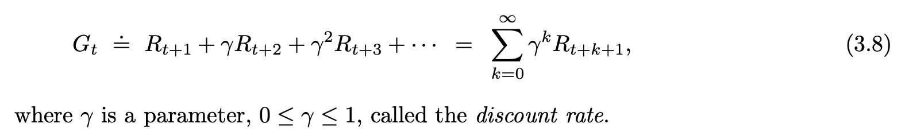

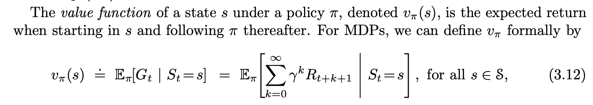

### Optimal Policy State Value

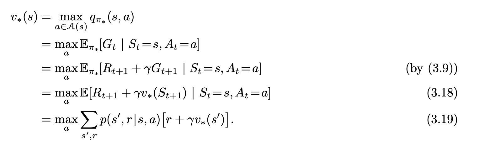

Bellman equations for State Value (there is an analogous one for action values).

Once one has v\*, it is relatively easy to determine an **optimal policy**. For each state s, there will be one or more actions at which the maximum is obtained in the Bellman optimality equation. Any policy that assigns nonzero probability only to these actions is an optimal policy. You can think of this as a one-step search. If you have the optimal value function, v\*, then the actions that appear best after a one-step search will be optimal actions. Another way of saying this is that any policy that is greedy with respect to the optimal evaluation function v* is an optimal policy

> The beauty of v\* is that if one uses it to evaluate the short-term consequences of actions—specifically, the one-step consequences—then a greedy policy is actually optimal in the long-term sense in which we are interested

**Executive summary:** Bellman equations dictate the value each state or state-pair action holds. If we have these, we can have an optimal policy that simply, for each state, picks the action with highest value (where value is Gt or '_next reward plus discounted value of next state_'). Solving for these is usually computationally intractable (as there may be a huge number of possible states and actions), but settling for approximate solutions is Reinforcement Learning's bread and butter.

## Dynamic Programming

In this chapter we learn how to solve the Bellman Equations for a MDP where all probabilities are known beforehand. 

If this is the case, we can use the combo of _policy evaluation_ and _policy improvement_ to iteratively improve upon an initial arbitrary policy, until we reach convergence, in which optimality is guaranteed.

**Policy Evaluation:** Given a policy π and a set of Bellman Equations, we iteratively assign to each state a value q as a function of all the other values, starting from arbitrary ones. This is a [Gauss-Seidel](/wiki-articles/computer-science/metnum-final) iterative method for solving linear equations, as we have N states and N linear constraints, which guarantees there will be a single solution. 

After convergence, we will know what the value for each state is under a certain policy. But how do we use this to find the optimal policy?

**Policy Improvement:** It can be proved that if a policy π is updated such that a single transition is changed to assign all probability for jumping towards the highest value state, then this new policy π' will be better. We can repeat this process until no more improvements are found, and we are guaranteed to find the optimal policy that way. This may be slow if there are many states, but usually converges in surprisingly little steps as a function of state-space size.

More generally, DP methods (like value iteration or policy iteration) can be seen as instances of **Generalized Policy Iteration**.

"GPI is the general idea of two interacting processes revolving around an approximate policy and an approximate value function. One process takes the policy as given and performs some form of policy evaluation, changing the value function to be more like the true value function for the policy. The other process takes the value function as given and performs some form of policy improvement, changing the policy to make it better, assuming that the value function is its value function. Although each process changes the basis for the other, overall they work together to find a joint solution: a policy and value function that are unchanged by either process and, consequently, are optimal. In some cases, GPI can be proved to converge, most notably for the classical DP methods just discussed."

**Asynchronous DP methods** do away with performing a whole sweep of the entire state space on each iteration, taking instead a local approach: on each iteration, a certain subset of states' values may be updated according to the equations, and then a different one and so on (typically choosing the states that are relevant to the most likely tasks). The algorithm may never find the value function for every state in the space, but this way also skips computing such values for useless or unlikely states.

> "in-place iterative methods that update states in an arbitrary order, perhaps stochastically determined and using out-of-date information."

We say all these DP algorithms use **bootstrapping**, because each state is updated only taking into account the values for its successors.

## Monte Carlo Methods

Monte Carlo methods learn value functions and optimal policies from experience in the form of _sample episodes._ In many problems, getting the exact probabilities for each event may be unfeasible or computationally challenging, whereas sampling the process is cheap. For these situations, Monte Carlo methods based on sampling the process repeatedly and training a policy on the encountered results can be very efficient, especially if we can choose the starting state wisely.

* They can be used to learn optimal behavior directly from interaction with the environment, with no model of the environment’s dynamics.
* They can be used with simulation or sample models.
* It is easy and efficient to focus Monte Carlo methods on a small subset of the states.

Monte Carlo methods can follow the GPI (Generalized Policy Iteration) schema. They provide an alternative policy evaluation process. Rather than use a model to compute the value of each state, they average many returns that start in the state, yielding a good unbiased estimate of this value.

In control methods we are particularly interested in approximating **action-value functions**, because these can be used to improve the policy without requiring a model of the environment’s transition dynamics. Monte Carlo methods intermix policy evaluation and policy improvement steps on an episode-by-episode basis.

To solve the exploit-explore problem (where an optimum policy will always pick the best value action, but we want an agent in training to explore new avenues and see if they yield bigger results), we may assume that episodes begin with state–action pairs randomly selected to cover all possibilities (**_exploring starts_**).

That approach is impractical in most cases, so instead two different solutions are proposed and analyzed:

That approach is impractical in most cases, so instead two different solutions are proposed and analyzed:
- **On-Policy methods**: By forcing the policy π to be soft (e.g., epsilon-soft where there's always an epsilon chance of picking an action uniformly as in the Bandit problem), we can guarantee every policy will be picked eventually under infinite attempts, yielding more information about every possible transition in the Markov chain.
- **Off-Policy methods**: Two different policies are designed: one is epsilon-soft and is kept fixed (called b), another, π, is fit for optimality by taking the information given by episodes sampled under the soft policyand multiplying the obtained results by the odds of them occurring under π (an action choice twice as likely in π as in b will carry twice as much information, and such). Then All rewards are normalized by the sum of all these products, or their average. 

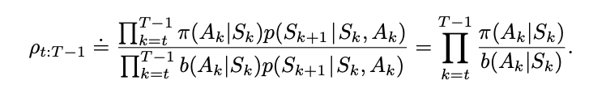

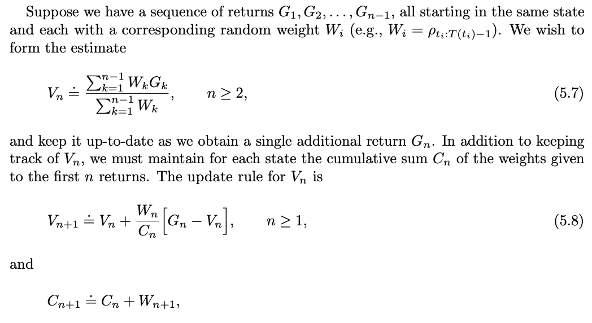

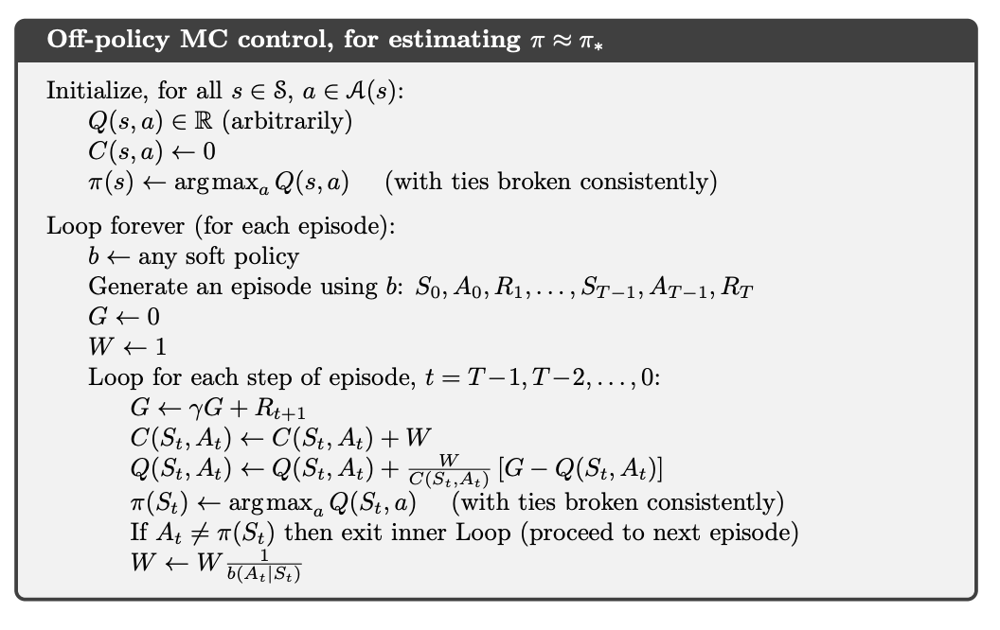

"Off-policy prediction refers to learning the value function of a target policy from data generated by a different behavior policy. Such learning methods are based on some form of importance sampling, that is, on weighting returns by the ratio of the probabilities of taking the observed actions under the two policies, thereby transforming their expectations from the behavior policy to the target policy. Ordinary importance sampling uses a simple average of the weighted returns, whereas weighted importance sampling uses a weighted average. Ordinary importance sampling produces unbiased estimates, but has larger, possibly infinite, variance, whereas weighted importance sampling always has finite variance and is preferred in practice. Despite their conceptual simplicity, off-policy Monte Carlo methods for both prediction and control remain unsettled and are a subject of ongoing research."

## Temporal Difference Methods

TD methods update their estimates based in part on other estimates. They learn a guess from a guess—they bootstrap.

They combine bootstrapping and Monte Carlo sampling, making them an intermediate technique between DP and MC.

TD methods can be Sarsa (update using the next sample's value estimate), QD (use the maximum value next state could produce, over all actions -independent of which was chosen-) or Expected Sarsa (use as an estimate for a Q(s,a) the expected value of next state -so probability for each a times value of Q(s t+1, a t+1)). They all converge to the same values, which model the subjacent Markov chain instead of the average return per action-state pair [_certainty equivalence_].  

Note that Monte Carlo methods cannot easily be used here because termination is not guaranteed for all policies. If a policy was ever found that caused the agent to stay in the same state, then the next episode would never end. Online learning methods such as Sarsa do not have this problem because they quickly learn during the episode that such policies are poor, and switch to something else.

We can classify TD control methods according to whether they deal with this complication by using an on-policy or off-policy approach. Sarsa is an on-policy method, and Q-learning is an off-policy method. Expected Sarsa is also an off-policy method as we present it here.

The methods presented in this chapter are today the most widely used reinforcement learning methods. This is probably due to their great simplicity: they can be applied online, with a minimal amount of computation, to experience generated from interaction with an environment; they can be expressed nearly completely by single equations that can be implemented with small computer programs.

From discussion: "It was only when TD methods were analyzed as pure prediction methods, independent of their use in reinforcement learning, that their theoretical properties first came to be well understood. Even so, these other potential applications of TD learning methods have not yet been extensively explored."

## n-Step Temporal Difference Methods

In this chapter we have developed a range of temporal-difference learning methods that lie in between the one-step TD methods of the previous chapter and the Monte Carlo methods of the chapter before. Methods that involve an intermediate amount of bootstrapping are important because they will typically perform better than either extreme.

These are **n-step methods, which look ahead to the next n rewards, states, and actions**.

All n-step methods involve a delay of n time steps before updating, as only then are all the required future events known. Such costs can be well worth paying to escape the tyranny of the single time step.

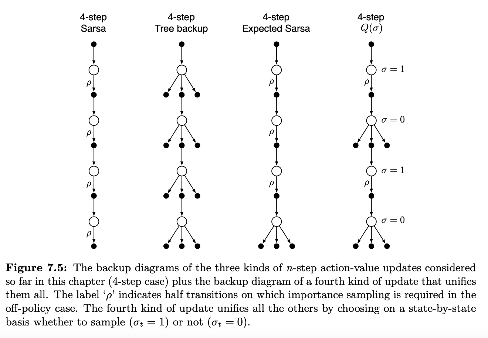

## Planning and Learning with Tabular Methods

MCTS (Monte Carlo Tree Search) has proved to be effective in a wide variety of competitive settings, including general game playing (e.g., see Finnsson and Björnsson, 2008; Genesereth and Thielscher, 2014), but it is not limited to games; it can be effective for single-agent sequential decision problems if there is an environment model simple enough for fast multistep simulation.

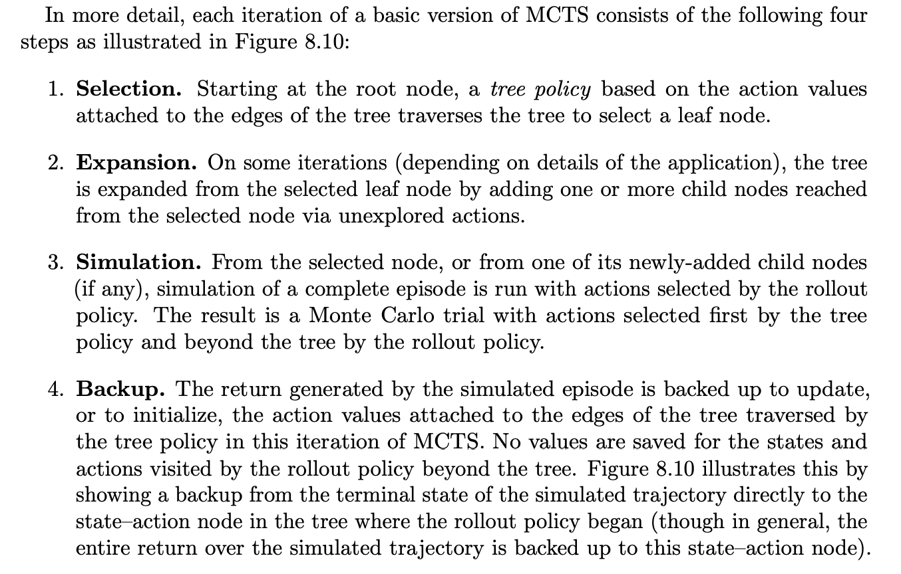

Planning requires a model of the environment. A distribution model consists of the probabilities of next states and rewards for possible actions; a sample model produces single transitions and rewards generated according to these probabilities. Dynamic programming requires a distribution model because it uses expected updates, which involve computing expectations over all the possible next states and rewards. A sample model, on the other hand, is what is needed to simulate interacting with the environment during which sample updates, like those used by many reinforcement learning algorithms, can be used.

There are close relationships between **planning optimal behavior** and **learning optimal behavior**. Both involve estimating the same value functions, and in both cases it is natural to update the estimates incrementally, in a long series of small backing-up operations.

Any of the learning methods can be converted into planning methods simply by applying them to simulated (model-generated) experience rather than to real experience. (We run iterations of planning in the middle of a learning algorithm, by repeatedly sampling rewards and next states from a random previously seen state, and updating action values accordingly. I all the versions seen in this chapter they use a table with last next state and reward for each _s,a_ seen, but they can also be replaced with distribution -estimated- or average reward -if state transition is deterministic-).

It is straightforward to integrate incremental planning methods with acting and model learning. Planning, acting, and model-learning interact in a circular fashion, improving each other. The processes may proceed asynchronously and in parallel. If the processes must share computational resources, then the division can be handled almost arbitrarily depending on the task.

Among the smallest updates are one-step sample updates, as in Dyna. Another important dimension is the distribution of updates, that is, of the focus of search. **Prioritized sweeping** focuses backward on the predecessors of states whose values have recently changed -by maintaining a queue with each state for which values have changed significantly, and its predecessors-. **On-policy trajectory sampling**focuses on states or state–action pairs that the agent is likely to encounter when controlling its environment. This can allow computation to skip over parts of the state space that are irrelevant [unreachable or suboptimal].

> Browne, Powley, Whitehouse, Lucas, Cowling, Rohlfshagen, Tavener, Perez, Samothrakis, and Colton (2012) is an excellent survey of MCTS methods and their applications. [🌱]

---

## Part 2: Approximate Solution Methods

The problem with large state spaces is not just the memory needed for large tables, but the time and data needed to fill them accurately. In many of our target tasks, almost every state encountered will never have been seen before. To make sensible decisions in such states it is necessary to generalize from previous encounters with di↵erent states that are in some sense similar to the current one. In other words, the key issue is that of generalization. How can experience with a limited subset of the state space be usefully generalized to produce a good approximation over a much larger subset?

Reinforcement learning with function approximation involves a number of new issues that do not normally arise in conventional supervised learning, such as 

* nonstationarity
* bootstrapping
* delayed targets

---

## On-policy Prediction with Approximation

Here we approximate a state's value using a function with parameters **w**. The function could be linear, non-linear, a decision tree, etc., but this allows the model to generalize better (nowadays the function is usually a DNN).

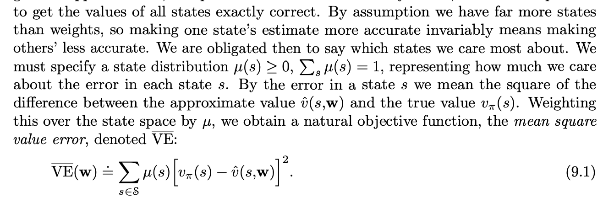

Often µ(s) is chosen to be the fraction of time spent in s. Under on-policy training this is called the on-policy distribution; we focus entirely on this case in this chapter.

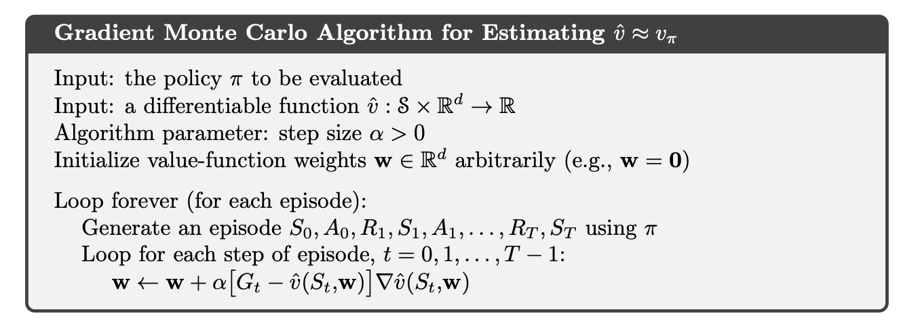

---

Here follows a long section on ANNs and the Kernel trick + Linear Methods, all things I pretty much I already knew, so this part of the book merits no new notes on my part. [These feature creation methods are discussed elsewhere in this wiki -in Spanish-](/wiki-articles/computer-science/patrones)

---

"Recall that the on-policy distribution was defined as the distribution of states encountered in an MDP while following the target policy."

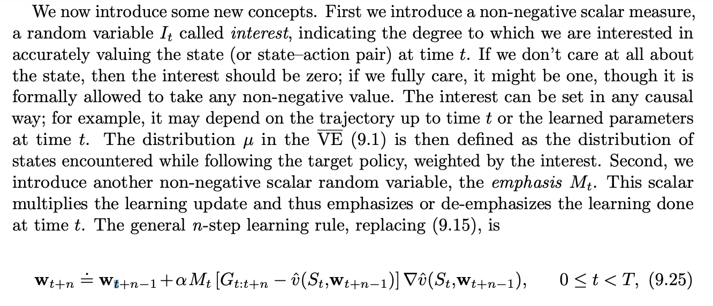

Reinforcement learning systems must be capable of **generalization** if they are to be applicable to artificial intelligence or to large engineering applications. To achieve this, any of a broad range of **existing methods for supervised-learning function approximation** can be used simply by treating each update as a training example.

The most suitable supervised learning methods are those using **parameterized function approximation**, in which the policy is parameterized by a weight vector **w**. Although the weight vector has many components, the state space is much larger, and we must settle for an approximate solution.

We resort to _mean square value error_,  approximation error weighted by states on-policy distribution. 

To find a good weight vector, the most popular methods are variations of SGD. In this chapter we have focused on the on-policy case with a fixed policy, also known as policy evaluation or prediction; a natural learning algorithm for this case is n-step semi-gradient TD, which includes gradient Monte Carlo and semi-gradient TD(0) algorithms as the special cases when n=1 and n= 1 respectively. Semi-gradient TD methods are not true gradient methods. In such bootstrapping methods (including DP), the weight vector appears in the update target, yet this is not taken into account in computing the gradient—thus they are semi-gradient methods. As such, they cannot rely on classical SGD results. Nevertheless, good results can be obtained for semi-gradient methods in the special case of linear function approximation, in which the value estimates are sums of features times corresponding weights. The linear case is the most well understood theoretically and works well in practice when provided with appropriate features. [Using Fourier bases, RBF, polynomials -not recommended-, etc.].

Nonlinear methods include artificial neural networks trained by backpropagation and variations of SGD; these methods have become very popular in recent years under the name deep reinforcement learning

## On-policy Control with Approximation

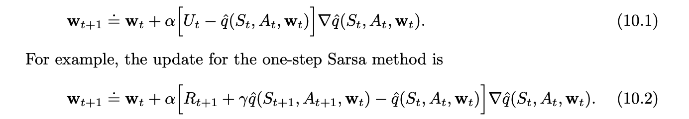

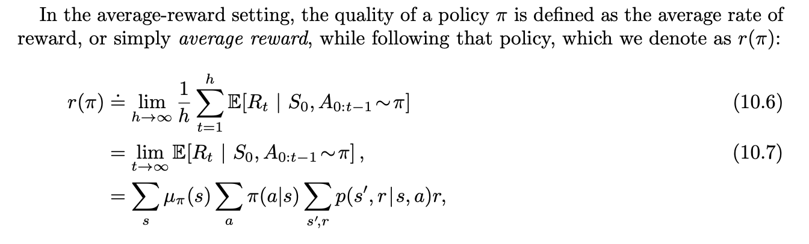

## Off-policy Methods with Approximation

Baird's counterexample shows that even the simplest combination of bootstrapping and function approximation can be unstable if the updates are not done according to the on-policy distribution. There are also counterexamples similar to Baird’s showing divergence for Q-learning. This is cause for concern because otherwise Q-learning has the best convergence guarantees of all control methods. Considerable effort has gone into trying to find a remedy to this problem or to obtain some weaker, but still workable, guarantee. For example, it may be possible to guarantee convergence of Q-learning as long as the behavior policy is sufficiently close to the target policy, for example, when it is the €-greedy policy. To the best of our knowledge, Q-learning has never been found to diverge in this case, but there has been no theoretical analysis. In the rest of this section we present several other ideas that have been explored.

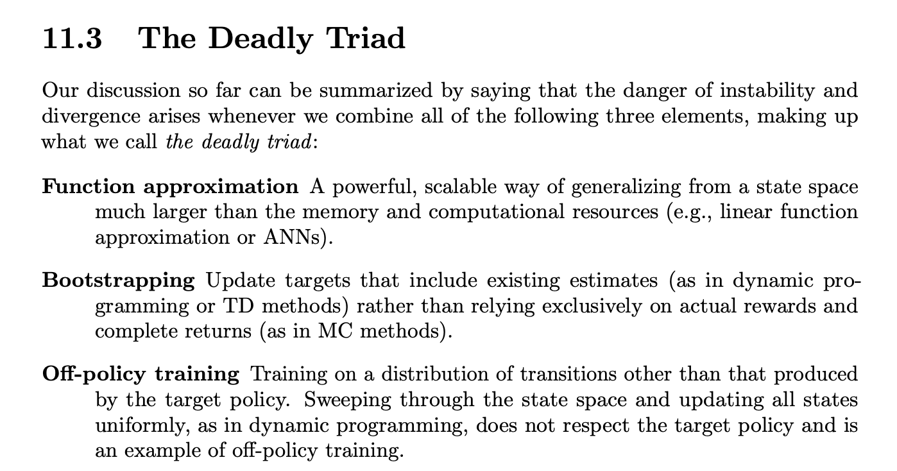

We then direct our attention towards which of these three conditions we could relax in order to get a more stable, guaranteed convergence method. 

**Function approximation** simply can't be removed in most cases, as some generalization will be needed if the state space is big enough. **Bootstrapping** is vital if episode length is significant, since then storing all the rewards and actions in memory has a non-trivial cost, and the algorithm would also pay a substantial communication cost were it made parallel.

Thus the least expensive property to discard will be **off-policy learning**.

"Off-policy methods free behavior from the target policy. This could be considered an appealing convenience but not a necessity. However, off-policy learning is essential to other anticipated use cases, cases that we have not yet mentioned in this book but may be important to the larger goal of creating a powerful intelligent agent."

The Bellman Operator, used for the Bellman error:

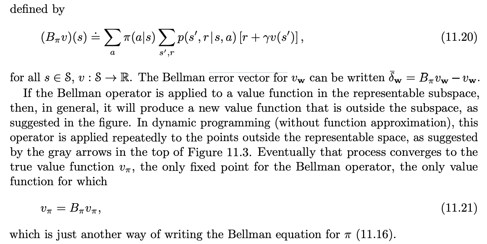

The Bellman error for a state is the expected TD error in that state. If we naively minimize this, we get the following derivation:

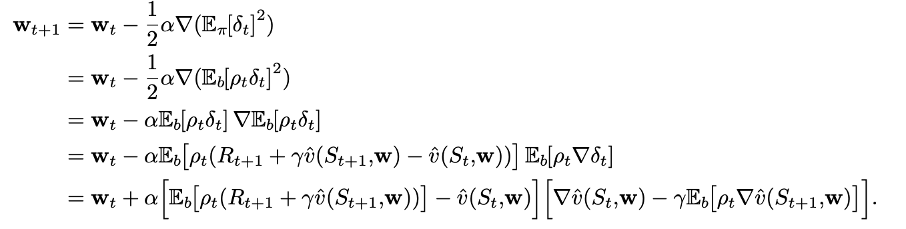

This update and various ways of sampling it are referred to as the **residual-gradient algorithm**. 

If you simply used the sample values in all the expectations, then the equation above reduces almost exactly to, the naive residual-gradient algorithm [just proven to not work].

But this is naive, because the equation above involves the next state, St+1, appearing in two expectations that are multiplied together. To get an unbiased sample of the product, two independent samples of the next state are required, but during normal interaction with an external environment only one is obtained.

Two solutions exist:

* If the environment is deterministic, then we can use this method as-is.
* If stochastic, but simulated, two transitions are simulated and one is only used for that product and then discarded, so we get the real distribution of transitions.

In either of these cases the residual-gradient algorithm is **guaranteed to converge to a minimum of the BE** under the usual conditions on the step-size parameter. As a true SGD method, this convergence is robust, applying to both linear and nonlinear function approximators. In the linear case, convergence is always to the unique w that minimizes the BE. However, there remain at least three ways in which the convergence of the residual-gradient method is unsatisfactory. 

* Empirically, it is slow, much slower that semi-gradient methods.
* The second way in which the residual-gradient algorithm is unsatisfactory is that it still seems to converge to the wrong values.
* The third way is also a problem with the BE objective itself rather than with any particular algorithm for achieving it. See next header.

### The Bellman Error is Not Learnable

> It turns out many quantities of apparent interest in reinforcement learning cannot be learned even from an infinite amount of experiential data.

These quantities are well defined and can be computed given knowledge of the internal structure of the environment, but cannot be computed or estimated from the observed sequence of feature vectors, actions, and rewards.2 We say that they are not learnable. It will turn out that the Bellman error objective (BE) introduced in the last two sections is not learnable in this sense.

The BE is like the VE in that it can be computed from knowledge of the MDP but is not learnable from data. But it is not like the VE in that its minimum solution is not learnable.

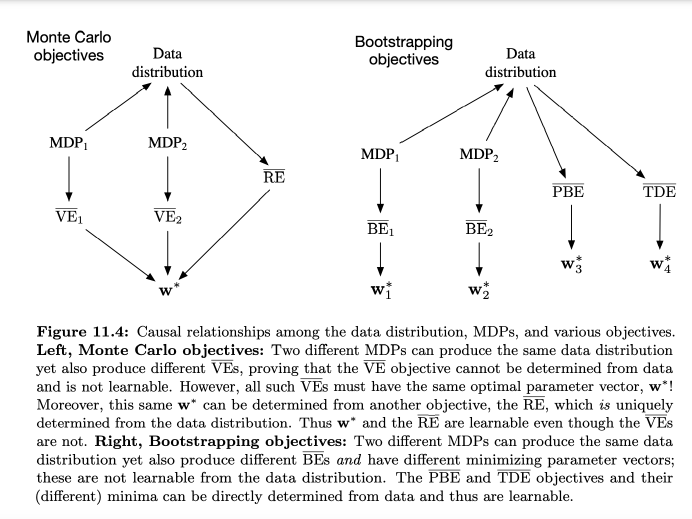

But what is RE? : 

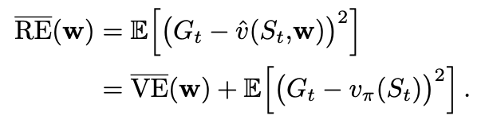

### Gradient-TD Methods

SGD methods for minimizing the PBE. As true SGD methods, these Gradient-TD methods have robust convergence properties even under off-policy training and nonlinear function approximation.

They do a lot of clever tricks with linear expressions to minimize the work and find everything can be estimated. Gradient-TD methods are currently the most well understood and widely used stable off-policy methods. There are extensions to action values and control. 

### Summary

"Off-policy learning is a tempting challenge, testing our ingenuity in designing stable and efficient learning algorithms. Tabular Q-learning makes off-policy learning seem easy, and it has natural generalizations to Expected Sarsa and to the Tree Backup algorithm.

One reason to seek off-policy algorithms is to give flexibility in dealing with the tradeoff between exploration and exploitation. Another is to free behavior from learning, and avoid the tyranny of the target policy.

Gradient-TD methods, performs SGD in the projected Bellman error. The gradient of the PBE is learnable with O(d) complexity, but at the cost of a second parameter vector with a second step size. The newest family of methods, Emphatic-TD methods, refine an old idea for reweighting updates, emphasizing some and de-emphasizing others. In this way they restore the special properties that make on-policy learning stable with computationally simple semi-gradient methods."

In the literature, BE minimization is often referred to as Bellman residual minimization.

## Eligibility traces

Almost any temporal-difference (TD) method, such as Q-learning or Sarsa, can be combined with eligibility traces to obtain a more general method that may learn more efficiently.

When TD methods are augmented with eligibility traces, they produce a family of methods spanning a spectrum that has Monte Carlo methods at one end (= 1) and one-step TD methods at the other ( = 0). In between are intermediate methods that are often better than either extreme method. Eligibility traces also provide a way of implementing Monte Carlo methods online and on continuing problems without episodes.

The primary computational advantage of eligibility traces over n-step methods is that only a single trace vector is required rather than a store of the last n feature vectors. (We're ditching the discrete for the continuum).

As we show in this chapter it is often possible to achieve nearly the same updates—and sometimes exactly the same updates—with an algorithm that uses the current TD error, looking backward to recently visited states using an eligibility trace. These alternate ways of looking at and implementing learning algorithms are called backward views.

Any set of n-step returns can be averaged in this way, even an infinite set, as long as the weights on the component returns are positive and sum to 1. The composite return possesses an error reduction property similar to that of individual n-step returns (7.3) and thus can be used to construct updates with guaranteed convergence properties. Averaging produces a substantial new range of algorithms.

### TD(lambda)

TD(lambda) improves over the off-line lambda-return algorithm [waiting until end of episode and updating the weights for each state by its lambda return] in three ways. First it updates the weight vector on every step of an episode rather than only at the end, and thus its estimates may be better sooner. Second, its computations are equally distributed in time rather than all at the end of the episode. And third, it can be applied to continuing problems rather than just to episodic problems. In this section we present the semi-gradient version of TD(lambda) with function approximation.

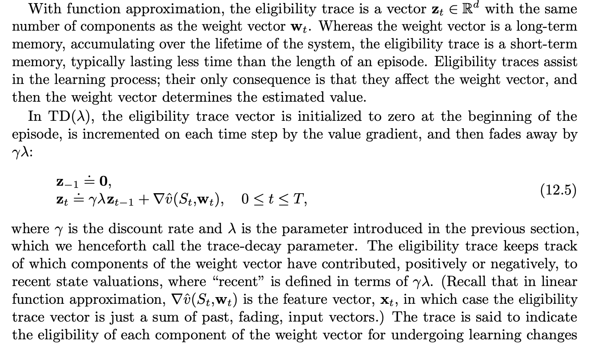

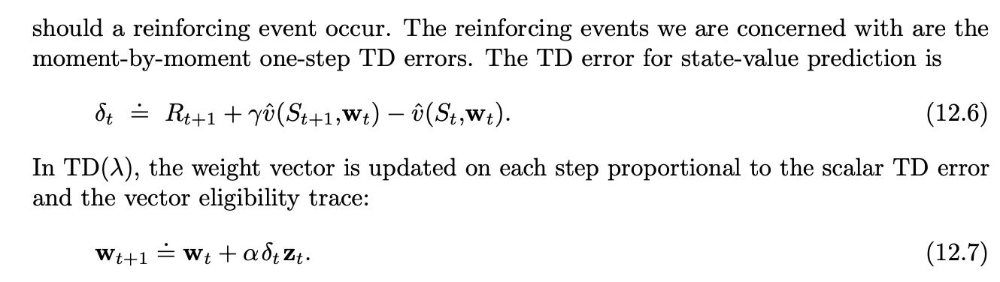

At each moment we look at the current TD error and assign it backward to each prior state according to how much that state contributed to the current eligibility trace at that time.

TD(1) is a way of implementing Monte Carlo algorithms that is more general than those presented earlier and that significantly increases their range of applicability. Whereas the earlier Monte Carlo methods were limited to episodic tasks, TD(1) can be applied to discounted continuing tasks as well. Moreover, TD(1) can be performed incrementally and online. One disadvantage of Monte Carlo methods is that they learn nothing from an episode until it is over. For example, if a Monte Carlo control method takes an action that produces a very poor reward but does not end the episode, then the agent’s tendency to repeat the action will be undiminished during the episode. Online TD(1), on the other hand, learns in an n-step TD way from the incomplete ongoing episode, where the n steps are all the way up to the current step. If something unusually good or bad happens during an episode, control methods based on TD(1) can learn immediately and alter their behavior on that same episode. 

TD(0) corresponds to the TD(0) algorithm seen previously, as it only updates on the previous step each time.

### n-step Truncated-return Methods

Like  TD(lambda) but we only keep the returns for the next n steps in the reward sequence, then update accordingly. 

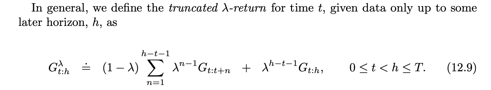

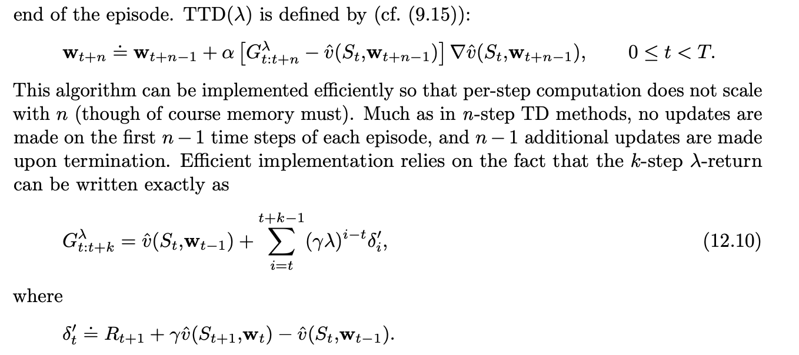

## Elligibility Traces

### True Online TD()

Very similar to TD(lambda) but we update the weights using a different eligibility trace that better approximates the objective (cumulative trace instead of dutch trace).

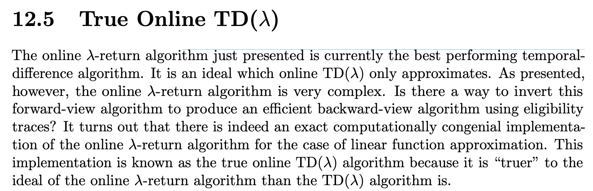

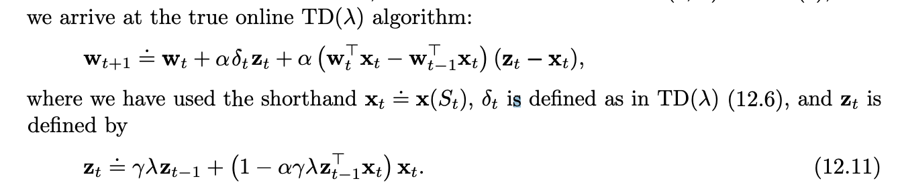

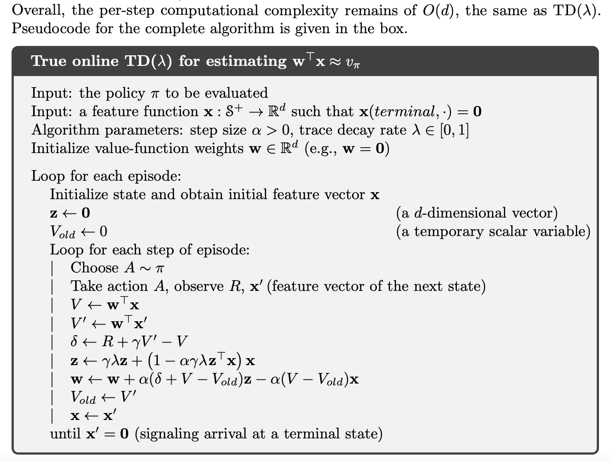

### Sarsa()

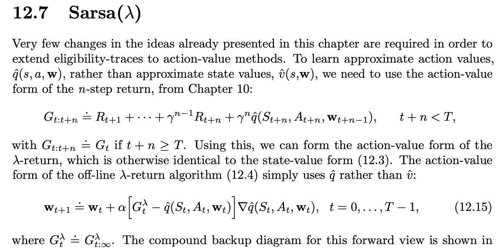

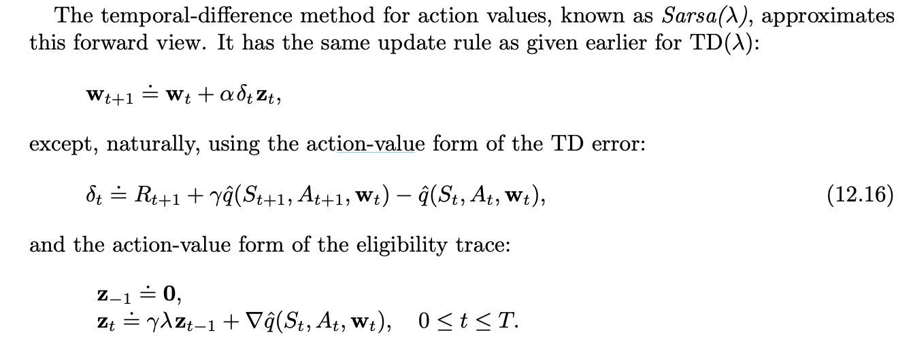

Pseudocode for Sarsa 

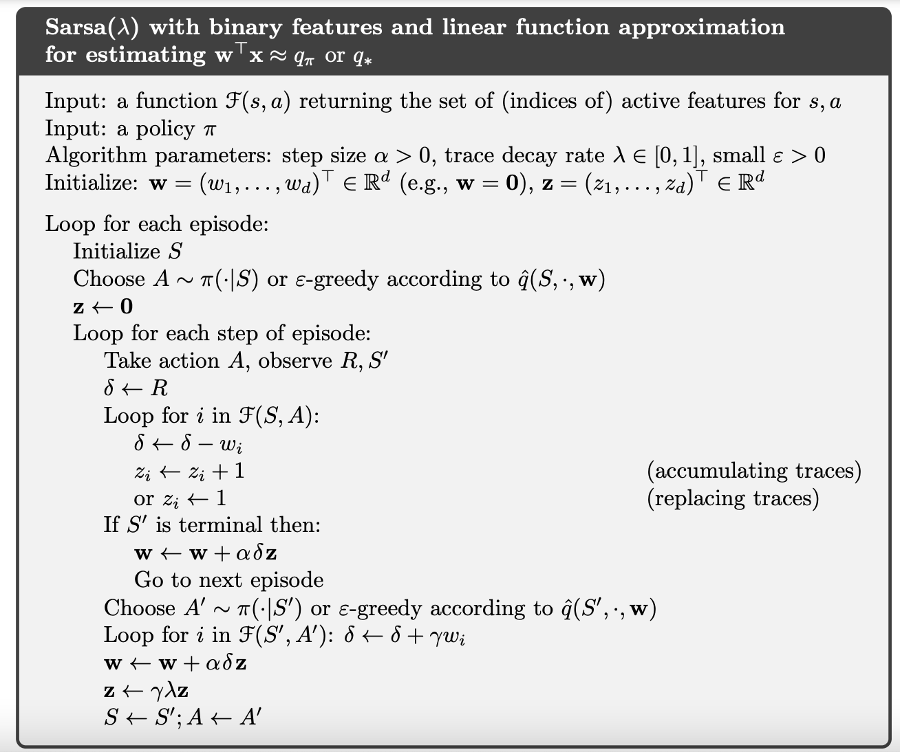

The general idea is we keep an eligibility trace (A convex sum of discounted gradients, which in this case dwx/dw=x) and always update the weights by the TD-error times the eligibility vector times the learning rate. It's cute and simple.

Below is True online Sarsa().

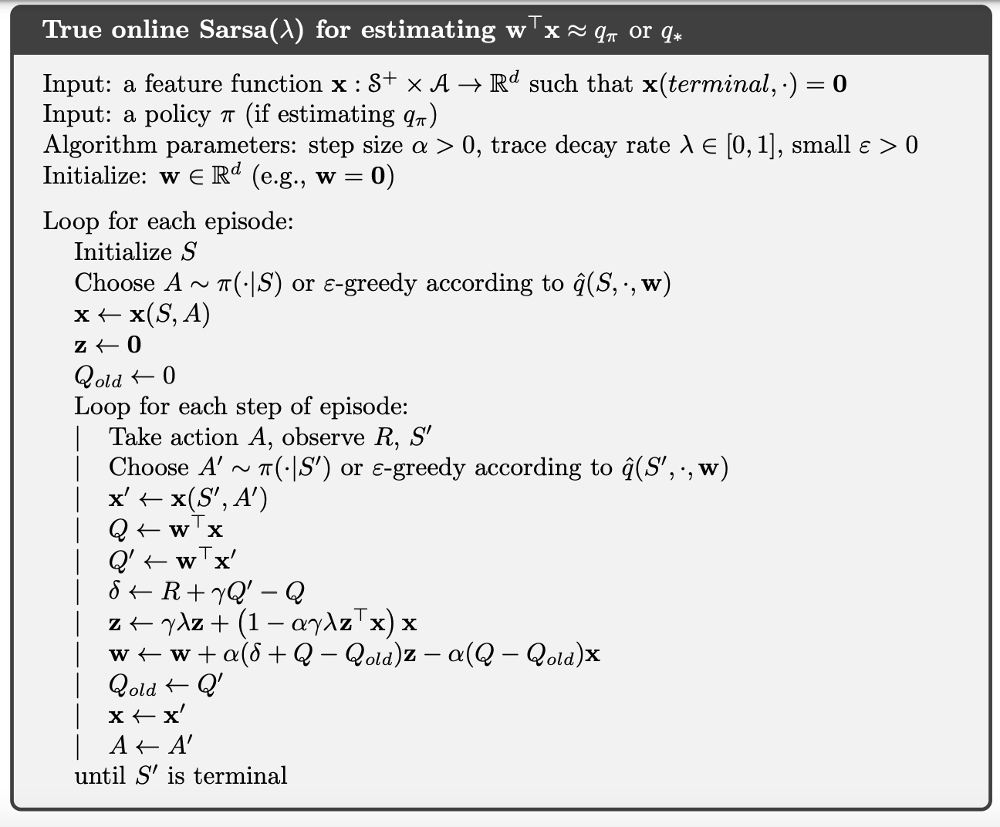

In the line with the w update, notice the second term of the sum uses eligibility (and takes into account both the error but also the momentum of the update) and the third one acts as a regularizer in a way: we subtract according to the momentum times the current input.

## Off-policy traces with control variates

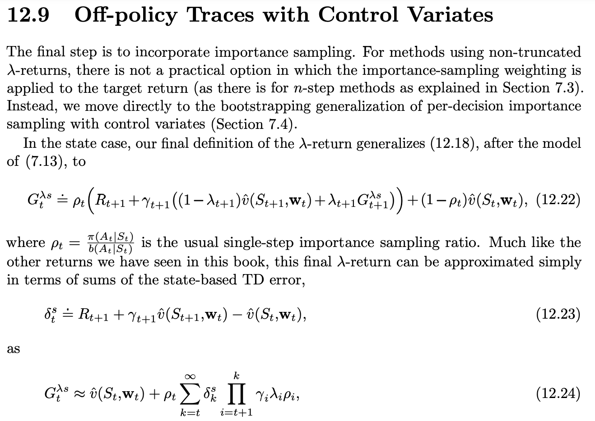

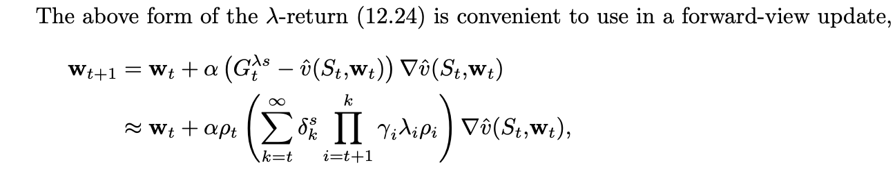

It can be shown that the sum that multiplies alpha is an eligibility trace (scaled by importance sampling). 

In the off-policy case, the algorithm often works well but, as a semi-gradient method, is not guaranteed to be stable.

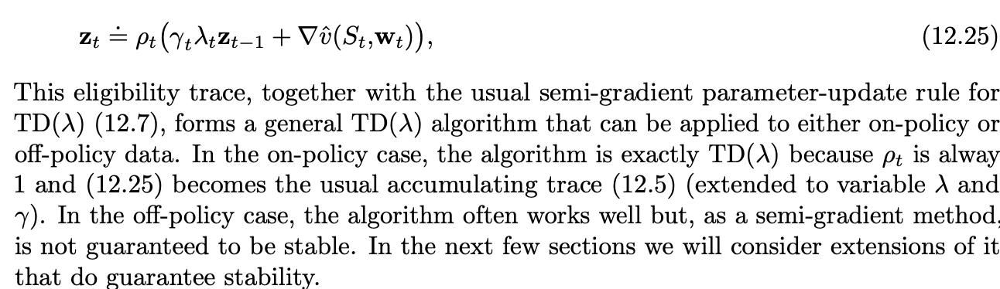

These can be directly extended to an action-value based algorithm like off-policy Sarsa.

The following sections deal with how to make these algorithms (which are maybe the best at the time but quite unstable) more stable.

### Watkins’s Q() to Tree-Backup()

Watkins' Q(lambda) is an off-policy function approximation version of Q-learning. For each episode, we use an epsilon greedy policy. Each q(s,a) is updated with lambda weighted TD-errors, until episode is over. But if a non-greedy action is chosen, we update it using the maximum TD-error (TD-error for a arg max q(s',a) as in Q-learning) and finish. This allows for off-policy learning without importance sampling.

Tree-backup(lambda) uses the probability under policy of choosing each action to weigh each possible TD-error except the one for the action actually taken (a function approximation counterpart to the Tree-Backup algorithm).

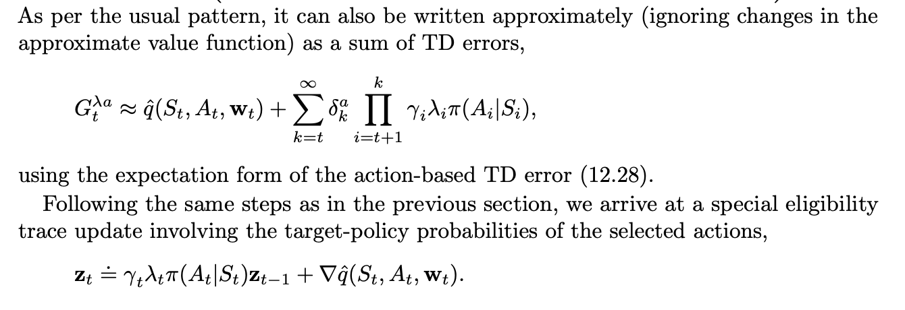

### Summary

Eligibility traces in conjunction with TD errors provide an efficient, incremental way of shifting and choosing between Monte Carlo and TD methods.

The n-step methods of Chapter 7 also enabled this, but eligibility trace methods are more general, often faster to learn, and offer different computational complexity tradeoffs

As mentioned before, Monte Carlo methods may have advantages in non-Markov tasks because they do not bootstrap. Because eligibility traces make TD methods more like Monte Carlo methods, they also can have advantages in these cases.

On tasks with many steps per episode, or many steps within the half-life of discounting, it appears significantly better to use eligibility traces than not to. On the other hand, if the traces are so long as to produce a pure Monte Carlo method, or nearly so, then performance degrades sharply.

Methods using eligibility traces require more computation than one-step methods, but in return they offer significantly faster learning, particularly when rewards are delayed by many steps. On the other hand, in off-line applications in which data can be generated cheaply, perhaps from an inexpensive simulation, then it often does not pay to use eligibility traces. 

## Policy Gradient Methods

Action-value methods learned the values of actions and then selected actions based on their estimated action values; their policies would not even exist without the action-value estimates. Next, we consider methods that instead learn a parameterized policy that can select actions without consulting a value function.

In this chapter we consider methods for learning the policy parameter based on the gradient of some scalar performance measure J(theta) with respect to the policy parameter. These methods seek to maximize performance, so their updates approximate gradient ascent in J:

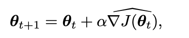

We map each state, action to a preference value (arbitrarily high) then sample our next action using softmax. This is preferable to sampling from the softmax of the value function itself, as this way preference doesn't need to converge to any specific value and can tend to resemble the deterministic policy much more.

A second advantage of parameterizing policies according to the soft-max in action preferences is that it enables the selection of actions with arbitrary probabilities. In problems with significant function approximation, the best approximate policy may be stochastic

Perhaps the **simplest advantage that policy parameterization may have over action-value parameterization is that the policy may be a simpler function to approximate**. Problems vary in the complexity of their policies and action-value functions. For some, the action-value function is simpler and thus easier to approximate. For others, the policy is simpler. In the latter case a policy-based method will typically learn faster and yield a superior asymptotic policy.

With continuous policy parameterization the action probabilities change smoothly as a function of the learned parameter, whereas in "-greedy selection the action probabilities may change dramatically for an arbitrarily small change in the estimated action values, if that change results in a di↵erent action having the maximal value. Largely because of this, stronger convergence guarantees are available for policy-gradient methods than for action-value methods.

> It is the continuity of the policy dependence on the parameters that enables policy-gradient methods to approximate gradient ascent.

How can we estimate the performance gradient with respect to the policy parameter when the gradient depends on the unknown e↵ect of policy changes on the state distribution? Fortunately, there is an excellent theoretical answer to this challenge in the form of the policy gradient theorem, which provides an analytic expression for the gradient of performance with respect to the policy parameter (which is what we need to approximate for gradient ascent) that does not involve the derivative of the state distribution.

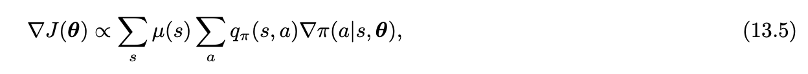

### REINFORCE: Monte Carlo Policy Gradient

Our current interest is the classical REINFORCE algorithm (Willams, 1992) whose update at time t involves just At.

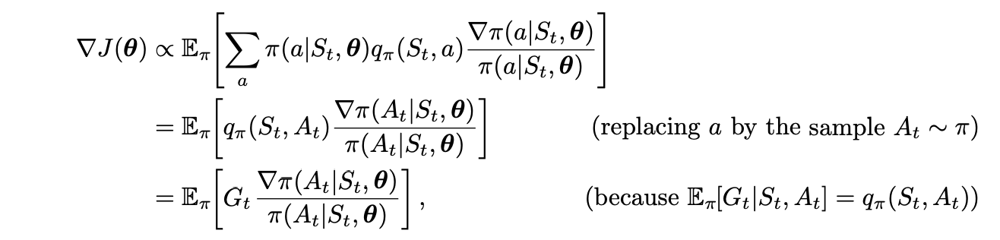

This is a quantity that can be sampled on each time step whose expectation is proportional to the gradient. We only need to update theta with a term proportional to that one. Note that we will need to compute the whole return (hence this being the episodic algorithm) before doing all the updates.

Pseudocode for REINFORCE follows:

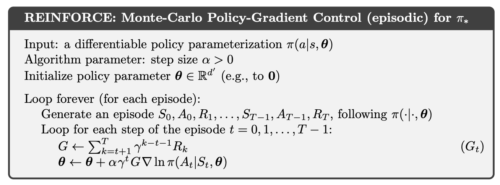

As a stochastic gradient method, REINFORCE has good theoretical convergence properties. By construction, the expected update over an episode is in the same direction as the performance gradient. This assures an improvement in expected performance for sufficiently small alpha, and convergence to a local optimum under standard stochastic approximation conditions for decreasing alpha.

"The estimated value of the second state, when discounted and added to the reward, constitutes the one-step return, Gt:t+1, which is a useful estimate of the actual return and thus is a way of assessing the action. As we have seen in the TD learning of value functions throughout this book, the one-step return is often superior to the actual return in terms of its variance and computational congeniality, even though it introduces bias. We also know how we can flexibly modulate the extent of the bias with n-step returns and eligibility traces. When the state-value function is used to assess actions in this way it is called a critic, and the overall policy-gradient method is termed an actor–critic method. Note that the bias in the gradient estimate is not due to bootstrapping as such; the actor would be biased even if the critic was learned by a Monte Carlo method."

One-step _actor–critic methods_ **replace the full return of REINFORCE with the one-step return** (and use a learned state-value function as the baseline). Note that it is **now a fully online, incremental algorithm**, with states, actions, and rewards processed as they occur and then never revisited.

They bring back TD-error!

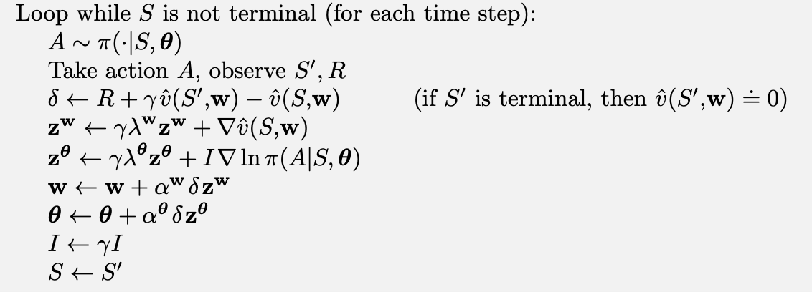

### Summary

We have considered policy-gradient methods—meaning methods that update the policy parameter on each step in the direction of an estimate of the gradient of performance with respect to the policy parameter.

Methods that learn and store a policy parameter have many advantages. 

* They can learn specific probabilities for taking the actions.
* They can learn appropriate levels of exploration and approach deterministic policies asymptotically. 
* They can naturally handle continuous action spaces.

All these things are easy for policy-based methods but awkward or impossible for Æ-greedy methods and for action-value methods in general.

Parameterized policy methods also have an important theoretical advantage over action-value methods in the form of the policy gradient theorem, which **gives an exact formula for how performance is affected by the policy parameter that does not involve derivatives of the state distribution**.

The REINFORCE method follows directly from the policy gradient theorem. Adding a state-value function as a baseline reduces REINFORCE’s variance without introducing bias. If the **state-value function is also used to assess—or criticize—the policy’s action selections**, then the **value function is called a critic and the policy is called an actor** ; the overall method is called an **actor–critic method**.

---

## Part III : Going Deeper

I decided to skip the chapters on psychology and neuroscience. I started reading them but they didn't seem to relevant to my interests. Going straight to "Applications and Case Studies". I did not take notes on them though, but I found them entertaining.

### How AlphaGo works
"Where in addition to reinforcement learning, AlphaGo relied on supervised learning from a large database of expert human moves, AlphaGo Zero used only reinforcement
learning and no human data or guidance beyond the basic rules of the game (hence the
Zero in its name)."

"The main innovation that made AlphaGo such a strong player is that it selected moves by a novel version of MCTS that was guided by both a policy and a value function learned by reinforcement learning with function approximation provided by deep convolutional ANNs."

Each node of the tree was expanded with a node with a value that was a mixture between a value estimation for that state (calculated using a deep CNN) and the return from a monte carlo game (generated such that each decision made by either player was done from a linear rollout policy, also trained in a supervised manner from an expert play dataset).

" APV-MCTS’s rollouts in AlphaGo were simulated games with both players using a fast rollout policy provided by a simple linear network, also trained by supervised learning before play."

**For the value network**: They divided the process of training the value network into two stages. In the first stage,
they created the best policy they could by using reinforcement learning to train an RL
policy network. This was a deep convolutional ANN with the same structure as the SL
policy network. It was initialized with the final weights of the SL policy network that
were learned via supervised learning, and then policy-gradient reinforcement learning was
used to improve upon the SL policy. In the second stage of training the value network,
the team used Monte Carlo policy evaluation on data obtained from a large number of
simulated self-play games with moves selected by the RL policy network.

In testing the final RL policy, they found that it won more than 80%
of games played against the SL policy, and it won 85% of games played against a Go
program using MCTS that simulated 100,000 games per move.

The rollout policy network allowed approximately 1,000
complete game simulations per second to be run on each of the processing threads that
AlphaGo used.

**Summary**: If I understand correctly, the entire pipeline was: from current state, select next action using the SL-policy network. Then do rollout using the rollout policy (which is linear and simpler). Add the node to the tree with a value that is a mixture between the value network (the RL-policy network) and the return on the monte carlo rollout. Eventually the node with the highest return is chosen on decision time.   The best play resulted from setting the mixture parameter to 0.5.

AlphaGo Zero, instead, did not have complex represenattions of the board (just the matrix of pieces and places) and used MCTS during self-play, combined with a CNN that predicted next move probabilities and a probability of winning, guiding MCTS but being gradient descended to iteratively predict closer to MCTS itself.

"The DeepMind team also compared AlphaGo Zero with a program using an ANN with
the same architecture but trained by supervised learning to predict human moves in a
data set containing nearly 30 million positions from 160,000 games. They found that the supervised-learning player initially played better than AlphaGo Zero, and was better at predicting human expert moves, but played less well after AlphaGo Zero was trained for a day. **This suggested that AlphaGo Zero had discovered a strategy for playing that was different from how humans play.**" [Emphasis mine.]

This makes me wonder, what novel strategies may we find in different games if we trained RL algorithms for them? What facets of the world are hidden, waiting to be found by a different AlphaX Zero? Could RL be applied in logistics, finance, maybe manufacturing processes? What is rewards were about designing clothes that people like or writing blog posts people find insightful? And what happens when "Reinforcement Learning as a Service" emerges as a B2B technology or even an app in say ~10 years when costs have gone down significantly? \[Maybe write an article on this with real examples and use-cases.\]

"AlphaGo Zero soundly demonstrated that superhuman performance can be achieved
by pure reinforcement learning, augmented by a simple version of MCTS, and deep ANNs
with very minimal knowledge of the domain and no reliance on human data or guidance."

