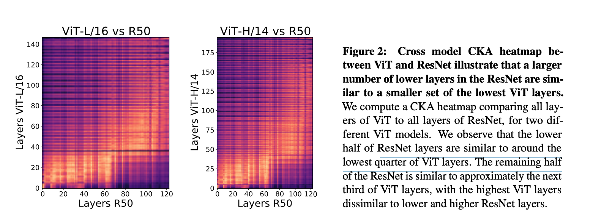
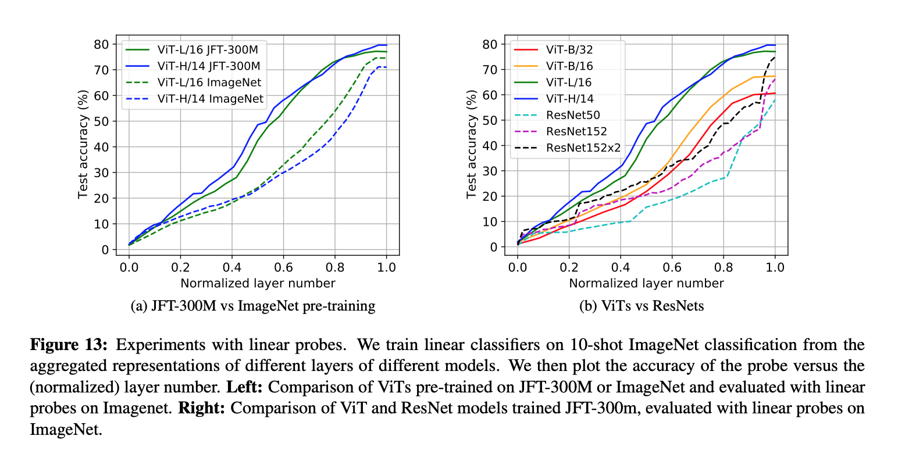

<https://arxiv.org/pdf/2108.08810.pdf>

Over the past several years, the successes of deep learning on visual tasks has critically relied on convolutional neural networks. Remarkably however, recent work has demonstrated that Transformer neural networks are capable of equal or superior performance on image classification tasks at large scale.
This breakthrough highlights a fundamental question: how are Vision Transformers solving these image based
tasks? Do they act like convolutions, learning the same inductive biases from scratch? Or are they developing
novel task representations? And what is the role of scale in learning these representations? In this paper, we
study these questions, uncovering insights about key differences between ViTs and CNNs. 

- We investigate the internal representation structure of ViTs and CNNs, finding striking differences between the two models, such as ViT having more uniform representations, with greater similarity between lower and higher layers.
- Analyzing how local/global spatial information is utilised, we find ViT incorporates more global information than ResNet at lower layers, leading to quantitatively different features.
- Nevertheless, we find that incorporating local information at lower layers remains vital, with large-scale pre-training data helping early attention layers learn to do this.
- We study the uniform internal structure of ViT, finding that skip connections in ViT are even more influential than in ResNets, having strong effects on performance and representation similarity.

The right pane, which has line plots of these norm ratios across ResNet50, the ViT CLS token and the ViT
spatial tokens additionally demonstrates that skip connection is much more influential in ViT compared to
ResNet: we observe much higher norm ratios for ViT throughout, along with the phase transition from CLS to
spatial token propagation (shown for the MLP and self-attention layers.)

Given the central role of convolutional neural networks in computer vision breakthroughs, it is remarkable
that Transformer architectures (almost identical to those used in language) are capable of similar performance.
This raises fundamental questions on whether these architectures work in the same way as CNNs. Drawing
on representational similarity techniques, we find surprisingly clear differences in the features and internal
structures of ViTs and CNNs. An analysis of self-attention and the strength of skip connections demonstrates
the role of earlier global features and strong representation propagation in ViTs for these differences, while
also revealing that some CNN properties, e.g. local information aggregation at lower layers, are important to
ViTs, being learned from scratch at scale. We examine the potential for ViTs to be used beyond classification
through a study of spatial localization, discovering ViTs with CLS tokens show strong preservation of spatial
information — promising for future uses in object detection. Finally, we investigate the effect of scale for
transfer learning, finding larger ViT models develop significantly stronger intermediate representations through
larger pretraining datasets.

This paper uses HSIC to compare activations of layers given a batch of inputs. It looks like cosine similarity with extra steps, and they take the HSIC(L,K) divided by the geometric mean of HSIC(K,K) and HSIC(L,L) as CKA. 

### See Also

- [Visual Transformer](/wiki-articles/machine-learning/visual-transformer)
- [transGAN](/wiki-articles/machine-learning/transGAN)
- [Unsupervised Learning Core](/wiki-articles/machine-learning/unsupervised-learning-berkeley)
