## Autoregressive models

On a general, generic case you may approach this problem with an autoregressive RNN. This can for instance generate plausible samples for MNIST, and improves drastically if you also provide it with metadata on pixel position (so you pass it the RNN state, and the X and Y coordinates).

**PixelCNN**: User a 2d-filter over pixels above, and a different 1d one over pixels to the left, condition on both and do softmax.

**WaveNet**: We actually read the paper, but dillated causal convolutions + tanh\*sigmoid activation+ residual connections. It's interesting that it generalizes to images, but it *needs* the pixel coordinates as metadata to work.

## Flow models
En una dimension, mappear distribuciones arbitrarias a otras mas conocidas usando una funcion aprendida, que maximice log likelihood y sea inversible. E.g., tomo una distribucion cualquiera, le tomo la CDF y la mappeo a la CDF de una gaussiana. 
### autoregressive flow vs inverse autoregressive flow
Autoregressive flow: train fast, sample slow (linearly on pixel quantity).
Inverse: train slow (depends on sampled pixels), but sample very fast (just sample N variables from your prior and then run the f(z...) autoregressively.

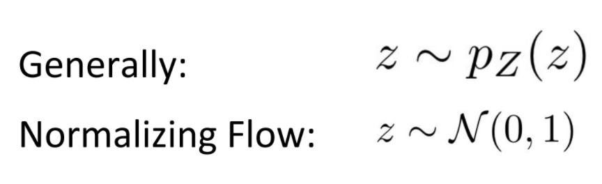
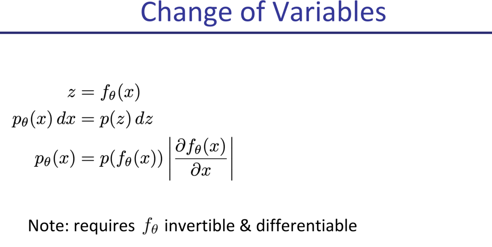

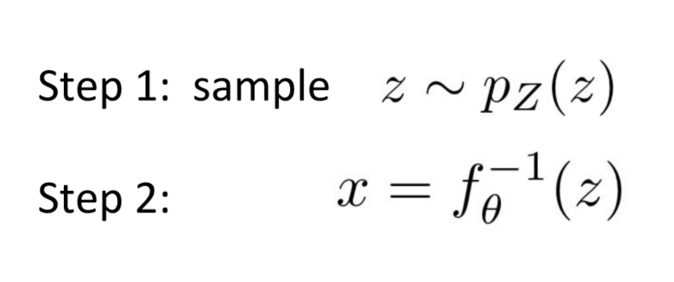
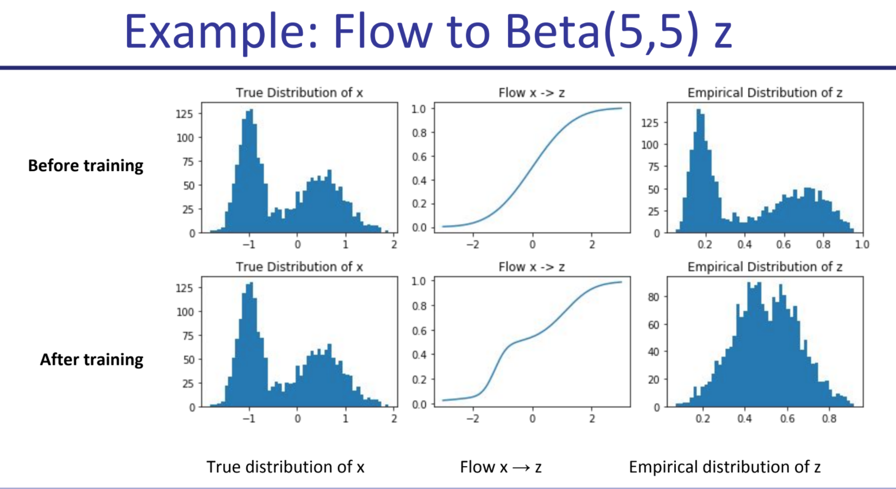

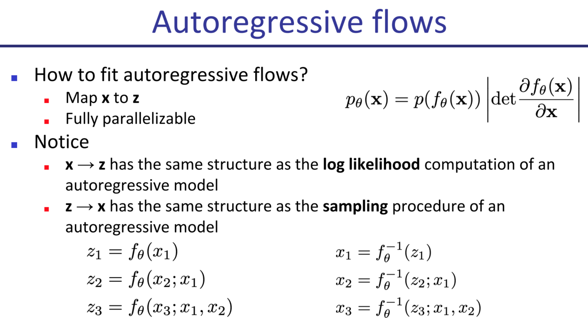
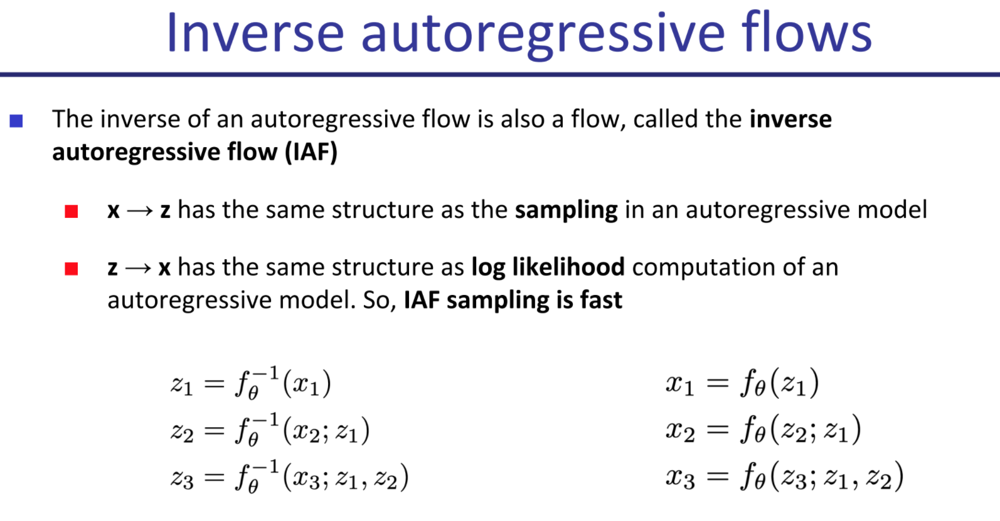
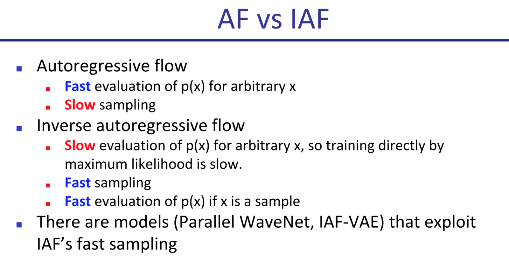

### (Uniform) Dequantization
We add a random number uniformly sampled from -.5 to .5 to our discrete data every time, so that flow doesn't learn to use discrete data and overfit by asigning too much mass to too few points.

### RealNVP / NICE
Mappeo de x -> Z tq X0:n/2 quedan iguales en z, y Xn/2:n = Xn/2:n * s(x0:d/2) + t(x0:d/2).
Osea que la mitad de los x los dejo iguales, la otra mitad los transformo con una transformacion afin donde los pesos lineales son funcion de la primera mitad.
Tipicamente partis alternando pixeles (el famoso checkerboard) pero tambien se probo imagen partida vertical u horizontalmente. Esto ultimo empeora resultados.
 Las funciones s y t son arbitrarias con que fitteen, no necesitas reversibilidad porque ya conocias x0...n/2.

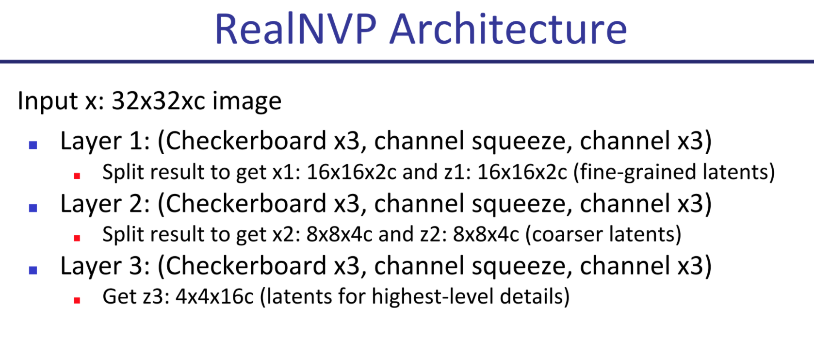

Otros modelos que funcionan pero no se cubren en detalle:
- [Glow](https://openai.com/blog/glow/) [🌿](/wiki-articles/machine-learning/flow-based-models-glow)
- [FFJORD](https://arxiv.org/abs/1810.01367) 🌱

## Latent Variable Models

In a latent variable model, you have a distribution of data X, and you assume it has an underlying cause distribution Z such that you can estimate P(X\|Z) and Z is easy to sample from. 

In a way this is similar to flow models, but here we make no strong constraints on the relationship between X and Z, we may not know the intermediate values for Z and the mapping needs not be invertible. 

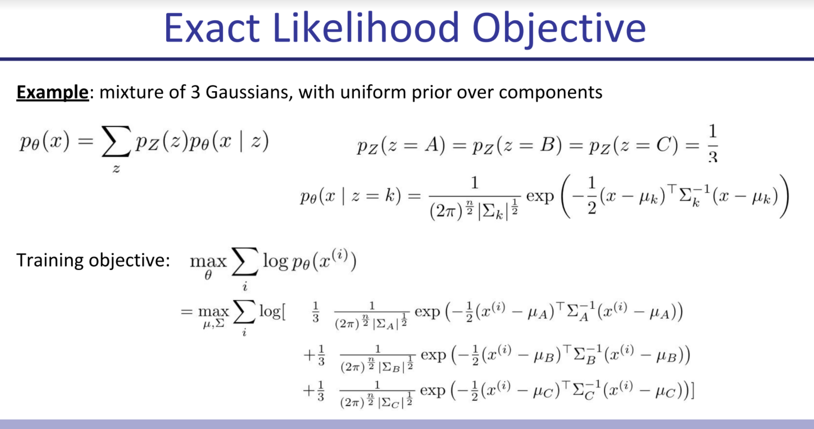

### Variational AutoEncoders
**Principle of Variational Approach**: We can't directly use the *p* we want, so instead we propose a parameterized distribution *q* we know we can work with (sample from, estimate likelihood) easily, and try to find a parameter setting that makes it as good as possible.

This works because we're doing importance sampling: we could be sampling from our random latent space and doing maximum likelihood of X given Z (without fitting Z, we only fit P(X\|Z)), but then for Z st P(X\|Z) is ~0, we're doing the work pointlessly (because the gradient is 0 and there's no information to propagate). Whereas if we make sure to only sample from points where X given Z is likely, we get more bang for our buck. However if we already had P(Z\|X) to calculate this we wouldn't be going through this in the first place (because Bayes) and this is usually intractable (if Z is gaussian or generally not enumerable), so instead we try to get this to be "as good as possible" and that's that.

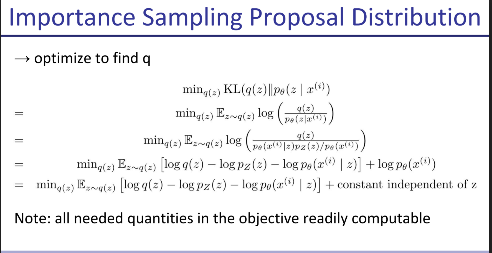

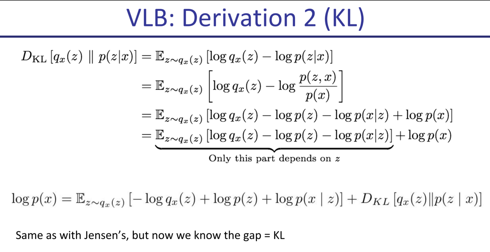
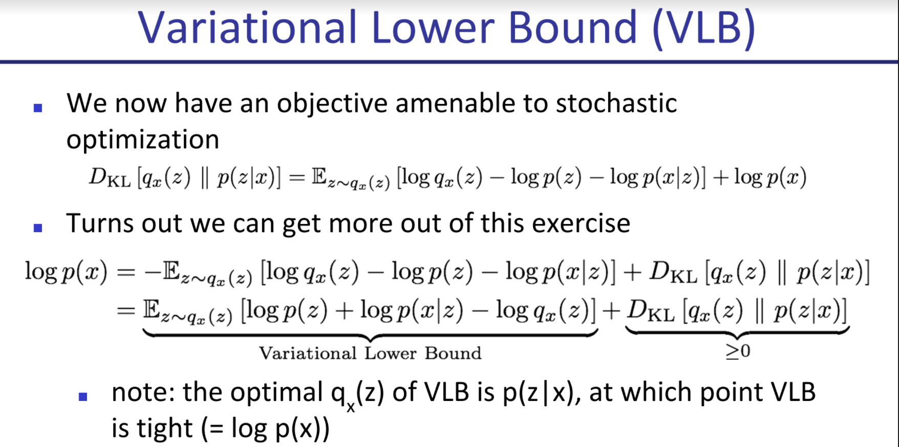

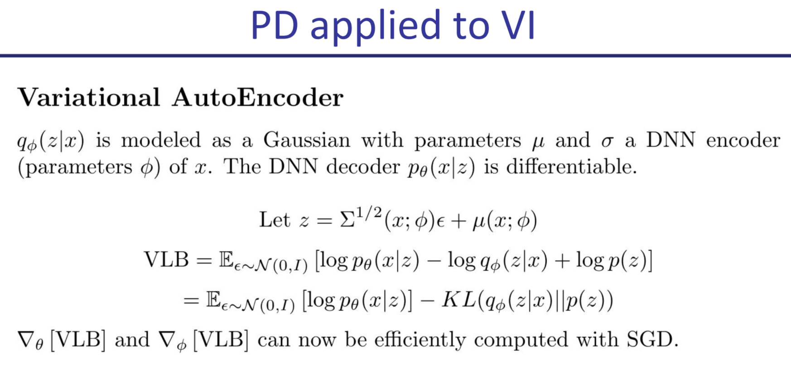
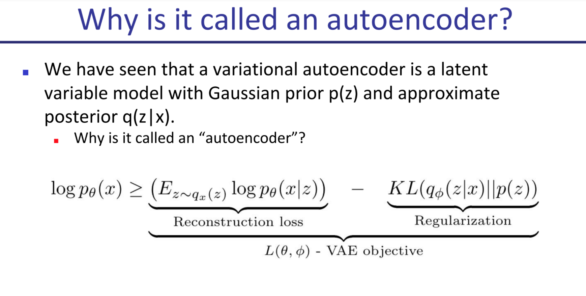

## GANs
The course introduces GANs, following Goodfellow et al. closely, so I won't reproduce what they say as it overlaps with [GANs](/wiki-articles/machine-learning/GAN).

It then discusses the difficulties in measuring GAN performance, as human judgement over samples is not enough (though it is the original propeller of GANs in a way).

### Inception Score
We pick a pretrained classifier on imagenet 1k classes and:
- Entropy of labels should be high (the generator should generate a diverse set of classes)
- But entropy of certainty of classifier should be low: the classifier must be quite certain which class each image belongs to.

The Inception score ends up being the DKL between p(y\|x) and p(y), where p(y) is the marginal probability over a sample set for each class, and p(y\|x) is the probability for that label for that specific sample. The p(y) marginal should be a uniform distribution, whereas the p(y\|x) should peak around a class. You want KLD to be *high*.

Equivalent to entropy of labels for generated samples - entropy of labels for each sample.

FID is a more complicated metric based on inception score that uses an embedding space from some classifier, and compares the embedding for generated image vs average embedding.

### Discriminator Saturation
The bayes ideal discriminator is always right (assigns prob 0 to fake and prob 1 to true). However if our discriminator is too good too fast, since the gradient tends to be very close to zero for high confidence predictions (the landscape is flat around the edges, think of a sigmoid), the generator gets little information to work with.

**Ways to address Discriminator Saturation**: Use a different, non-zero-sum objective where you switch the log(1 - D(G(z))) with a -log(D(G(z))). This changes the regime of the game so it stops being zero sum, and also makes it so that the gradient goes to 0 when the generator is already winning, which is far less terrible. Otherwise a generator may get stuck on a bad initialization. The other way to prevent this is alternating updates between generator and discriminator.

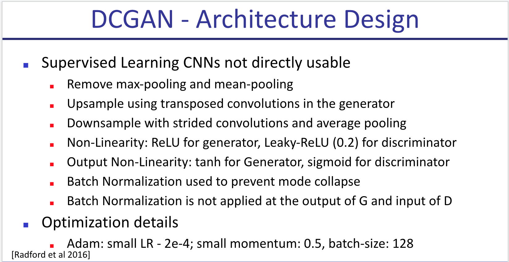

### Other techniques

**Feature Matching**: Add to the objective that the mean batch value for the vector of **hidden features** for generated images shouldn't stray too far from mean vector of data features.

**DC-Gan**: Improved performance by using deconv layers and a few other tricks.

**Improvements over DCGAN**:
- Feature Matching: add a loss that looks at 2-norm divergence between means of hidden reps of generated and true data.
- Minibatch discrimination: I didn't quite understand this one [🌱]
- Historical Averaging: add a penalty to distance between theta and mean historical theta
- Virtual batch normalization: instead of calculating mu and sigma for each minibatch, keep a big one and use their weights and keep adding the new batches to it.
- One-sided label smoothing: change label 1 to .9 (less important if you use the good objective)

**WGAN**: Wassertein GAN: keep the gradient in a magic (Lipschitz-1) space using weight clipping: for each weight, clip it between c and -c. c too big changes nothing and makes convergence hard. c too close to 0 may make you lose too much information. Made models significantly more robust, allowing for instance to train a DCGAN without batch-norm with similar results.

**WGAN-GP**: Same idea, achieves the same without weight clipping (which is subpar in many ways and gets ugly results). Just add a term to loss that punishes the gradient of the discriminator from diverging from norm 1. Keeps the gradient in a more docile regime and generally gets better and more robust results. The only code change is adding this term to the loss. Interestingly, the gradient is computed for an interpolation (convex sum) between generated and real samples.

**SNGAN**: You normalize each layer of the discriminator by the [spectral norm](/wiki-articles/computer-science/metnum-final) (value of biggest eigenvalue) of its weight matrix W. You do this to guarantee lipschitz-ness of the network, restricting the optimization problem to min G: max \|\|f\|\|Lip <= K V(G,D).

**SAGAN**: Adds self attention to SNGAN. Applies spectral norm in both discriminator and generator. (Instead of just discriminator).

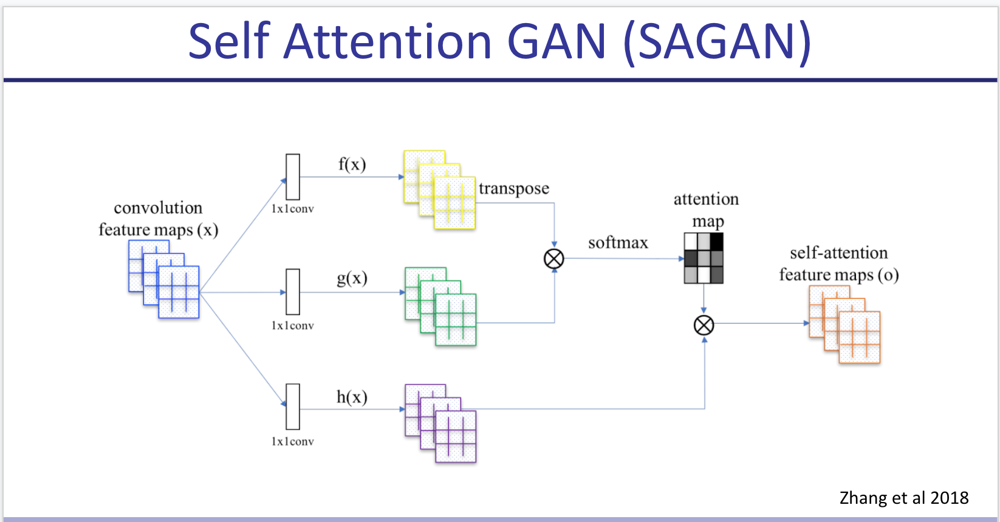

**BigGAN**: Just makes everything bigger (wider and deeper), Orthonormal regularization -make each W close to I- & Truncation Trick -at test time only, sample from truncated normal instead of standard one-.

**StyleGAN**: Very big GAN with a MLP that turns gaussian latent into a different vector, and feeds it into every layer. Also adds noise to inputs 100 times (100 different noise vectors) and uses *that* to generate the statistics for batch norm, which it does individually for each sample and for each channel (averaging over all WxH). This is called AdaIN. 

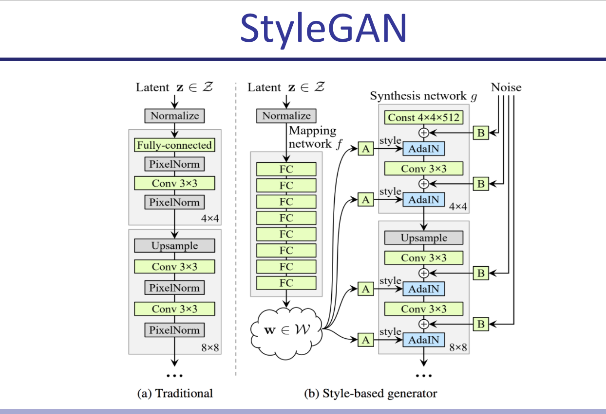

> **Bottom line**: Use BigGan for conditioned image generation, styleGAN for unconditioned or if you have an interest in interpolation. They require at least 16GB of VRAM anyway.

**Pix2Pix**: Train a model G(x, z) where z is your (random) latent and x is an actual black and white image, such that a discriminator that takes D(x, G(x, z)) and D(x, y) can't tell which is which in an adversarial setting (where y = actual-colored-of(x) ). I think this approach is beautiful. It kind of reminds me of [contrastive learning](wiki-articles/machine-learning/clip)

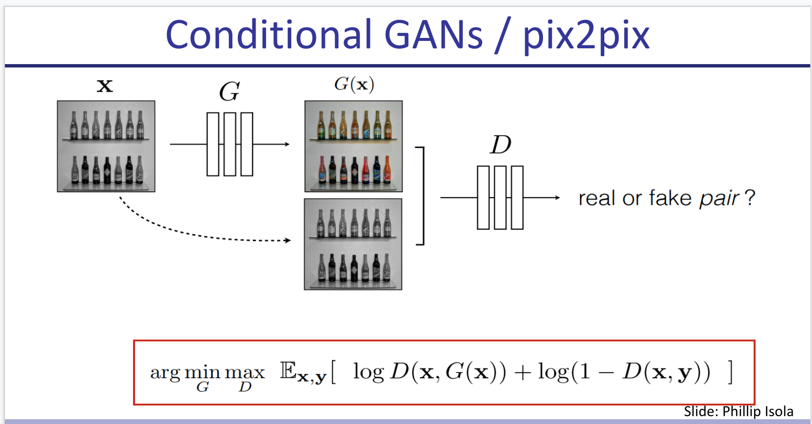 

In the objective, besides the shared loss function they add a term for L1 reconstruction loss (L1-norm of difference between G(x,z) and y) -between the generated translation of the source image and the expected target image-.

- Pix2Pix can be extended to video but I'm not 100% sure how (see 2018 neurips video synthesis from semantic drawings). [🌱]
- There's also GauGAN by Nvidia which makes photorealistic illustrations from segmentation semantic drawings. It looks pretty awesome so I'd like to read on that. [🌱]

**InfoGAN**: Instead of class, you provide a vector of "latent codes" such that each code captures a few aspects of your image. You train the discriminator with two losses: the classic discriminator loss (real or fake?) and also a new term where the discriminator tries to maximize I(c ; x) the mutual information (by maximizing its estimation of the posterior P(c\|x)). So basically it's trying to predit what C generated a given x. e.g., for MNIST you could have c1 = digit, c2 = rotation etc.

Interestingly, the code can be discrete and fed in a random way (e.g., uniformCateg(1024) for a 1000 classes dataset) and eventually even without a specific loss for this, the models converge in making different classes for different values of the categ code (obtained in a completely unsupervised way). This is only using the loss of a regular BigGAN.

**BigBiGAN**: Comes after BigGAN. You train an encoder that generates z' from image x, and your typical generator G(z)=x'. You then train the discriminator to receive both z' and x' or z and x, and decide whether x/' is real or fake. 
You could then take any image and map it into the representational space z'. This reaches state of the art in linear probe for top 1 accuracy in some datasets at the time.
Also you can do a weird autoencoder (which was never in the objective!) x' = G(E(x)), where x' is the optimal confounder for a given discriminator. Pretty neat! (and pure nightmare fuel for human faces apparently).

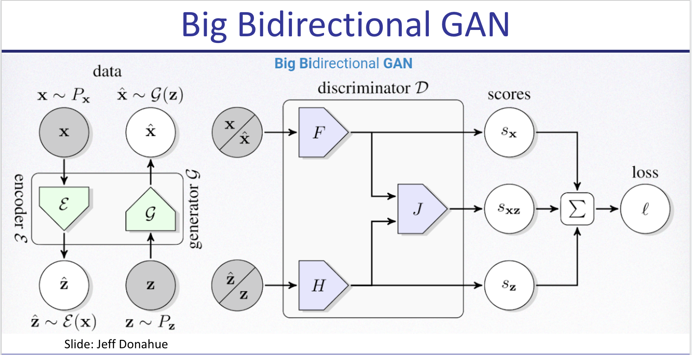

**IMLE (Implicit Maximum Likelihood Estimation)**: initialize theta on random. for k = 1 to K: sample X1'...Xn' from P'(x), pick a random batch S of X (real), L times repeat: update theta with gradient where cost is distance between a random sample of size n from the batch S, and the generated samples, but you compare generated vector to the one closest to it in the real batch (for some definition of distance).
This evenually converges preventing mode collapse.

## Self-Supervised Learning

We wish to learn rich and useful features from raw unlabeled data that can be useful for several downstream tasks. For this we use pretext tasks that require no labeling on a big dataset, improving data efficiency for downstream tasks.

### Pretext Tasks
Used to learn feature representations.
- Autoencoders (typically denoising)
- Relative Position of Image Patches
- Predicting one view from another (e.g., color from B&W)
- Predict rotation (rotating just 4 angles works best)
- Word2Vec and contrastive learning are also Self-supervised learning

CPC (Contrastive predicting coding) can also be used to predict next audio chunk after X audio (using a RNN as encoder) or next patch of an image. They just use softmax over k\_i embedding * W * c where c is code for X.

MoCo and SimCLR do the same, but they keep a stash of all previous instances in memory using a weighted average of the weights over time to predict (so noisy output of model for contrastive loss). This is useful for batchnorm and biggest "no" for contrastive step.

## Semi-Supervised Learning

Train a supervised model on labeled data and then leverage unlabeled (typically much more numerous) data to improve it.

Some techniques include:
- Label Consistency: minimizing entropy for unlabeled data
- unsupervised data augmentation
- Pseudo Labeling: adding the most confident predictions as 100% labeled
- VAT Virtual Adversarial Training: where you take derivative of prediction wrt *the input* and move the input in the opposite direction keeping the label

**MixMatch**: Take unlabeled data, augment it many times, average predictions and sharpen them with temperature, then make that the label for all augmentations. This term in loss is weighted with a hyperparam. This algorithm *almost* matches supervised performance in CIFAR10 and others.

**Noisy Student** : Train a supervised model on your labeled data, that's your teacher. Create a student, which trains on labeled data but also in unlabeled such that the original teacher has high confidence in the label. Add noise (stochastic skip connections, dropout, data augmentation) to the inputs that go into the noisy student (hence the name). Then the student becomes the teacher and you keep repeating.

This uses the logits instead of the one-hot encoded predictions for the teacher classifications. It got a 10x data efficiency compared with sota (10x smaller unlabelled dataset) combining ImageNet and JFT. Sota in imageNet. Very robust in Imagenet-A, an adversarial dataset [🌱]. Scales well to little labeled data.

---
A small aside: a matrix W is orthogonalized by solving the following constrained quadratic problem:

 \\\( \min_{\bar{W}} \lVert W - \bar{W} \rVert s.t. \bar{W}^T \bar{W} = I \\\) 

One can show that this problem can be solved by taking the singular value decomposition (SVD) of W and replacing the singular values to ones.

### Notes from <title>

[Paper](https://aclanthology.org/N15-1104.pdf)

The authors try training an orthogonal matrix W to align (i.e., minimize cosine distance of normalized vectors) two word embedding spaces (EN-ES). They sample 6k frequent words, translate with google, and find W orthogonal that minimizes cosine distance (after normalizing embedding vectors to norm 1).

They compare against Mikolov who didn't normalize and used arbitrary linear transform, and conclude that "bilingual translation can be largely improved by the normalized embedding and the accompanied orthogonal transform". They reach about 40% P@1, 60% P@5.
