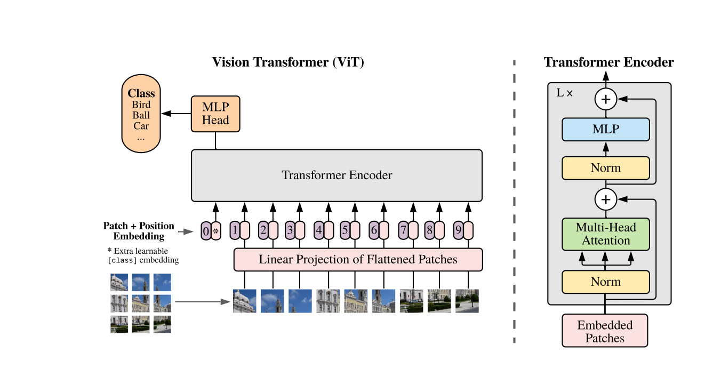
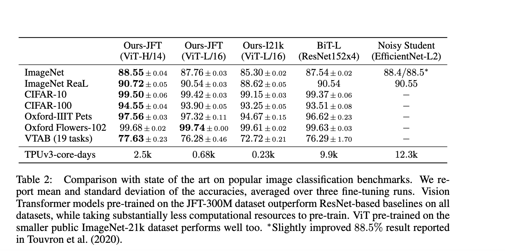
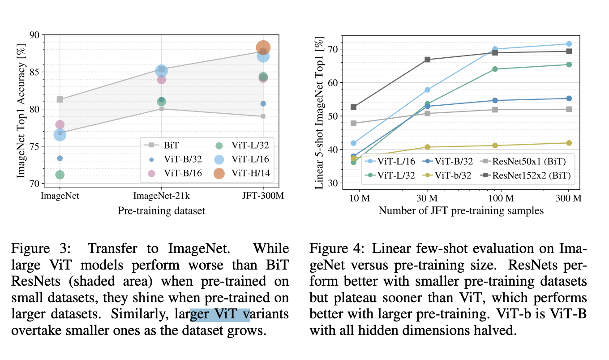
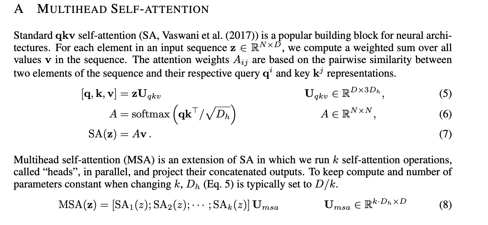

# An Image is Worth 16x16 Words: Transformers for Image Recognition at Scale
<https://arxiv.org/pdf/2010.11929v2.pdf>

While the Transformer architecture has become the de-facto standard for natural
language processing tasks, its applications to computer vision remain limited. In
vision, attention is either applied in conjunction with convolutional networks, or
used to replace certain components of convolutional networks while keeping their
overall structure in place. We show that this reliance on CNNs is not necessary
and a pure transformer applied directly to sequences of image patches can perform
very well on image classification tasks. When pre-trained on large amounts of
data and transferred to multiple mid-sized or small image recognition benchmarks
(ImageNet, CIFAR-100, VTAB, etc.), Vision Transformer (ViT) attains excellent
results compared to state-of-the-art convolutional networks while requiring substantially fewer computational resources to train.

Inspired by the Transformer scaling successes in NLP, we experiment with applying a standard
Transformer directly to images, with the fewest possible modifications. To do so, we split an image
into patches and provide the sequence of linear embeddings of these patches as an input to a Transformer. Image patches are treated the same way as tokens (words) in an NLP application. We train
the model on image classification in supervised fashion.

When trained on **mid-sized datasets** such as ImageNet without strong regularization, these models yield **modest accuracies of a few percentage points below ResNets** of comparable size. This
seemingly discouraging outcome may be expected: Transformers lack some of the inductive biases inherent to CNNs, such as translation equivariance and locality, and therefore do not generalize well
when trained on insufficient amounts of data.
However, the picture changes if the models are trained on larger datasets (14M-300M images). 

We find that **large scale training trumps inductive bias**. Our Vision Transformer (ViT) attains excellent
results when pre-trained at sufficient scale and transferred to tasks with fewer datapoints. When
pre-trained on the public ImageNet-21k dataset or the in-house JFT-300M dataset, ViT approaches
or **beats state of the art** on multiple image recognition benchmarks. In particular, the best model
reaches the accuracy of 88.55% on ImageNet, 90.72% on ImageNet-ReaL, 94.55% on CIFAR-100,
and 77.63% on the VTAB suite of 19 tasks.

Naive application of self-attention to images would require that each pixel attends to every other
pixel. With quadratic cost in the number of pixels, this does not scale to realistic input sizes. Thus,
to apply Transformers in the context of image processing, several approximations have been tried in
the past. Parmar et al. (2018) applied the self-attention only in local neighborhoods for each query
pixel instead of globally. Such local multi-head dot-product self attention blocks can completely
replace convolutions (Hu et al., 2019; Ramachandran et al., 2019; Zhao et al., 2020). In a different
line of work, Sparse Transformers (Child et al., 2019) employ scalable approximations to global selfattention in order to be applicable to images. An alternative way to scale attention is to apply it in
blocks of varying sizes (Weissenborn et al., 2019), in the extreme case only along individual axes (Ho
et al., 2019; Wang et al., 2020a). Many of these specialized attention architectures demonstrate
promising results on computer vision tasks, but require complex engineering to be implemented
efficiently on hardware accelerators.

The residual skip-connection is **additive**.

Typically, we pre-train ViT on large datasets, and fine-tune to (smaller) downstream tasks. For
this, we remove the pre-trained prediction head and attach a zero-initialized D × K feedforward
layer, where K is the number of downstream classes. It is often beneficial to fine-tune at higher
resolution than pre-training (Touvron et al., 2019; Kolesnikov et al., 2020). When feeding images
of higher resolution, we keep the patch size the same, which results in a larger effective sequence
length. The Vision Transformer can handle arbitrary sequence lengths (up to memory constraints),
however, the pre-trained position embeddings may no longer be meaningful. We therefore perform
2D interpolation of the pre-trained position embeddings, according to their location in the original
image. Note that this resolution adjustment and patch extraction are the only points at which an
inductive bias about the 2D structure of the images is manually injected into the Vision Transformer.

When considering the computational cost of pre-training the
model, ViT performs very favourably, attaining state of the art on most recognition benchmarks at
a lower pre-training cost.

 Vision Transformers overfit more than ResNets with
comparable computational cost on smaller datasets. For example, ViT-B/32 is slightly faster than
ResNet50; it performs much worse on the 9M subset, but better on 90M+ subsets. The same is true
for ResNet152x2 and ViT-L/16. This result reinforces the intuition that the convolutional inductive
bias is useful for smaller datasets, but for larger ones, learning the relevant patterns directly from
data is sufficient, even beneficial. The result that hybrid models only outperform ViT for smaller datasets is somewhat surprising,
since one might expect convolutional local feature processing to assist ViT at any size.

In the appendices, there's a nice summary of [Attention](/wiki-articles/machine-learning/deep-learning-NLP) (we need to read AiayN!).

### Related links (May read later):
[iGPT (GPT autoregression of pixels, OpenAI, 2020)](https://openai.com/blog/image-gpt/)
[Understanding ViT vs ResNet](/wiki-articles/machine-learning/transformers-see-like-cnn) 🌱
[Model itself to play around with](https://github.com/google-research/vision_transformer#installation) 🌱
