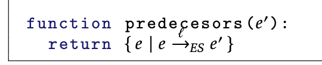

" Interestingly, the three disciplines share
the important characteristic that input specifications are given via compact
descriptions."

 That is, the problems’ semantics are based on sorts of transitions systems, which are often exponential with respect to the size of these compact
descriptions.

In supervisory control, DES are expressed compactly by relying on a modular
approach based on the parallel composition of multiple interacting components, referred to as the plant.

 Supervisory control aims at controlling
DES to achieve certain guarantees, this is done by deploying a so-called
“supervisor” that dynamically disables controllable events while monitoring
uncontrollable events. Traditional supervisory control techniques look for
maximally permissive supervisors, which has been argued to require a prohibitive computational cost. Directors (i.e., minimally permissive supervisors) have been proposed as a computational efficient alternative, still
effective synthesis procedures have not yet been developed for this particular
case.

Three different representations are mentioned in the literature:
- Supervisory Control (we'll do this one)
- Reactive Synthesis (the declarative specification is made using LTL or CTL -Computational Tree Logic, a different temporal logic-)
- Automated Planning (mostly developed for deterministic systems, you specify preconditions, post-conditions and a goal)

All the different representations can be modeled with finite transition systems.

In spite of considering problem definitions with
subtle variations, the three areas can be seen as looking for a system subset
satisfying a given property.

Usually in planning, the goal is to reach a particular state, that is, a reachability objective. Instead, in reactive synthesis, 
liveness requirement such as a Buchi acceptance condition, is pursued.
Whereas, in supervisory control we look for a subset of the system that can
always continue to be productive

 state explosion has been
dealt with in the three fields relying on different approaches.

supervisory control compositional analyses are performed on
individual components allowing for a (potentially) efficient merging procedure that meets the problem requirements

we review techniques from the different fields and,
by combining them, we devise a novel algorithmic solution called Directed
Controller Synthesis (D C S)

The main contributions of this thesis can be summarized as follows:
- A novel algorithmic approach (D C S) to solve the compositional supervisory control problem, inspired by the combination of techniques from the fields of supervisory control, reactive synthesis and automated planning. Can handle much larger problem sizes than SotA.
- A polynomial-time compilation for supervisory control.

## Preliminaries

A common approach to relate different fields tackling similar problems is to provide translations between their problem formalizations.

Summarizing, the synthesis of operational strategies with partially observable
and non-deterministic environments is a problem with many facets. In this
thesis we consider the synthesis problem under these settings, and compare
the approaches taken in the three fields highlighting their differences. Furthermore, we propose an extension to our on-the-fly compositional method avoiding the blowup induced by determinization steps, thus permitting greater
scalability

A A compositional supervisory control problem is defined by two elements, first
a set of intervening components and, second, a partition of the event set of
the plant in controllable and uncontrollable events.

We compose the components through synchronous product, whereupon the marked states for the product will turn out to be those such that each corresponding state in the tuple is a marked state in its corresponding component.

Given a set of automata
and a partition of the event set, we look for a supervisor that can disable
some of the controllable events and monitor uncontrollable events; such that
every word in the language generated by the restricted plant can be extended
to a word in the language accepted by the plant.

A solution for E is a supervisor σ (va de A\* -> Ae -cadenas a eventos-), tq σ is:
- Controlable: para todo w, σ(w) contiene todos los Au
- Non-blocking: para todo w tq w en Lσ(E), existe w' tq ww' en Lσ(E) y ê -> e\_m, con e\_m en Me, ê el inicial.

That is, a supervisor σ is said to be controllable (or admissible) if it only disables controllable events; and it is non-blocking if it is able to restrict the language generated by the plant E to a set of strings that can always be extended to reach a marked state.

Maximality comes at a cost in complexity
and hence there is a growing interest in less ambitious solution concepts such
as directors, which require controllers to enable at most one controllable
event at each state. Thus, here we follow this trend away from maximality
and accept a supervisor satisfying solely the base requirements.

 The results show that our translations allow to transparently
apply techniques from reactive synthesis and automated planning with an
efficiency that rivals that of native supervisory control tools.

In fact, mixed states represent a race condition that, in worst case, can always
be won by the plant, and hence if there is a solution to the control problem,
it must necessarily have a solution on the occurrence of the uncontrollable
events.

Part 4 gives supervisory control as reactive synthesis, an equivalence/translation proof by construction between supervisors and strategies, supervisory control problems and CTL formulas.

The theorem states:
> Let E be a compositional supervisory control problem and let ϕE the CTL formula obtained by following the above proposed translation from E. Then, there exists a supervisor σ for E if and only if there exists a strategy δ for ϕE. In addition, σ can be constructed from δ and vice versa.

From the benchmarks:
Despite relying on a compositional analysis S U P R E M I C A performs only slightly better than the monolithic approach (implemented by M T S A). Interestingly, in spite of being native to supervisory control, it solves less instances of the benchmark than other tools working under our encoding.

The translationbased approach to supervisory control is viable since the computational overhead introduced by the translation is negligible with respect of the cost of
solving the synthesis problem.

## The Algorithm

The on-the-fly exploration procedure is a modification of Best First Search (a
classical informed search procedure) adapted to account for uncontrollable
events. We perform a forward exploration, keeping a priority queue of open
states ordered by their estimated distance to a goal, and initialized only with
the initial state e¯.
At each iteration we take the highest “priority” state e from
the queue and, by following its first unexplored event, we expand a child
state e' adding it to the exploration structure. If we identify e' as a goal or
an error we prune the exploration. Otherwise, applying the heuristic to e'
we obtain a ranking of its enabled events, and then we insert e'
in the open
queue (considering the “priority” of e' to be the estimated distance of its first
unexplored event).

Every time a loop is closed by following a transition from a state
e to a state e', we need to inspect the exploration structure to decide if the
state is a goal, an error, or so far undetermined. In order to do this we check
whether e belongs to a Controllably Connected Component (CCC) unfolding
from e', that is, a set C of the states reachable from e'
for which: (a) all uncontrollable transitions lead back to C; and (b) for states where there are no
enabled uncontrollable events, at least one controllable transition also leads

The exploration process is repeated until a marked CCC containing the initial
state is discovered, or until arriving to the conclusion that such a CCC does
not exist.

If the open queue becomes empty or the initial state is flagged
as an error, D C S reports that the problem is unrealizable (i.e., there is no
supervisor). Whereas, if the initial state is flagged as a goal (i.e., belongs to
a marked CCC) we build a supervisor by following, from the initial state, the
transitions connecting states also flagged as goals.

### State Propagation

- The error status is propagated when a transition leads to a state already flagged as error and when expanding a deadlock state (since we know for certain that this prevents achieving the goal). 
- The goal status is propagated when a transition leads to a state already flagged
as a goal and upon discovering a marked CCC. 
- The undetermined status is propagated when closing a loop over a state that does not belong to a marked CCC, but from which there could still be unexplored paths leading to such a goal. We do this in an orderly fashion propagating the status information from e back to its ancestors.

**Definition of CCC**

The heuristic function takes a state e and the ES, and returns a ranking
of the events enabled from e. Heuristic functions may extract useful
information from the ES, such as the marked states visited in the path
from the initial state to e.

**Definition of predecessors**:

all reachable uncontrollable transitions are included in fully uncontrollable
states, and at least one controllable transition is included in fully controllable
states. Moreover, in mixed states all uncontrollable transitions are included,
and if no such transition leads to a marked state then at least one controllable
transition with this property is included too. Thus, the result is a valid nonblocking supervisor.

 The proof follows from the fact that for D C S to return a supervisor,
the initial state e¯ has to be flagged as a goal. Thus, there must be a marked
CCC C containing e¯. In such a case, it is straightforward to see that we can
extract a supervisor from C (i.e., restricting the plant to remain within C).

**Controllable**: For this not to hold, σ must disable some uncontrollable event from a state in which the event is enabled.

**Non-blocking**:  for this not to hold, there must exist a word w ∈ Lσ(E) such that w cannot be extended to reach a marked state.

 We guide A\* with the precomputed number of steps between states of Ei. 
The accumulated cost of a path explored by A\* is the sum of distances of the steps in the path. Since the number of steps underestimates the distance, A\* is guaranteed to return the shortest path to a target state of Ei.
Interestingly, we can avoid repeating the work performed by A\* by caching the paths explored for each state. That is, in worst case, A\* needs to consider every state only once.

The ranking is generated by the rank function, which sorts **uncontrollable events in descending order and then appends controllable events sorted in ascending order**.

The exponential complexity presented by the CM problem has a big
impact on D C S. D C S solves the largest number of instances for each
case except for CM and TA. Remarkably, M Y N D manages to solve many
instances of these difficult problems.

### Dudas:
- Al final la heuristica MA cuando llama a A\*, el camino mas corto lo computa usando como peso las distancias que tienen en cuenta el orden de los eventos (blocking)?

### Next Steps:
- Paralelizar? Podemos agregar un edge nuevo y solo bloquear para propagar (si un estado sigue en unknown podemos pisarlo, nunca pisamos un known) Cuanta es la ganancia posible? Las heuristicas son tambien algunas trivialmente paralelizables (random, RA).
- Estudiar casos de uso de DCS en la industria y generar benchmarks relevantes a tales casos, + ver optimizaciones del algoritmo que aprovechen topografias tipicas? (no prometo que tal cosa exista, pero sí me da mucha curiosidad). Tambien ver si los bottlenecks en casos reales suelen ser memoria, tiempo o que onda. Basicamente: domain independent? Let's try domain dependent. Puntualmente, si "We believe that the
potential for cross-fertilization is still abundant and that, in spite of complexity barriers, advances in this direction will get us closer to handle practical
problems from numerous application domains." me encantaria armar una noologia, un set de problemas de dominio de aplicacion que hoy en dia no manejamos con DCS (y potencialmente, hallar como abarcarlos).
- "Soft goals, that is, optimization criteria associated with time or cost models, could also be studied." Esto me llama mucho la atencion si es lo que creo que es (ponerle precio a los goals y buscar los mas caros?) pero no lei la referencia aun.
- Limpieza previa? Hacemos que cada componente pierda los nodos que sabemos no alcanzan (DFS-reverso) un nodo marcado.

