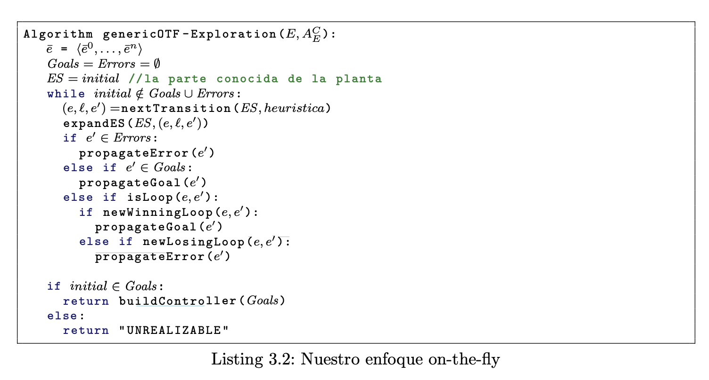

Dado un (conjunto de) automata(s) y una particion de sus eventos en dos subconjuntos: controlables y no-controlables, lo que buscamos es un controlador (director) que restrinja el vocabulario aceptado de forma de mantener un camino posible a los estados marcados del automata.

El controlador restringe el lenguaje de T tq w en L'(T) solo si todos sus prefijos cumplen que sigma(w[:i], w[i]) == True. Para cada cadena de prefijos de L te devuelve el conjunto de eventos validos.

Problema de control safe y non-blocking: Tengo una tupla Epsilon = (E, Ac) donde Ac son los eventos controlables de E, y E un conjunto de automatas en composicion paralela. Una solucion para E es un supervisor sigma tq es
- **Controlable**: sigma(w) contiene todos los Aue (eventos no controlables) para todo w
- **Safe y Nonblocking**: Para todo w en L'(E) hay una w' no vacia tq ww' en L'(E) y ww' en Lm(E) -el lenguaje marcado-. 

Osea que todo w en L'(E) es prefijo de una cadena aceptada por Lm(E), y sigue siendolo para culquier siguiente caracter que sea un uncontrolled.

En resumen, un supervisor σ es controlable si solo deshabilita eventos controlables, y es safe y nonblocking si restringe el lenguaje generado a palabras que siempre puedan extenderse para llegar a un estado marcado.

Decimos que un estado s es **winning** (ganador) del problema E si hay una solucion para el problema E' tq E' es E con un nuevo estado inicial s. Cuando no la hay, decimos que es un estado perdedor.

Podemos pensar en un controlador non-blocking como un jugador optimista. Se encarga
de no perder, y solo requiere conocer un futuro camino posible para llegar a un estado
ganador.

Es importante notar que como se busca que cualquier palabra sea extensible a otro
estado marcado, lo que se busca es pasar por algun estado marcado infinitas veces. Es
decir, un estado ’e’ marcado que tenga un camino para que el jugador pueda volver controlablemente al mismo estado ’e’.

Los primeros estados ganadores son aquellos que estan en un loop controlable
con un estado marcado dentro. Luego anotamos como ganador tambien a cualquier estado
que controlablemente alcanza un estado ganador.

Los directores son supervisores que solo permiten como mucho un evento controlable por prefijo.
La construccion de directores puede requerir una menor exploracion de la planta que
la construccion de un supervisor, ya que al encontrar un camino ganador a partir del
estado s, puede evitar explorar otros eventos controlables de s.

Hay un algoritmo monolitico "de punto fijo" para hallar el supervisor de una planta: comienzo con el conjunto de estados perdedores, y en cada paso voy agregando a la clausura todos los estados que o bien caen en uno de los estados de la clausura a traves de un evento no controlable, o bien no tienen un controlable que no caiga en la clausura.

La **exploracion on-the-fly** clasifica estados como
ganadores o perdedores durante la composicion. 
Así logramos:
- Cortar tempranamente la exploracion de una rama de la planta que ya se sabe que es perdedora
o ganadora.
- Si el estado inicial fuera marcado como ganador o perdedor antes de la composicion completa de la
planta, ya podemos cortar el algoritmo. 

Primero definimos E-top y E-bottom que son la extension de ES a E donde asumimos que todo estado no en ES era ganador, o perdedor respectivamente. Si e es ganador en bottom o perdedor en top, entonces no necesitamos seguir explorando para clasificarlo, por monotonicidad.

Parte del trabajo de Zanollo et al. fue adaptar el algoritmo para volver su correctitud agnostica de la heuristica utilizada, permitiendo incluso implementar nuevas como una dummy.
Usamos una heuristica para elegir qué edge agregar cada vez, y vamos propagando para un lado o para el otro hasta que sepamos si el estado inicial es ganador o perdedor. Notar que todo estado es uno o el otro, y que convergemos cuando todos los estados explorados fueron clasificados (no necesitamos explorar de mas!).

Falta ver como se expande ES. 

- 2.3 por que se dice de punto fijo?
- 2.2 es 2\^A o partes(A)?
- Listing 2.1 por que en el segundo and no sacamos del para todo los no controlables?
- Listing 3.1 que es el -e- que hay?
- Fig 3.4, el nodo 2 es ganador independientemente de la controlabilidad del edge 11, aun si este es controlable? Creo que no, pero quiero confirmar.
- "Nuestra suposicion es que la implementacion scd anterior clasificaba estados como Goals de manera anticipada y posiblemente erronea, quizas casos como los vistos en la seccion 5.3. Esto puede hacer que se llegue a una conclusion apurada que posiblemente devuelva un controlador incorrecto, pero que en el benchmark parezca resolver mas instancias." Esto no era testeable?

Lineas interesantes:
- No podemos agregar ejes en paralelo?
- Usar heuristicas basadas en el grafo? (e.g., en cada momento agrego la edge de la frontera que lleve al nodo con menor out-degree, o a la menor distancia a un marked state).
