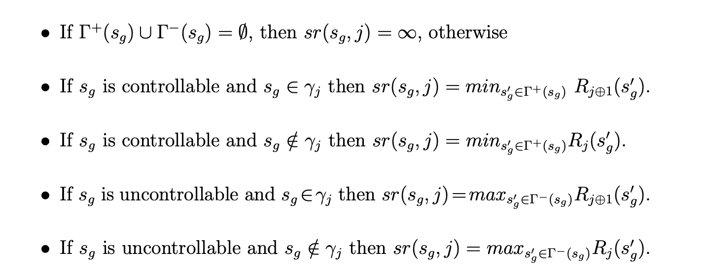

(Tesis de D'ipi.)

Behaviour model synthesis is also used to automatically construct plans that
are then straightforwardly enacted by some software component.

Existing Software Engineering techniques for automatic synthesis of event-based controllers have various limitations. Such limitations can be seen
as restrictions in the expressiveness of the system goals and environment
assumptions, the relation between the controllable and monitored actions, or scalability problems.

Most techniques **restrict controller goals and environment assumptions to
safety properties.** Hence, synthesis can be posed as a backward error propagation variant where a behaviour model is pruned by disabling controllable actions that can lead to undesirable states. However, in many domains, and particularly in the realm of reactive systems, **liveness requirements can be of importance** and having synthesis techniques capable of
dealing with them is desirable.

- **Requirements**: prescriptive statements to be achieved by the machine.
- **System goals**: prescriptive statements to be achieved by the machine and its environment.
- **Environment assumptions**: descriptive statements guaranteed or assumed to be guaranteed by the environment.

When described with LTS or Kripke structures, the model of the environment is assumed to be complete
up to some level of abstraction (i.e. with respect an alphabet of actions or
propositions).

The techniques presented in this thesis work for an expressive subset of **liveness properties**, distinguish between controllable and monitored
actions, and differentiate system goals from environment assumptions.

**Descriptive statements** represent properties about the system that hold independently of how the system behaves. Descriptive statements are in indicative mood. 

**Prescriptive statements** state desirable properties which may hold or not. Indeed, prescriptive statements must be enforced by system components. Naturally, prescriptive statements may be changed, strengthened/weakened or even removed while descriptive cannot.

Este paper usa LTS y LTL para describir el environment y los goals.

FLTL es Fluent LTL. Usa Fluents que son Fl = \< As , At, {True,False}\>. Dada una traza w en (Act\*), se satisface w,i \|= Fl sii para algun k anterior a i wi in As, y ningun j > k tq wk in At. Notar que AtUAs in Act.

A restricted LTS control problem for expressive subset of temporal properties that includes liveness and allows for a polynomial
solution.

Nevertheless, restrictions on the form of the goal and assumptions specification have been studied and found to be solvable in polynomial time. For example, goal specifications consisting uniquely of safety requirements can be solved in polynomial time, and so can particular styles of liveness properties such as [AMPS98] and GR(1) under the assumption of full observability. The latter can be seen as an extension of [AMPS98] to a more expressive liveness fragment of LTL.


A responsiveness goal has the form: \[]\(P -> \<\>Q )

**Best Effort Controller**: If this controller achieves G after sequence σ, by forcing the environment to not comply with assumptions, then no other controller could have won G *without breaking the assumptions* after σ.

**Assumption Preserving Controller**: stronger criterion than best effort: if σ finite in Tr(E\|\|M) and there is no σ' st σ.σ' \|= As, then no σ'' exists st σ.σ'' in Tr(E) and σ.σ'' \|= I \^ As. En criollo: si no hay forma de seguir esta traza y mantener las asunciones usando tu controller, entonces tampoco la habia en el environment irrestricto.

**Assumption compatibility**: for every state in E there is no strategy for the controller to falsify As. That is, for every state s, there is no solution to the problem E's = \<Es, H', Ac\> where Es is E with s as initial state and H' changes \<As, G\> for \<As, False\>. If this happens, we say environment E is compatible with assumptions As.

## Solving SGR(1) problems 
We construct a GR(1) game G from SGR(1) LTS control problem E in a straightforward manner. 
- For every s in E, k a fluent that appears in As or G, we make s' in G st s' = (s, true, true, false...) st the sequence of booleans assigns a boolean to each fluent. We get 2^k * \|S\| states in G.
- The transition relationship is defined as you'd expect, except state s gets no outward edges if it breaks safety.
- the goal is defined as gr(fii, psii) where fii is a property in an Assumption, psii in a goal.

Note that the safety part of the specification is not encoded as part of the
wining condition ϕg of the GR(1) game, rather it is encoded as a deadlock
avoidance problem when constructing Γ− and Γ+.

From a strategy σ,u we construct an MTS M = (Sm, A, Dm, sM0) such that:
- Sm ⊆ Ω × Sg;  ∆M ⊂ SM × A × SM contains all non-controllable transitions and all controllable ones allowed by strategy. Initial state = Sg0.

It can be shown that this strategy is complete and correct.

## Concrete Algorithm
The rank for a particular successor will measure the “distance”
to the next goal in terms of the number of times that all assumptions will be
satisfied before reaching the goal. If this number tends to infinity then this
means that from the current state a trace is possible in which the environment assumptions hold infinitely often but the system goals do not.

Intuitively, Rj (sg) = (k, l) means that in order to reach
from sg a state in which γj holds, all paths will make assumption φl hold at most k times, φ1 through φl−1 will hold at least k + 1 times and assumptions
φl+1 through φn will hold at least k times. R(s) = ∞ means that s is a
loosing state, i.e. from s there is no strategy for the controller that can avoid
a trace which satisfies infinitely often all assumptions but does not satisfy
infinitely often all goals.
Osea, k es cuantas veces, y l es la asuncion de minimo indice que se sostiene como mucho k veces. Todas las anteriores se sostendran como minimo k+1 veces y todas las posteriores minimo k. 

We do a fixpoint where every state sg has a rank for goal j based on rank of its successors. If sg is controllable it chooses the successor with the least rank to goal j. Unless sg satisfies goal j, whereupon it will move towards the next goal in the ring. If sg is non-controllable, we make its successor the worst case scenario, i.e. the non-controllable event that leads to the highest rank for goal j happens.



Function sr(sg, j) computes the rank of the successor state that should be
used to compute Rj (sg). It does so assuming that ranks of all successor states
have been previously computed.

In order to compute the true ranks of all
states, we must do a fixed point iteration. The fixed point is when the rank
of every state is stable with respect to every goal.

Every rank greater than (max\_j max\_i |φi − γj |, n) is effectively equivalent to ∞, where |φi − γj | is the number of states in G that satisfy φi and do not satisfy γj.

The Algorithm has three steps:
- Initialize ranking so everyone has Rj(s) = (0,1)
- Iterate sr until the ranking is stable. If it is not, some rank needs to be increased.
- If a node has a rank > the maximum, it is losing. set it to infinity.
If ranking is stable and initial node has rank < infinity, then it's winning. 

By completeness, every state with a non-infinite rank has a winning strategy.

- Duda pag 73 dipipaper: However, if the successors of sg are winning then, as γj holds in sg, no assumptions need to be visited before satisfying γj . Hence, best possible rank is (0, 1). Aca pone un 1 pero no es l el numero de asuncion?  Solved! dice que puede avanzar y no pasamos por todas las asunciones en el medio (porque no tengo que pasar por ningun lado, estoy por despachar el goal) entonces significa que logras llegar a j+1 sin cumplir todas. 1 es arbitrario ish.

At high level, the algorithm has two major parts, the initialisation and the stabilisation.

The initialisation sets the initial rank for every state in the game and initialises the queue of states pending to be processed. All states start on (0,1) except deadlocks on inf.

The stabilisation part is a fixed point that iterates on pending until is it empty.

The function unstablePred(state,g) returns a set of pairs of predecessors of state and a rankings g for which the ranking is unstable.

The function best(state,g) returns the value of best(state, g), as defined above.

inc((k, l),state, g) returns (0, 1) if state is in γg, it returns (k, l) if state is not in assumption-l, and it returns the minimal value greater than (k, l) otherwise. 


### Pseudocode

As follows:
```
for g in guarantees: rank(g,state) = (0,1) forall state in states

Queue pending;

for g in guarantees, state in states: if state in assumption-l and state not in g: pending.push(pair\<state, g\>)

for state in states, g in guarantees: if state is deadlock: rank(g, state) = inf; pending.push(unstablePred(\<state, g\>)

While (!pending.empty) { 
	state, g = pending.pop();
	if (rank_g(state)== inf) cont;
	if (is_stable(rank_g(state))) cont;
	rank_g(state)=inc(best(state,g),state,g);
	pending.push(unstablePred(state,g));
}
```
## Case studies

Following the World-Machine model i.e., properly
modelling the relevant descriptive and prescriptive statements, helped us discover the required environmental assumptions on the user behaviour which
allow for guaranteeing the satisfaction of the prescriptive goals.

The assumption mentioned (if the controller tries often enough,
it will eventually succeed) is a typical fairness condition sometimes referred
to as strong fairness 

We distinguish failures from other actions as follows. For each control problem we define a set of try-response triples. Such a triple captures the relation
between controlled actions and their success or fail reactions. Note that we
require 1) the “try” action to be controlled, 2) all actions in a try-response
triple to be unique with respect to other triples in the set, 3) re-tries cannot
occur before a response, 4) responses can only occur as a result of a try, 5)
maximum of one response occurs for every try, and 6) the decision of whether to fail or succeed cannot be enforced by other actions, hence failure is
enabled if and only if success is enabled.

The following definition captures this stronger notion of fairness. It requires
that for every transition labelled with a try, if it is taken infinitely often then
infinitely often success occurs before another try.

They do this to solve the problem of two cooks: if I have two states which make a try at the same action, I could satisfy a strong fairness condition ([]<\>a -> []<\>b) half the time making them succeed, but still the double link chain will be breaking.

t-strong fair with respect to E and T = {(Try-i , Suc-i , fail-i)}: For all transitions t = (s, try-i, s') the following holds: pi \|= []<\>try-i -> []<\>(¬try-i U suc i).
Creo que dice "siempre que intentas, eventualmente tenes exito" pero no estoy 100% seguro.

As π is strong independent fair, the try-transition must be successful and infinitely often no failures occur before assumptions occur.

---
The change from state-based to event-based semantics introduces the need for
determinism of the environment to guarantee that the controller has sufficient
information about the state of the environment to guarantee it satisfies its
goals


- Que es el n en pagina 74 en este rank?
- Pag 77 que diferencia entre pushear unstable y pushear pair?
- Lemma 3.1. determinacy qué esta diciendo?

- El case study 3.8.1 con el robot es compositional en naturaleza y puede servir para el otf-gr1.
- Strong independent fairness te la debo.

- Hence, there is a wide spectrum of optimisation techniques that have yet to be evaluated as possible improvements of our implementation, such as partial order reduction or bit caching
