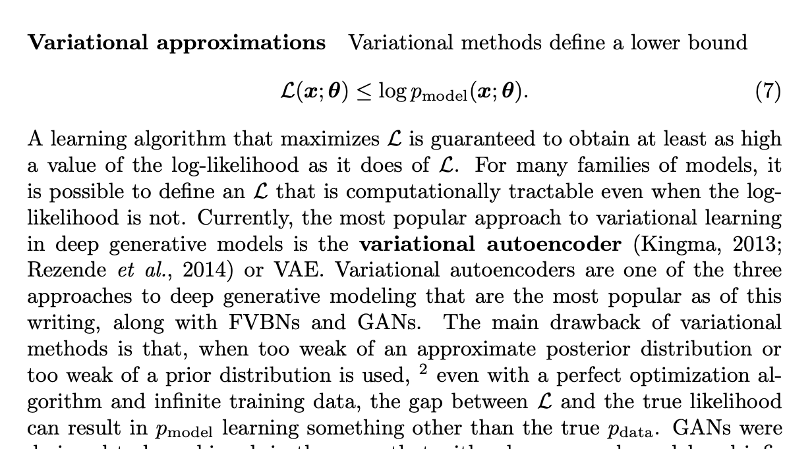
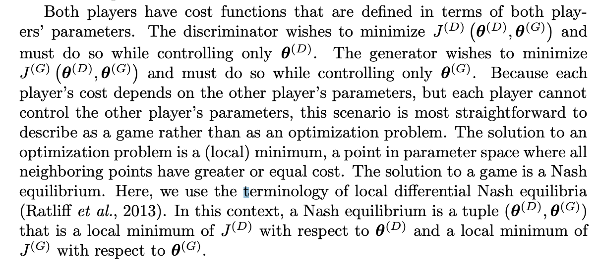
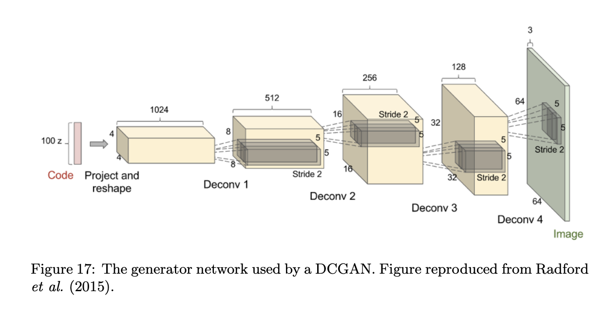

### GAN Survey, Goodfellow 2016

The following are my notes on, and excerpts from, [Goodfellow GAN Survey 2016 NIPS](https://arxiv.org/pdf/1701.00160.pdf).

When training a Generative Adversarial Network, we will train two models. A generative model, and a classifier or discriminator model. The discriminator receives both generated and real inputs, and needs to ascertain which are which. Its cost function is its accuracy in this task (measured as the cross entropy for assigning 1 to generated inputs and 0 to real ones). The generator receives Gaussian noise as an input, and maps it to generated instances, which will tend to be as similar as possible to the dataset's real distribution. Its cost is the negative of the average probability the discriminator assigns them of being fake. We call this cost J.

GANs were designed to be unbiased, in the sense that with a large enough model and infinite data, the Nash equilibrium for a GAN game corresponds to recovering pdata exactly. In practice, variational methods often obtain very good likelihood, but are regarded as producing lower quality samples. There is not a good method of quantitatively measuring sample quality, so this is a subjective opinion, not an empirical fact."

In summary, GANs were designed to avoid many disadvantages associated with other generative models:
- They can generate samples in parallel, instead of using runtime proportional to the dimensionality of x. This is an advantage relative to FVBNs.
- The design of the generator function has very few restrictions. This is an advantage relative to Boltzmann machines, for which few probability distributions admit tractable Markov chain sampling, and relative to nonlinear ICA, for which the generator must be invertible and the latent code z must have the same dimension as the samples x.
- No Markov chains are needed. This is an advantage relative to Boltzmann machines and GSNs.
- No variational bound is needed, and specific model families usable within the GAN framework are already known to be universal approximators, so GANs are already known to be asymptotically consistent. Some VAEs are conjectured to be asymptotically consistent, but this is not yet proven.
- GANs are subjectively regarded as producing better samples than other methods.

On [Variational Autoencoders](/wiki/unsupervised-learning-berkeley#variational-autoencoders):

{: alt="" loading="lazy"}

At the same time, GANs have taken on a new disadvantage: training them requires finding the Nash equilibrium of a game, which is a more difficult problem
than optimizing an objective function.

{: alt="" loading="lazy"}

"We can also think of them as
cooperative, in the sense that the discriminator estimates this ratio of densities
and then freely shares this information with the generator. From this point of
view, the discriminator is more like a teacher instructing the generator in how
to improve than an adversary. So far, this cooperative view has not led to any
particular change in the development of the mathematics."

{: alt="" loading="lazy"}

Another highly important research area related to GANs is that it is not clear
how to quantitatively evaluate generative models. Models that obtain good
likelihood can generate bad samples, and models that generate good samples
can have poor likelihood. There is no clearly justified way to quantitatively
score samples. GANs are somewhat harder to evaluate than other generative
models because it can be difficult to estimate the likelihood for GANs. [Theis et al. (2015)](https://arxiv.org/pdf/1511.01844.pdf) describe many of the
difficulties with evaluating generative models.

I cover GANs in more detail in my [notes on Unsupervised Learning: GAN](/wiki/unsupervised-learning-berkeley#gans) from Berkeley's Unsupervised Learning course.

## Read Later
- [DC-GAN TensorFlow tutorial with MNIST](https://www.tensorflow.org/tutorials/generative/dcgan) for a more practical approach.
- [Survey on Computer Vision (1 decade later)](https://www.gwern.net/docs/ai/2008-golle.pdf) 🌱
- [Diffusion models beat GANs](https://arxiv.org/abs/2105.05233#openai) 🌱
- [Diffusion models intro](https://yang-song.github.io/blog/2021/score/) 🌱
- [BigGAN](https://arxiv.org/abs/1809.11096#deepmind) 🌱
- [Tips, tricks and hacks for training a GAN](https://github.com/soumith/ganhacks) 🌱
- [Machine Vision Unsupervised Task](https://arxiv.org/abs/1807.03748) A task that's a language model equivalent for images (but not literally language modelling like [ViT](/wiki/visual-transformer) does now). Was relevant back in 2019 and seems interesting. 🌱
- [Notes on GANs](http://joschu.net/docs/gan-notes.pdf) Recommended reading from the Berkeley course.🌱

### Related Reading
- [TransGan](/wiki/transGAN)
- [Visual Transformer](/wiki/visual-transformer)
- [This Food Does Not Exist](https://nyx-ai.github.io/stylegan2-flax-tpu/): StyleGAN trained on TPU for food image generation. Replicate later maybe?
- [GLIDE](/wiki/glide) to see how diffusion models end up beating GANs in image generation, and outperform any other models in Text-To-Image.
