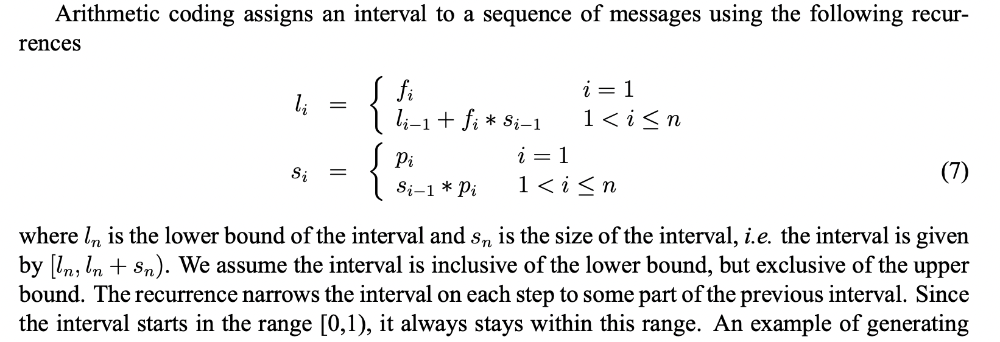
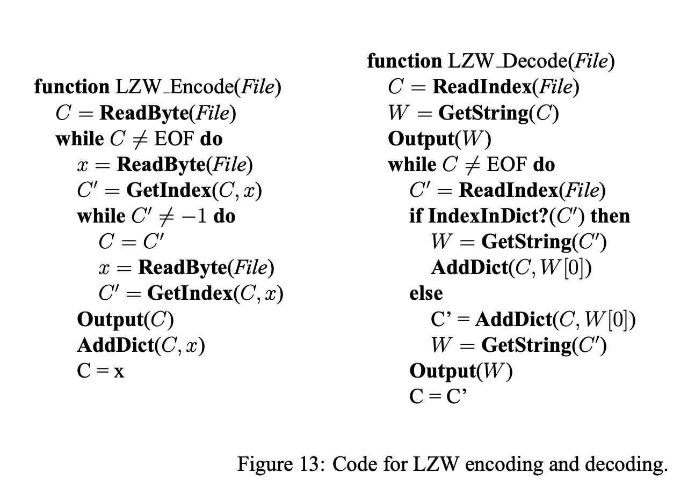
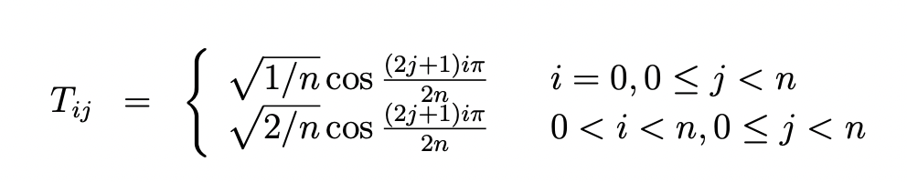

['Introduction to Data Compression' by Guy E. Blelloch.](https://www.cs.cmu.edu/~guyb/realworld/compression.pdf)

Compression algorithms map a message (for example, a file) to a reduced version. They are composed of a pair of encoding and decoding procedures, such that a message is compressed by the former and recovered by the latter. The process can be lossless, where the recovered message is exactly the same as before, or lossy, where a part of the message (hopefully one deemed less important) may be lost in the process.

Commonly, lossless compression is used on text, and lossy is saved for images, audio and other media forms where exact recovery is not as necessary.

"Because one can’t hope to compress everything \[since an isomorphism ould necessarily require the same amount of bits in the end], all compression algorithms must assume that
there is some bias on the input messages so that some inputs are more likely than others, i.e. that
there is some unbalanced probability distribution over the possible messages. Most compression
algorithms base this “bias” on the structure of the messages – i.e., an assumption that repeated
characters are more likely than random characters, or that large white patches occur in “typical”
images. **Compression is therefore all about probability**."

When describing compression algorithms, the paper proposes to distinguish between the *coder* and the *model*. The model refers to an estimation of the distribution for the compressed tokens or characters in the message. For instance when compressing an image, we may assume it is more likely for neighboring pixels to share similar colors. The coder is the procedure that encodes data, typically by assigning shorter codes to more likely tokens, and longer ones to the ones thought to be least likely.

It can be shown that the best compression rate possible would be using only as many bits per token as their entropy. As we chunk more characters into "tokens" we could get more compression per bit (for instance modeling the string AABBBAAAA as using the tokens AA, AB, BA, BB instead of just A and B).

There is also conditional entropy (H(s\|c)): the entropy of the distribution of p(s\|c), weighted by the distribution of c over all possible contexts and s over all possible messages.

{: loading="lazy"}

It can be shown that H(s\|c) <= H(s) and the bound is only tight if context and messages are completely independent. An example of context could be the previous n pixels before the current one, or surrounding n words, etc. 

### Huffman Codes

Huffman codes are optimal prefix codes generated from a set of probabilities by a particular algorithm, the Huffman Coding Algorithm. 

"The Huffman algorithm is very simple and is most easily described in terms of how it generates
the prefix-code tree."

```
Start with a forest of trees, one for each message (=token). Each tree contains a single vertex with
weight wi = pi.

Repeat until only a single tree remains:
	1) Select two trees with the lowest weight roots (w1 and w2). 
	2) Combine them into a single tree by adding a new root with weight w1+w2,
	 and making the two trees its children. 
	 It does not matter which is the left or right child, 
	 but our convention will be to put the lower weight root on the left if w1 != w2.

```

If I'm seeing this correctly, the most likely codes will end up nearer to the final root, and the least likely ones closer to the leaves. The algorithm is greedy in a way, as it always links the two least likely contenders until there is a single tree.

"For a code of size *n* this algorithm will require *n−1* steps since every complete binary tree with
n leaves has *n−1* internal nodes, and each step creates one internal node. If we use a priority queue
with *O(log n)* time insertions and find-mins (e.g., a heap) the algorithm will run in *O(n log n)* time.
The key property of Huffman codes is that they generate optimal prefix codes."

Example: 

```
a .2, b .3, c .3, d .1, e .1

=>
t(d e) .2
a .2

=>
t(a , t(d, e)) .4
t(b, c) .6

=>
t( t(a , t(d, e)) , t(b, c) )
```

Even though all Huffman codes have the same average (minimum) length, it can be good if average message variance is also reduced (for buffering, speed guarantees, etc.). 

To ensure this, a simple modification is breaking ties when picking which trees to merge using the two earliest created nodes. All leaves are assumed to have been created first. So if 3 nodes tie in weight, we join the two that were created earlier first. This way, trees diverge less from the average length.

### Arithmetic Coding

{: loading="lazy"}
{: loading="lazy"}


This method seems impractical due to floating point arithmetic's quirks.

### Applications of Probability Coding

The simplest message distribution model we can make is based on counting. This is unsophisticated and most likely suboptimal.

More sophisticated models are used in real-world applications. All these techniques take advantage of the “context” in some way.

This can either be done by
- **Transforming the data before coding** (e.g., run-length coding, move-to-front coding, and residual coding)
- **Directly using conditional probabilities based on a context** (JBIG and PPM).

**Run Length Coding**: In this coding procedure, a sequence is coded as a sequence of tuples, repetitions where repeated symbols are summed up. E.g. aaaabb => a;4,b;2. The tuples are usually Huffman encoded later, to compress things even further.

**Move-To-Front Coding**: We start with a preordered alphabet, and for each character in the message we a) shift that character to the beginning of the alphabet and b) output how many positions it moved. Hopefully the same characters tend to cluster together and therefore most times we will output small values.

*Example* : Think of an image, where characters are channel values. The alphabet has 256 values, and since similar pixels have similar colors channels may repeat. Maybe if we combine it with run-length so it goes closer to 0? It wouldn't work with 256\^3 values for colors, I guess, since it's such a big alphabet.

### Residual Coding: JPEG-Lossless (LS)

In residual coding, our model outputs a guess for the correct value of the next message, and then we store only the residual (by how much we missed the mark). Hopefully the model will be good, and then the residuals will tend to gather close to 0, reducing entropy. Finally we do a pass of Huffman encoding after this step, and it's all done.

For images, we typically divide them into their three channels and compress each separately (as channel values are more correlated and less varied than pixel values).

**Context Coding: JBIG** is a very naive autoregressive algorithm, but only scales well to black and white (like fax) images or very low entropy greyscales (think 6 bits). Again, we output probability residuals and huffman encode them first.

### Context Coding: PPM - Prediction by Partial Matching

Variants of this algorithm have consistently given either the best or close to the best compression ratios recently.

We keep a table of last j characters seen, for each j from 0 to k, and occurrences of next character for each (like in a markov chain model). For each character we are encoding, we output its probability given the current model and previous k characters, and then update it with the new information. However if this character has never been seen within this context, we output a probability of finding a new character (estimated as #different characters / total occurrences of this context) and move one level below in the table, to contexts of length k-1. And so on until we reach context 0, which is just individual character probabilities up to now.

### Lempel-Ziv Algorithms

The Lempel-Ziv algorithms code groups of characters of varying lengths by building a dictionary of previously seen strings.

At the highest level the algorithms can be described as follows. *Given a position in a file,
look through the preceeding part of the file to find the longest match to the string starting at the
current position, and output some code that refers to that match. Now move the finger past the
match.*

This is the algorithm used in gzip, except it also includes information about probabilities for each substring.

**Lempel-Ziv 77** is the one used in gzip, and it involves a sliding window.

The LZ77 algorithm and its variants use a sliding window that moves along with the cursor. The
window can be divided into two parts, the part before the cursor, called the dictionary, and the part
starting at the cursor, called the lookahead buffer. The size of these two parts are parameters of the
program and are fixed during execution of the algorithm. The basic algorithm is very simple, and
loops executing the following steps:

- Find the longest match of a string starting at the cursor and completely contained in the lookahead buffer to a string starting in the dictionary.
- Output a triple *(p, n, c)* containing the position p of the occurence in the window, the length
n of the match and the next character *c* past the match in the buffer.
- Move the cursor n + 1 characters forward.

A possible improvement is called LZSS variant, which uses two formats: if no match of length >2 is found, it turns on a bit and then outputs the character alone. Else it keeps it off. This way we avoid wasting two fields on an empty match.

Gzip uses separate huffman codes for the offset, the length and the character. Each uses adaptive Huffman codes.

It also makes matching **non-greedy**: It tries matching the string beginning from the next character besides the current one, then if that match is longer than the greedy one, it will append a single character and the second, longer match's tuple. 

Pseudocode for LZW is as follows (note that this version doesn't do LZSS, or non-greediness).

{: loading="lazy"}

The dictionary operations can be implemented very efficiently using a trie, or just a hash table for each prefix if memory is an issue (which happens quick as the trie grows in memory exponentially in the key length -with a base proportional to alphabet size-, and keys can get long).


## Lossy Compression

In lossy compression, the resulting message may be significantly smaller in size than the original, but after reconstruction a portion of the information is lost.

Thus lossy algorithms can compress data almost arbitrarily efficiently, with human perceived degradation as the constraint.

**Vector Quantization**: We assign all vectors in our population to a set of clusters, and map each point to its closest cluster centroid. This allows for a very efficient encoding of, for instance, image pixels (using a reduced palette as I covered in [dithering](/dithering)). 

For a lossless alternative, we could store each pixel's centroid ID plus the residue, which if the data are sufficiently clustered should tend to be small and thus encode efficiently through e.g. Huffman encoding or others.

**Transform Coding**: For a set of _n_ values, transforms can
be expressed as an _n × n_ matrix _T_. Multiplying the input by this matrix _T_ gives, the transformed coefficients. Multiplying the coefficients by _T^−1_ will convert the data back to the original form.

For example, the coefficients for the discrete cosine transform (DCT) are:



For the purpose of compression, the properties we would like of a transform are (1) to decorrelate the data, (2) have many of the transformed coefficients be small, and (3) have it so that from
the point of view of perception, some of the terms are more important than others (so dropping the unimportant ones is viable).

### JPEG

JPEG is a lossy compression scheme for color and gray-scale images.

JPEG is designed so that the loss factor can be tuned by the user to tradeoff image size and
image quality, and is designed so that the loss has the least effect on human perception.

It is optimized for naturalistic images, not line drawings or pictures with big smooth monochromatic surfaces.

The first step of JPEG
compression, which is optional, is to convert these into YIQ color planes.

The Y plane is designed to represent the brightness (luminance) of the image. It
is a weighted average of red, blue and green (0.59 Green + 0.30 Red + 0.11 Blue), weighted according to human eye perception of brightness.

The I (interphase) and Q (quadrature) components represent the color hue (chrominance).

JPEG keeps all pixels for the intensity, but typically down samples the two color planes by a factor of 2 in each dimension (a total factor of 4). This is the first lossy component of JPEG and gives a factor of 2 compression: (1 + 2 * .25)/3 = .5.

Then each plane is divided into 8x8 blocks, to each of which we apply a cosine
transform across both dimensions. This returns an 8x8 block of 8-bit frequency terms. So far this
does not introduce any loss, or compression.

"After the cosine transform, the next step applied to the blocks is to use uniform scalar quantization on each of the frequency terms. This quantization is controllable based on user parameters and is the main source of information loss in JPEG compression. Since the human eye is more perceptive to certain frequency components than to others, JPEG allows the quantization scaling
factor to be different for each frequency component. The scaling factors are specified using an
8x8 table that simply is used to element-wise divide the 8x8 table of frequency components."

The frequency table is then traversed in zig zag, and run length encoded so that there are many similar consecutive values (especially 0, due to obscure transform-related reasons).

This last sequence is compressed with Huffman coding.

A more visual explanation can be found in this [introduction to JPEG compression](https://www.tutorialspoint.com/dip/Introduction_to_JPEG_compression.htm).

### MPEG

> Correlation improves compression. This is a recurring theme in all of the approaches we have seen; the more effectively a technique is able to exploit correlations in the data, the more effectively it will be able to compress that data.

Each frame in an MPEG image stream is encoded using one of three schemes:

- **I-frame**, or intra-frame: are coded as isolated images.
- **P-frame**, or predictive coded frame, are based on the previous I- or P-frame.
- **B-frame**, or bidirectionally predictive coded frame, are based on either or both the previous and next I- or P-frame.

In an MPEG stream, I-frames and P-frames
appear in an MPEG stream in simple, chronological order. However, B-frames are moved so that
they appear after their neighboring I- and P-frames. This guarantees that each frame appears after
any frame upon which it may depend. An MPEG encoder can decode any frame by buffering the
two most recent I- or P-frames encountered in the data stream.

Since **I-frames are independent images**, they can be encoded as if they were still images. The
particular technique used by MPEG is a variant of the JPEG technique.

To decode any frame we need only find its closest previous I-frame and go from
there. This is important for allowing reverse playback, skip-ahead, or error-recovery.

To **encode a P-frame**, for each target block in the P-frame the encoder finds a reference block in the previous P- or I-frame that most closely matches it. The reference block need not be aligned on a 16-pixel boundary and can potentially be anywhere in the image. In practice, however, the x-y offset is typically small. The offset is called the motion vector.

Once the match is found, the pixels of the reference block are
subtracted from the corresponding pixels in the target block. **This gives a residual which ideally is close to zero everywhere.** This residual is coded using a scheme similar to JPEG encoding, but will ideally get a much better compression ratio because of the low intensities. In addition to sending the coded residual, the coder also needs to send the motion vector. This vector is Huffman coded.

> The motivation for searching other locations in the reference image for a match is to allow for the efficient encoding of motion.

In practice, the search for good matches for each target block is the most computationally
expensive part of MPEG encoding. Decoding however is cheap.

**B-frames look for reusable data in both directions.** The overall technique is very similar to that
used in P-frames, but instead of just searching in the previous I- or P-frame for a match, it also
searches in the next I- or P-frame. This works for cases where, for instance, an object is occluded and appears from behind another, then moves and hides behind a second one or disappears out of scene.

The coder needs to send some information on which reference(s) is (are)
used, and potentially needs to send two motion vectors, if it chooses to average next and previous I/P- frame.


