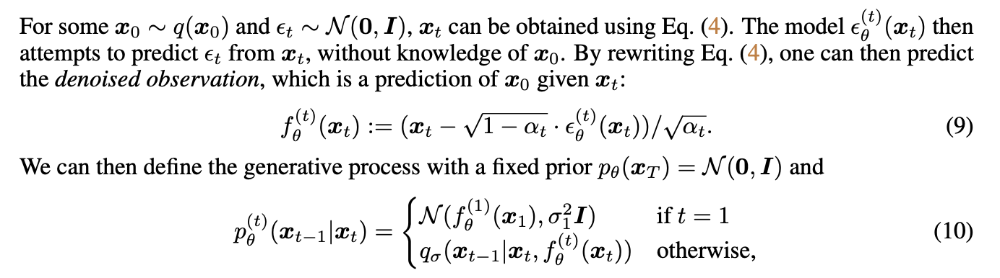
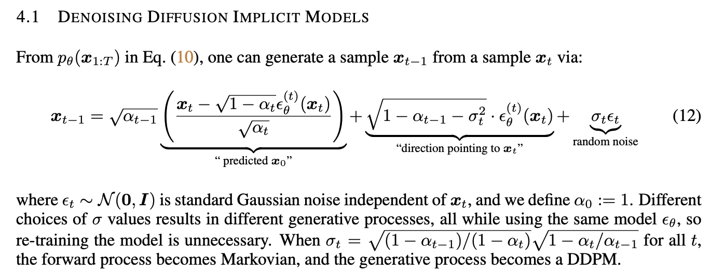

<https://arxiv.org/pdf/2010.02502.pdf>

A critical drawback of these models is that they require many iterations to produce a high quality
sample. For DDPMs, this is because that the generative process (from noise to data) approximates
the reverse of the forward diffusion process (from data to noise), which could have thousands of
steps; iterating over all the steps is required to produce a single sample, which is much slower
compared to GANs, which only needs one pass through a network. For example, it takes around 20
hours to sample 50k images of size 32 × 32 from a DDPM, but less than a minute to do so from
a GAN on a Nvidia 2080 Ti GPU. This becomes more problematic for larger images as sampling
50k images of size 256 × 256 could take nearly 1000 hours on the same GPU.
To close this efficiency gap between DDPMs and GANs, we present denoising diffusion implicit
models (DDIMs). DDIMs are implicit probabilistic models (Mohamed & Lakshminarayanan, 2016)
and are closely related to DDPMs, in the sense that they are trained with the same objective function.

We show that the resulting variational training objectives have a shared surrogate objective,
which is exactly the objective used to train DDPM. Therefore, we can freely choose from a large
family of generative models using the same neural network simply by choosing a different, nonMarkovian diffusion process (Section 4.1) and the corresponding reverse generative Markov Chain.

### Properties of DDIM vs DDPM
- DDIM samples have the following “consistency” property, which does not hold for DDPMs: if we start with the same initial latent variable and generate
several samples with Markov chains of various lengths, these samples would have similar high-level
features. 
- Because of “consistency” in DDIMs, we can perform semantically meaningful image
interpolation by manipulating the initial latent variable in DDIMs, unlike DDPMs which interpolates

From a trained model, x0 is sampled by first sampling xT from the prior pθ(xT ), and then sampling
xt−1 from the generative processes iteratively.
The length T of the forward process is an important hyperparameter in DDPMs. From a variational
perspective, a large T allows the reverse process to be close to a Gaussian (Sohl-Dickstein et al.,
2015), so that the generative process modeled with Gaussian conditional distributions becomes a
good approximation; this motivates the choice of large T values, such as T = 1000 in Ho et al.
(2020). However, as all T iterations have to be performed sequentially, instead of in parallel, to obtain a sample x0, sampling from DDPMs is much slower than sampling from other deep generative
models, which makes them impractical for tasks where compute is limited and latency is critical.
near the image space due to the stochastic generative process.

Our key observation is that the DDPM objective in the form of Lγ only depends on the marginals2
q(xt|x0), but not directly on the joint q(x1:T |x0). Since there are many inference distributions
(joints) with the same marginals, we explore alternative inference processes that are non-Markovian,
which leads to new generative processes (Figure 1, right). These non-Markovian inference process
lead to the same surrogate objective function as DDPM.

They change the forward process for something more general that depends both on x0 and xt for xt-1, adding random noise that depends on a sigma for each step (where if the parameter for sigma were 0, the whole chain could be deterministic and determined by x0 and any xt). This process is more general but has the same objective!

The key insight: instead of approximating ϵ from xt to xt-1, they approximate the ϵ such that x0 and ϵ are mixed to make xt. They then can use the same training objective and the same model as DDPM, but sample only S steps in the markov chain (no longer markovian as it now depends on x0 directly) and reconstruct the image 10~50x faster!

They fix the sigmas and multiply by η so η==0 means DDIM, η==1 means DDPM no changes added, and it's possible to interpolate between both.
The XT parameter seems to encode the high level features of the image well, and interpolation works semantically. longer sample trajectories give better quality samples but
do not significantly affect the high-level features.

It's also possible to reconstruct an image given its XT encoding (if I understand correctly though, this encoding has the same dimensionality, so it's not really compressing. Maybe it's possible to take fewer dimensions?).
