_These are my notes for the [Stanford MOOC](http://web.stanford.edu/class/cs224n/index.html)_. 

I have explained most concepts by rephrasing and summarizing them, and also added references to other material, like articles, papers and internal links when relevant.

## Word2Vec

In Word2Vec, we create a mapping between a language's tokens, and a semantically meaningful, dense space (of much lower dimensionality). For instance, in this space we would expect words that have similar meanings to be close (for a notion of vector distance), and words that are generally unrelated to be far away. These spaces are usually normalized (no vector has a length > 1).

To train Word2Vec, each instance will be a context (a set of N consecutive tokens in a training sample) where we will use as a loss the dot product between pairs of words (softmax(UWi)). This penalizes assigning a higher probability to other words, or a low probability to this pair.

You can also make it sigmoid(WiUj) for each pair of words in a context, for each context embedding Uj in a window, and then that + sigmoid(-WiUk) for k chosen randomly. 

This is a contrastive loss, like that used in [CLIP](/wiki/clip), or in a Boltzmann Machine. The random words would represent an "unlearning phase" in Boltzmann Machine parlance.

_Hyperparam magics_: performance plateaus at embedding dimension d=300 (but doesn’t fall apart, even at 10k!! -nips, 2018-). Seems to have something to do with PCA.

For these models, data quality matters a lot. Model with "small" Wikipedia dataset outperforms model with BIG news scraped dataset.

_Evaluating Word Embeddings_: You can evaluate analogies (with accuracy over premade datasets, using semantic or syntactic analogy), or cosine distance/similarity vs human-rated (e.g., mechanical-turk) similarity.

## Language Modeling
Train a model to predict the n+1th word based on the previous n words. This is an [autoregressive task](/wiki/unsupervised-learning-berkeley#autoregressive-models).

### Fixed-window models

Predict the next token using the previous fixed k words. E.g., use a Markov chain or a co-occurrence matrix. You can train a fully connected MLP using one-hot encoding of the words (super sparse vectors as inputs -actually passed as indices in any sane implementation-).

**Insight:**

Semantically similar words should produce similar "next word" distributions, but normal window models don’t leverage that! Let’s add some embeddings into the mix.

### Arbitrary length window models

Train a **Recurrent Neural Network** (RNN). This means divide your dataset into sequences (usually sentences, paragraphs, or whole texts from your corpus).

For every sequence, you initialize a hidden state h with zeroes (or a reasonable prior). You take each i-th word in order, get its embedding, concat that with h, make that go through an affine layer, plus bias, and use that to predict the i+1-th word (through your typical affine + softmax layer). 

After doing this for every word in your batch, you backpropagate the binary cross entropy loss of the generated probabilities, for every word, and thus get a better W matrix for both the hidden state and the embeddings. (You can train h0 too. You could also train the embeddings if your corpus was large enough).

### Perplexity

Defined as the inverse of the probability of the corpus, normalized by ^1/N. Another way to look at it: take the geometric average of the inverse probability your model gives to each t+1-th word, given the previous t of them.

GPT-3 gets about 20 as a perplexity value on test corpus (so mean probability is about .05. Not bad).

### Vanishing vs Exploding Gradient

The gradient for the t-th word is the productorial of the gradients of the previous t-1 words, which means if the norm of the Jacobian is <1 then it will be exponentially small on the amount of words, and the opposite will happen for a Jacobian >1.
This means a word a few spaces in the future, won’t make a big enough impact in decisions in the past.
We solve exploding gradients with clipping gradient: if gradient norm > e, then scale it down to norm e, for e a hyperparameter.

To solve vanishing gradients, two architectures were invented: LSTM and GRU, which is just a streamlined LSTM (a few less gates, converges faster and has less parameters). They usually perform similarly, or LSTM a bit better since it has more parameters.

### LSTM

LSTMs have Cell States aside from hidden states, and they save information in the cell state and decide which parts to pass along with hidden states.
They have forget, input and output gates, each a sigmoid of an affine transformation of the concatenation of the inputs (for word t) and the hidden state (t-1).
You make your cell state be tanh (another affine transform from input and hidden state t-1).

Then your actual cell state is input gate * that cell state + forget gate * last cell state.

Finally, you update your hidden state as output_gate * tanh(cell).

{: style="height:70%; width:70%" alt="" loading="lazy"}

### GRU
They work similarly, but have less gates. Instead of output gate and tanh of cell, you just make a convex sum between update gate times previous hidden state, and 1- update gate times tanh of affine of inputs + hidden state t-1 (times a reset_gate that’s kinda like a forget gate).

{: style="height:70%; width:70%" alt="" loading="lazy"}

## Seq2Seq for Neural Machine Translation

{: style="height:70%; width:70%" alt="" loading="lazy"}

{: alt="" loading="lazy"}

{: alt="" loading="lazy"}

{: alt="" loading="lazy"}

We train an encoder RNN (With the usual gizmos: Word Embeddings, usually we could use an LSTM or GRU, etc.) on the source language, and then train a different decoder RNN that has as its starting hidden state not a random or 0s vector, but the hidden state for the last word in the source sentence. We expect this value to encapsulate all the meaning in the source sentence.

The decoder then has to generate all the words in the target sentence using the source encoding as an input. We backpropagate the error in each word using cross entropy on softmax (with the same tricks you used for, say, word embeddings for the big vocab size).

{: alt="" loading="lazy"}

On the feedforward/test phase, you can sample the most likely word every time (greedy approach) or sample the top k most likely words, then keep expanding the top k most likely sequences of words, always stopping whenever you reach an end of sentence token.

Since log likelihood necessarily decreases as more words are added, and the most likely sentence ever is just empty sentence, you normalize sentences by 1/N for N size of sentence in words, to get a normalized score and not penalize long sentences.

{: alt="" loading="lazy"}

But how do we solve for the fact that the last hidden state may not contain all the information, especially from words far away in the beginning of the sentence?

{: alt="" loading="lazy"}

We add attention! Here's how it works:

- We take the hidden state for our i-th word on the target sentence, Hi.
- Take the dot product with each hidden state Hj on the source sentence.
- Take the vector of inner products (they’re each a scalar) and do softmax on it. We now have a probability (attention) distribution.
- Take the convex sum of encoder hidden states Hj, weighted by the attention each one gets. Concatenate that with the decoder hidden state and use that for the affine layer before the softmax.

It can also get more general: instead of a convex sum of dot products, we could do dot product between the states and a matrix in the middle, or do crazy things with tanh and a different vector for attention allocation.

{: style="height:70%; width:70%" alt="" loading="lazy"}

{: style="height:70%; width:70%" alt="" loading="lazy"}

## Question Answering

A few quotes I liked:

> "A lot of the last two years of NLP can be summed up as "people have found a lot of clever ways to use attention and that’s been pairing just about all the advances." "

_"Many times in research, you get the best performance with a simple model, then over time people come up with more complex architectures and they perform even better, and eventually someone realizes if you tune the parameters for the simpler model just right you can beat them again."_ \[paraphrased by me]

### Question Answering definition

In question answering we provide a passage and a question, and the model needs to select a substring of the passage that answers the question. This means we cannot answer yes or no questions, counting questions, etc.

Biggest datasets are made with mechanical turk + carefully selected rather simple texts. Most famous one is SQuAD. F1 score is usually the reported metric, where you look for precision+fpr of words vs mechanical turk answers.

Models were bad at noticing if no answer was present, until researchers came up with a solution to that (either use a threshold, or get a "noAnswer" token for answers.)

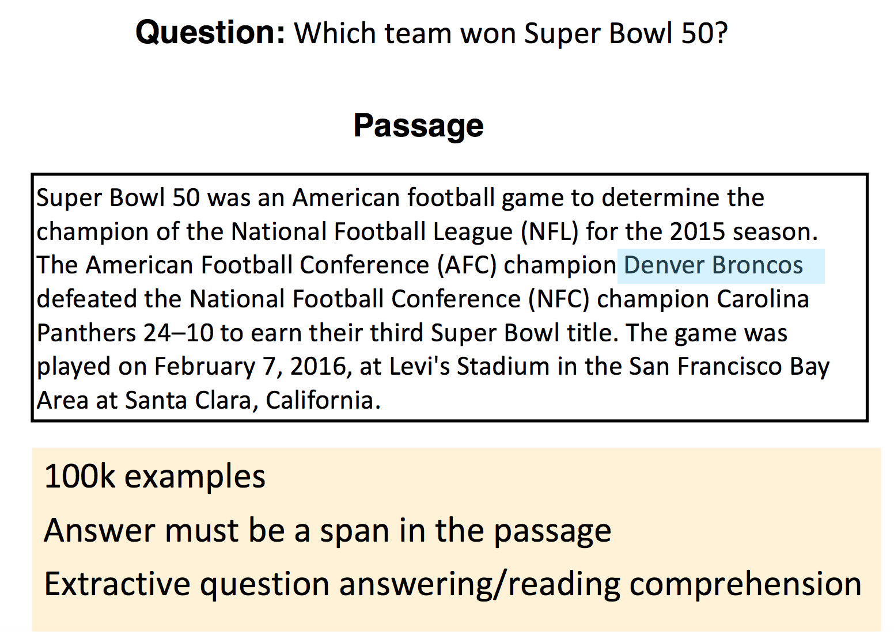{: style="height:70%; width:70%" alt="" loading="lazy"}
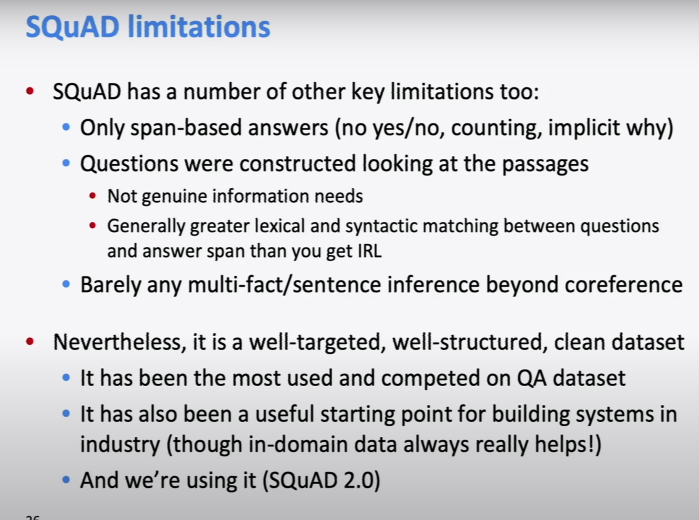{: style="height:70%; width:70%" alt="" loading="lazy"}

### Stanford attentive reader

This model beats traditional (non-neural) NLP models by a factor of almost 30 F1 points in SQuAD. It loses to BERT and other transformers, but it's simpler.

- Feed the Question through a bi-directional LSTM with word embeddings. 
- Concatenate both end states (one for each network, so one for first word of reverse and one for last of right way).
- Feed another LSTM bidirectionally and with word embeddings, this time on the passage.
- We use attention to find where the answer is. What we do is work out an attention score between question vector and passage states for each word, and use that to define a start and end word for the substring. 

{: alt="" loading="lazy"}

It could be thought that we're missing the information about words in the middle, but actually we're training the LSTM to push that information to the edges (and this is bidirectional so it works both ways).

Here's what we actually gained by using neural networks:

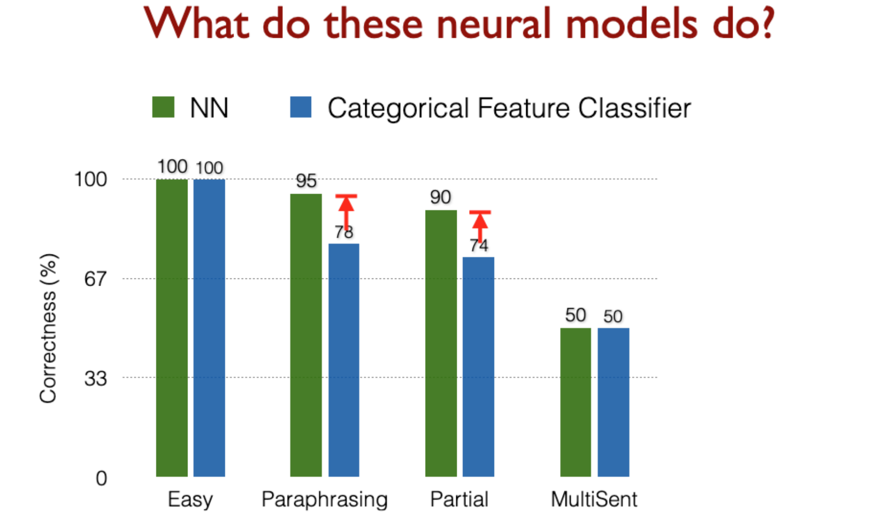{: style="height:70%; width:70%" alt="" loading="lazy"}

### BiDAF

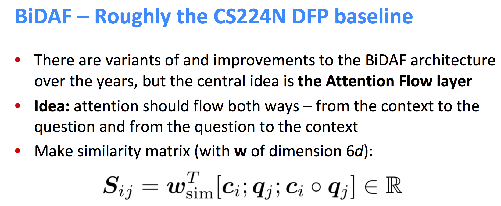{: style="height:70%; width:70%" alt="" loading="lazy"}
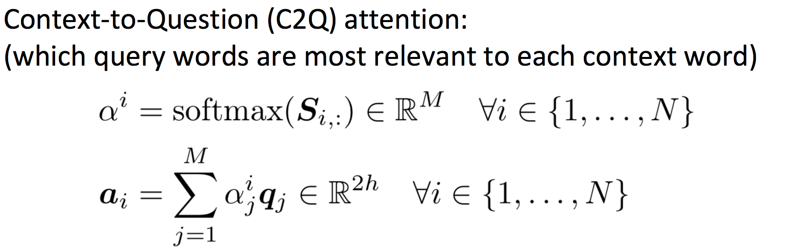{: style="height:70%; width:70%" alt="" loading="lazy"}
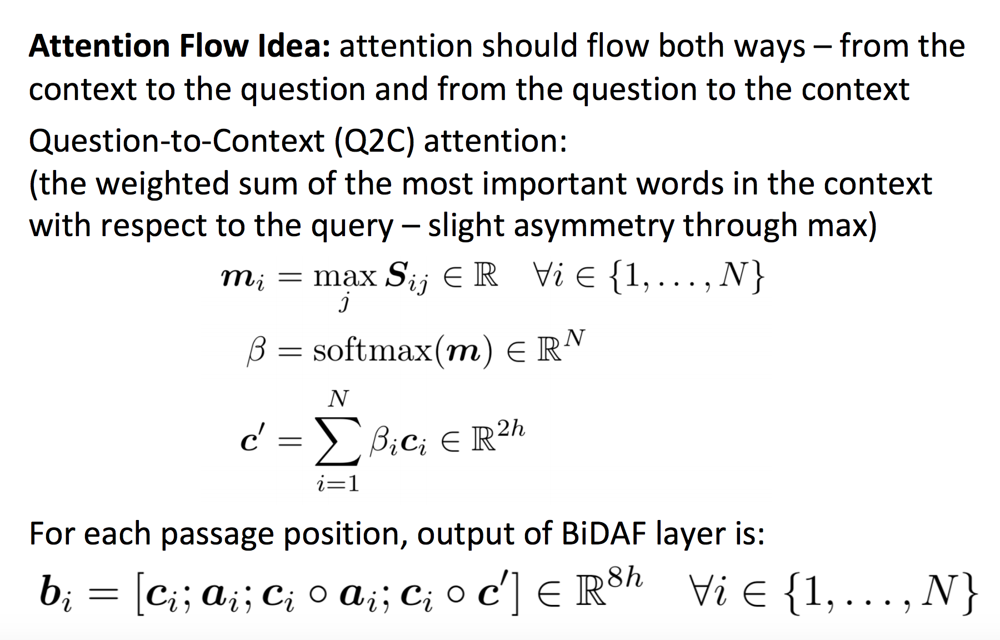{: style="height:70%; width:70%" alt="" loading="lazy"}
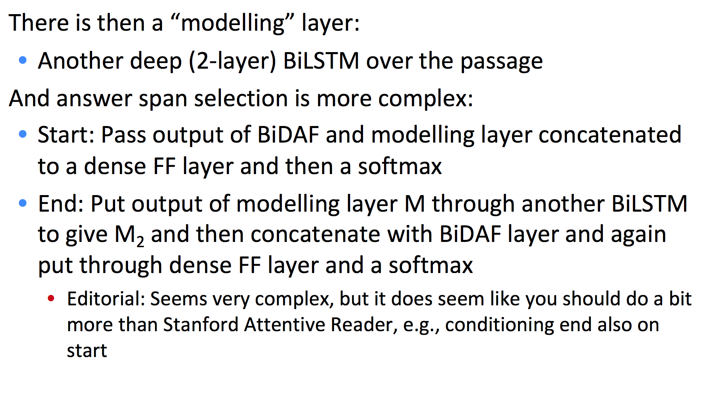{: style="height:70%; width:70%" alt="" loading="lazy"}

## Subword Models

### Character-Level Models

Word embeddings can be composed from character embeddings:

- Generates **embeddings for unknown words**. 
- Similar spellings share similar embeddings. 
- Solves **OOV problem** (usually you'll keep your word embeddings, and use average of character embeddings when OOV).

A **connected language** (such as Japanese) can be processed as characters.

Both methods have proven to work very successfully!

A seq2seq on character-level using LSTM was tested for Czech-English NMT. It slightly beat a baseline of word-level LSTM. 

Char-level works especially well on connected and agglutinative languages, but it's mega slow -3 weeks to train back in 2018-.

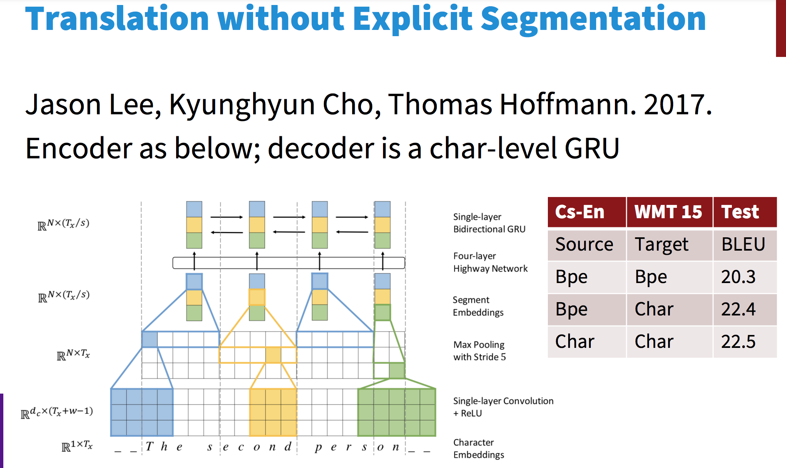{: style="height:70%; width:70%" alt="" loading="lazy"}

Two trends appear:

* **Hybrid models**: word-level model that defaults to char-level for unks.
* **Same architecture** as a word-level model, but with **char or word-piece embeddings**.

BERT uses a variant of the wordpiece model 

* (Relatively) common words are in the vocabulary:  at, fairfax, 1910s.
* Other words are built from wordpieces:

hypatia = h ##yp ##ati ##a 

*  If you’re using BERT in an otherwise word based model, you have to deal with this.

### Highway Network (2015)

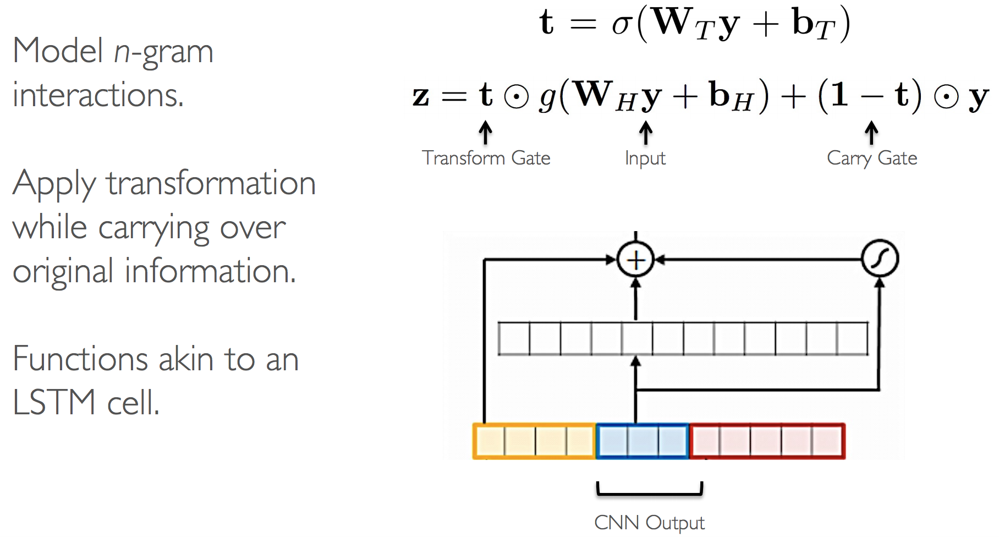{: style="height:70%; width:70%" alt="" loading="lazy"}

### Character level language model (2015, more complex)

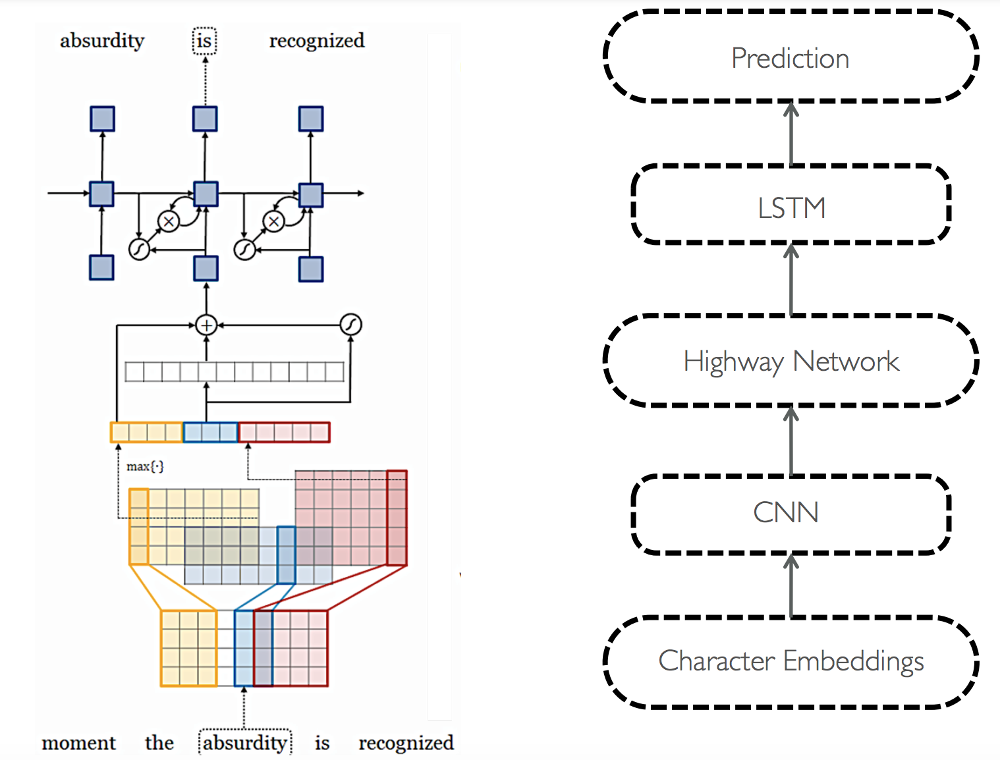{: style="height:70%; width:70%" alt="" loading="lazy"}

Almost reached SOTA, and also understood semantics of transformed words -good vs gooood-.

### Char-level word representations

Run bidirectional LSTM on both directions over characters of a word, concat both final hidden states as new representation.

### Hybrid NMT

* 2- stage decoding: use aggregated char-embeddings when decoding UNK.
* bidirectional LSTMs, 8 stacks.

## Contextual Word Representations: ELMo, Bert, etc.

Word embeddings are the basis of deep learning for NLP.

**Problem**: Word embeddings are applied in a **context free manner**

**Solution**: Train **contextual representations** on text corpus.

We sort of did this with hidden states on RNNs/LSTMs: their values depend on previously seen words (or seen in the future).

### TagLM

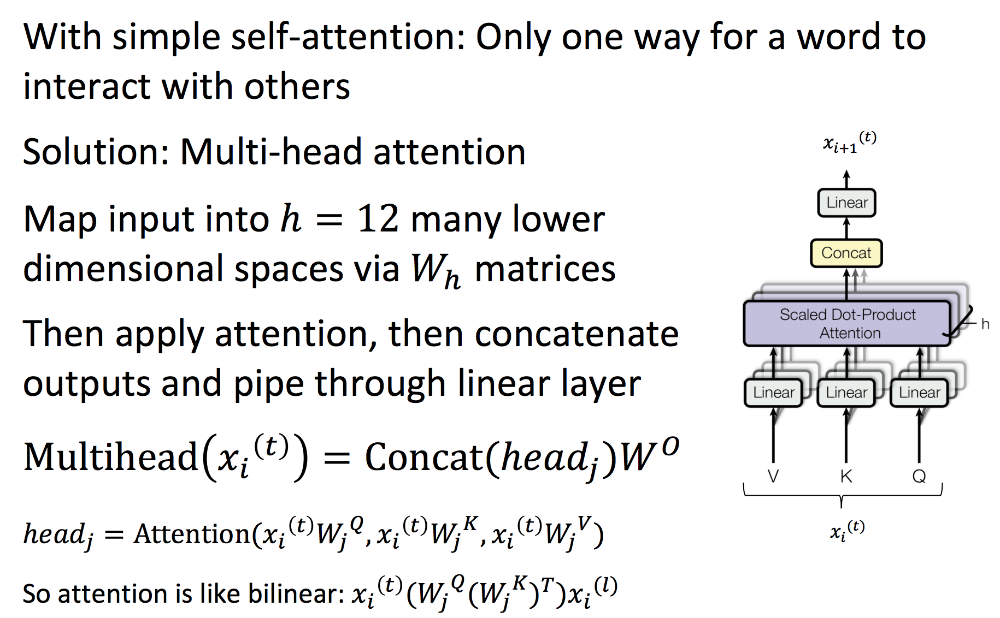{: style="height:70%; width:70%" alt="" loading="lazy"}

Train a separate Language Model in an unsupervised manner, which allows you to use a huge corpus (say, Wikipedia). Also derive your word embeddings from it.

Then feed to your main model both a char-RNN reppresentation, a word embedding and, after going through a bi-directional LSTM, concatenate hidden states with the concatenated hidden states of the (now pre-trained and frozen) language model.

This beat SotA by a narrow margin in perplexity but it was a much simpler model than the competition. 

### ELMo

ELMo beat SotA in a wide range of tasks by a big margin, whereas most academics work all year to beat SotA on a single task by about 1%. 

This was ground-breaking, and the paper won Best Paper Award at NAACL 2018. \[maybe read the best paper awards from the last few years?]\[🌱]

ELMo works similarly to TagLM. The architecture of the language model is:

- Use 2 Bi-LSTM layers.
- Use only a char-CNN to build initial word representations: 2048 char n-gram filters, 2 highway layers, 512 dim projection space.
- Use 4096 hidden state cells with 512 dim projections for next layer.

Then they added different weights per LSTM layer's hidden state, and different weight to the whole LM's hidden states per task. 

This way ELMo only uses the LM where it matters, and assigns different importance to each layer (reportedly the lowest layer is better for syntactic information, and is more useful for NER or POS-tag, whereas the second layer carries more semantic data, and works better for Question Answering, Sentiment Analysis, etc.).

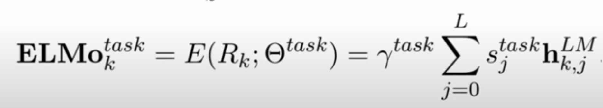{: style="height:70%; width:70%" alt="" loading="lazy"}

## Transformers

Transformers revolutionized natural language processing, then any autoregressive problem, and are now used for image, audio, text and many other tasks where modelling is required.

They do away with recurrent layers, and instead take a whole batch of consecutive temporal inputs (say, a sequence of tokens) and make them go through "attention heads" which map each token's embedding to a new embedding space that contains contextual information by attending to the embeddings of all other tokens in the context window.

On the one hand, we lose the unlimited window size. On the other, they can be trained much faster and more cheaply, and window sizes can be big enough (though limited) for the problem to be less relevant.

### GPT

"[Attention is all you need](https://arxiv.org/abs/1706.03762)": What if we drop the Recurrent part, and just keep the attention to maintain long-term information and context?

This is how a transformer's Encoder works:

You take the whole sentence, and make each word go through an "atttention head". 

All words in a same sentence can run through an attention head in parallel, making transformers train a lot faster in GPU.

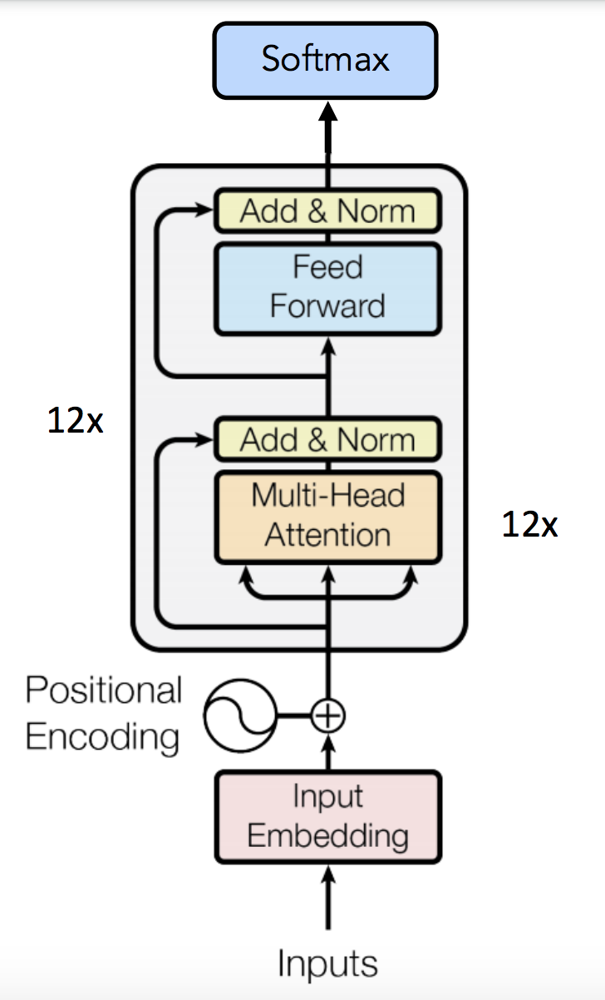{: style="height:50%; width:50%" alt="" loading="lazy"}

The attention mechanism can be scaled horizontally to add more semantic/syntactic interpretations of a word in-context. Notice the skip connections that make the final output the sum of all intermediate layers.

Here's the attention function for embeddings Q, K, V:

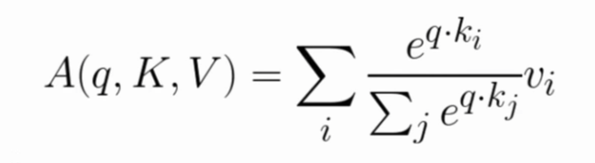{: style="height:70%; width:70%" alt="" loading="lazy"}

The feed-forward layer is a 2-layer MLP with ReLU.

{: style="height:70%; width:70%" alt="" loading="lazy"}

Where Wi are learned matrices, each of them projecting the Q,K,V word-embeddings into different spaces.

Typically, we'll make Q,K,V be the word embedding for the current word, concatenated to **positional encoding**, so same words at different locations have different overall representations:

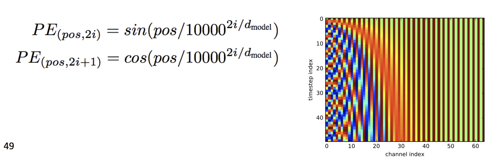{: style="height:70%; width:70%" alt="" loading="lazy"}

Multi-headed attention nodes are composed (vertically) and finally you can run your supervised task on the output.

The decoder is left as an exercise for the reader. For LM you can skip it.

**Related reading**: 

An excellent visual explanation of transformers is available at [The Illustrated Transformer](https://jalammar.github.io/illustrated-transformer/).

There is also Karpathy's [MinGPT](https://github.com/karpathy/minGPT) for a clean implementation.

**See also**: 
- [TransGAN](/wiki/transGAN)
- [Visual Transformer](/wiki/visual-transformer)
- [Transformers see like CNNs](/wiki/transformers-see-like-cnn)

And [many more articles tagged _transformer_](/tagged?q=transformer) in this wiki.

### BERT (Bidirectional Encoder Representations from Transformers)

Problem: LM's are unidirectional, but language understanding is bidirectional.

Why? Because you can't learn to predict the future by seeing it.

Solution: Train a LM by removing _k_=15% (a somewhat arbitrary value, but they never change this) of words from each sentence and predicting them from bidirectional context. 

Setting _k_ is a trade-off: too much and you don't see context, too little and you train too slowly.

In a way, OpenAI's GPT used unidirectional transformers, and ELMo took advantage of bidirectionality with its pre-trained LM.

This mixes both approaches by training a model that's inherently bidirectional. 

They also train it on **next sentence prediction**: given sentence A and sentence B, **can sentence B come after A**?

**First Layer**: Combine token embeddings -typical word/char embeddings-, position embeddings -as in GPT- and segment embedding -whether word belongs to sentence A or B-.

They trained a transformer encoder on Wikipedia+BookCorpus, similar size to GPT beat it by a couple points on most benchmarks.

After training the encoder, it can be used in other tasks by **removing last layer (classification) and fine-tuning** -as opposed to ELMo which just gave frozen representations-.

*Related reading*: [BERT interpretability](/wiki/bert-interpretability)

### Comparing BERT vs GPT

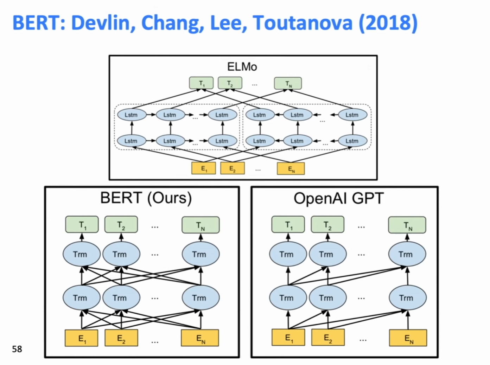{: style="height:70%; width:70%" alt="" loading="lazy"}

On BERT, you multiply by the whole sentence's embeddings on each layer, then go through the block. This makes it bidirectional, and lets you do each layer in a single matrix multiply, which is good for GPU usage.

On GPT, you were doing first a product for the first word, then one for the first two, and so on, for every layer. This wasn't as good -though it was still better than going full recurrent-.

For transformers for Neural Machine Translation, you send the last layer of the encoder, plus the last in the decoder, into an encoder-decoder attention layer which lets you model interaction between words.

You also make sure the decoder is trained on predicting unidirectionally, as opposed to the encoder which is bidirectional. This is, you feed the decoder only the first n words, and do prediction for the n+1-th one.

Transformers have been used on image generation tasks (either feeding them a rasterized version of the last n pixels on reading-order to predict the next one, or a rasterized version of the pixels on a MxN grid around the pixel that have been generated -that's the ones that come before in reading order-).

They have also been used for music generation, where the "tokens" were start note, end note, move clock forward, and a volume indicator.

## Natural Language Generation

Given an already trained language model, how do we sample a sequence of tokens from it?

Teacher Forcing: during training we feed the decoder with the right words from the supervised decoded sentence, regardless of what it is actually predicting on each step. 

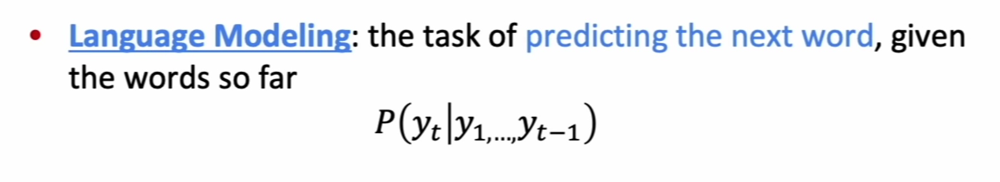{: alt="" loading="lazy"}

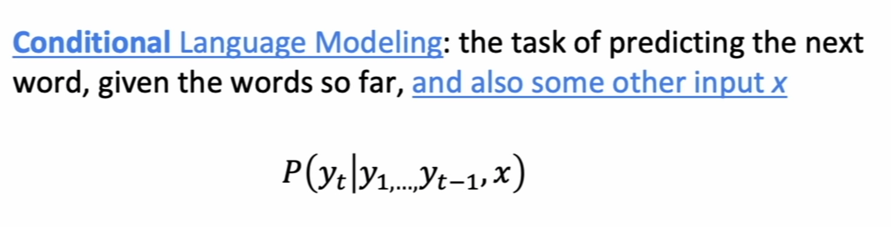{: alt="" loading="lazy"}

### Decoding Algorithms

- **Greedy Decoding**: take the most probable word at every step (until producing \<END\> token). Lacks backtracking and can generate poor results. Think Markov chain.
- **Beam-Search Decoding**: Find a high-probability sequence by tracking k most probable partial sequences (called hypotheses) so far. You choose sequence with highest probability, adjusted for length. (= greedy if k = 1\. Ungrammatical, nonsensical, etc. Larger k: reduces some of the problems, but is more computationally expensive. It also makes more generic dialogue on chit-chat tasks, and less BLEU score due to short sentences).

### Sampling-based Decoding

- **Pure Sampling**: sample from probability distribution for next word, greedily.
- **Top-n Sampling**: sample from probability distribution for next word (greedy), but only take into account the top n most likely words.

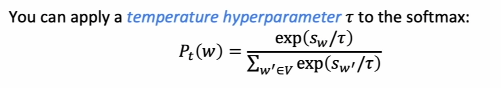{: alt="" loading="lazy"}

## Summarization

Task: given input text x, write a summary y, which is shorter and contains the main information of x. 

It can be **single-document** or **multi-document**: you either write a summary of x, or a summary of many related x's about the same topic (e.g., many news of a single event).

Summarization can be **extractive** (highlight the relevant parts of an article x) or **abstractive** (rewrite x in fewer words. Requires original language generation and is typically harder).

### Evaluation

Summarization can be evaluated with ROUGE, a BLEU-like metric that's recall-oriented (Recall-Oriented Understudy for Gisting Evaluation).

It's number of matching n-grams in generated summary over total number of n-grams generated. Summed over all human-made summaries.

It has no penalty for brevity, and is typically reported for 1-grams, 2-grams, etc. ROUGE-L is longest common subsequence overlap.

Both ROUGE and BLEU correlate badly with human ratings. Even if you correct by counting "near hits" where you used a word that is close in embedding space to another, it still fails catastrophically. 

### Neural Summarization

Since 2015 summarization has been done with Seq2Seq models with attention, with maybe later a few copying mechanisms which seemed useful at the time (like for each generated summary word having a probability of just copying a word from input, times the attention each input word gets at that stage). 

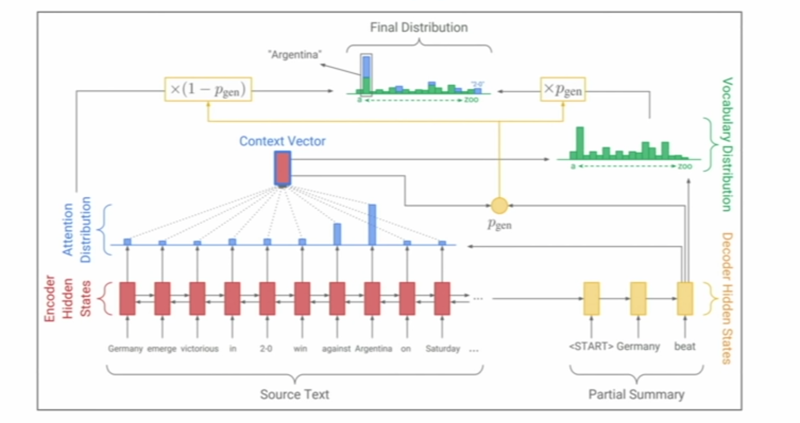{: alt="" loading="lazy"}

Copying can make your model **less abstractive**, and more extractive.

**Bottom Up Summarization**: Run a RNN that maps each word to a keep-vs-discard probability. Then only attend to words that have a high proba (the keep ones) during summarizing.

## Dialogue

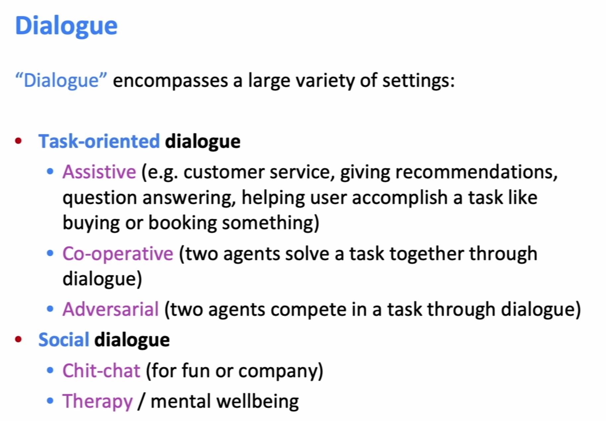{: alt="" loading="lazy"}

The solutions are basically another Seq2Seq model with attention, very similar. 

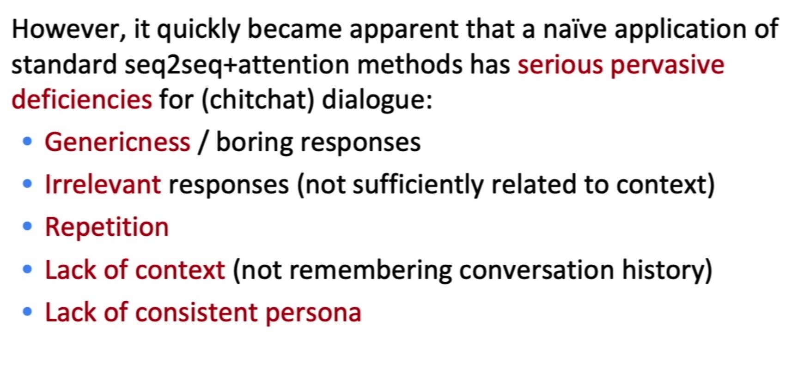{: alt="" loading="lazy"}

Some problems have easy solutions like improving beam-search to incentivize rarer words, penalize or ban repetition directly in beam-search. Lack of context and consistent persona are harder.

### Storytelling

Similar system (dataset made of WP's in r/writingPrompts and responses). Interestingly, models make very descriptive stories with consistent characters but no plot moves forward. They're static. 

This problem hasn't been solved yet! -as of the lecture-. 

### Conclusions on NLG

Final takeaway: NLG is the wild west of NLP, and there's a lot of new stuff to uncover. 

Conclusions taken from slide:

- The more open-ended the task, the harder everything becomes. • Constraints are sometimes welcome! 
- Aiming for a specific improvement can be more manageable than aiming to improve overall generation quality. 
- If you're using a LM for NLG: improving the LM (i.e. perplexity) will most likely improve generation quality... but it's not the only way to improve generation quality. 
- Look at your output, a lot.
- You need an automatic metric, even if it's imperfect. • You probably need several automatic metrics. 
- If you do human eval, make the questions as focused as possible. 
- Reproducibility is a huge problem in today's NLP + Deep Learning, and a huger problem in NLG. Please, publicly release all your generated output along with your paper! 
- Working in NLG can be very frustrating. But also very funny...

---

Back-translation : You train a reverse translator, and add to your dataset the pair (noisy input, nice target sentence). This is much more effective than generating a noisy target sentence and using it for training -because it may exacerbate error patterns or model biases-.

XLNet: Try many different ablations of BERT using a huge amount of computing power. They beat SotA until GPT-3 came along, only barely beating BERT and Roberta -which is just BERT+more epochs and data, since they showed BERT was undertrained. 

Part of the improvement seen on BERT comes from next-sentence prediction task, and part just comes from being bidirectional. Next sentence is important for question answering, in the other tasks improvement seems to come mostly from bidirectionality.
An interesting emerging effect is BERT beat SotA models in small datasets too, which violates common rules of thumb. 

### Distillation 
Distillation is an instance of [semi-supervised learning](/wiki/unsupervised-learning-berkeley#semi-supervised-learning). 

- Train a "teacher" which is just a SotA model
- Label a large amount of unlabeled inputs with teacher on the specific task you want to distill
- Train student with smaller (e.g., \~50x smaller) size and bigger dataset, on cross entropy

Now you have a small trained model for your problem.

<https://gluebenchmark.com/leaderboard>
