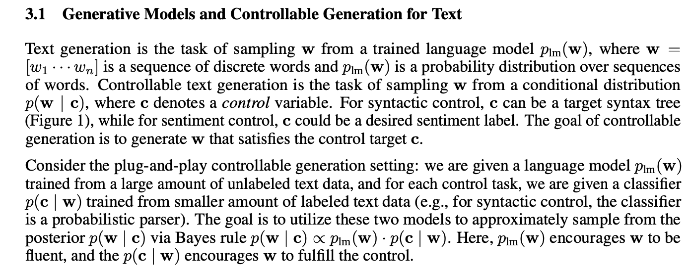

[Link to the paper](https://arxiv.org/pdf/2205.14217.pdf).

This paper uses diffusion models, which have been used successfully for image and audio generation (see my notes on [Glide](/wiki/ddim)), to **generate text in a controllable way**. 

Given a set of constraints, like syntactic structures, sentiment, or topics, this approach allows for text generation conditioned on them, balancing **coherence / fluency** (through the language model itself) and **constraint satisfaction** (through a different, supervised model).

> "In order to tackle more complex controls, we propose Diffusion-LM, a new language model based on continuous diffusions. Diffusion-LM starts with a sequence of Gaussian noise vectors and incrementally denoises them into vectors corresponding to words embeddings. (...) These gradual denoising steps produce a hierarchy of continuous latent representations. We find that this hierarchical and continuous latent variable enables simple, gradient-based methods to perform complex control tasks such as constraining the parse tree of a generated sequence."

In these experiments, text is generated directly in embedding space, allowing for a continuous modeling of tokens and semantic information.

{: alt="" loading="lazy"}

The paper then does a good job of explaining [Diffusion models](/wiki/glide).

{: alt="" loading="lazy"}

## Diffusion-LM: Continuous Diffusion Language Modeling

They define a training method for the embeddings, and a rounding process to get back to token space.

"We found that [pretrained fixed embeddings](/wiki/deep-learning-NLP#word2vec) are suboptimal for Diffusion-LM compared to end-to-end training". 

They instead map tokens to Gaussian variables centered around their embeddings. Then for the rounding process, they calculate probability of a sequence *w* of words as the product between the probabilities of each individual word, conditioned solely on that word's embedding, without any autoregression. This probability is modeled with a softmax.

They train the embedding function to make a word's mapping closer to the reconstruction from the first noising step. "Empirically, we find the learned embeddings cluster meaningfully: words with the same part-of-speech tags (syntactic role) tend to be clustered".

To make a mapper from Gaussian noise to some x0, they train a mapper f(xt, t) to always backtrack t steps and generate x0.

"This forces the neural network to predict x0 in every term and we found that models trained with this objective quickly learn that x0 should be precisely centered at a word embedding."

## Controllable Text Generation

Instead of performing control directly on the discrete text, they perform control on the sequence of continuous latent variables x0:T defined by Diffusion-LM, and apply the rounding step to convert these latents into text. The rounding step is a softmax distribution trained to predict the token from the embedding.

{: alt="" loading="lazy"}

They run gradient updates on a control objective with *fluency regularization*:

 \\\( \lambda log p (x_{t-1}\|x)\ +\ log p (c\|x_{t-1})\\\) .

They "found this term to be instrumental for generating fluent text."

When decoding, they employ **minimum bayesian risk decoding**: take the sample that minimizes the sum of negative BLEU scores against the other samples, to avoid one that is an outlier.

## Results

Diffusion-LM achieves high success and fluency across all classifier-guided control tasks. 

I see a very significant jump in syntax control tasks, and obviously in length control, but it beats SotA in everything.

