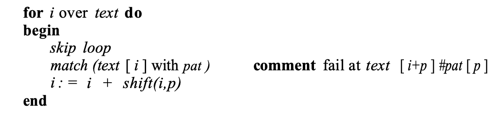
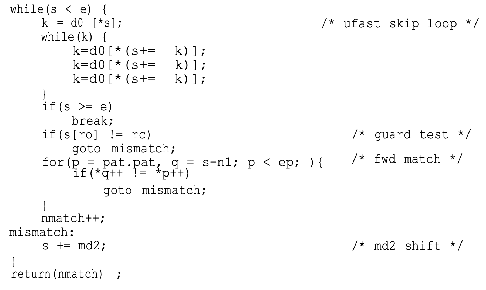

[Fast String Searching, Hume and Sunday](https://citeseerx.ist.psu.edu/viewdoc/download?doi=10.1.1.13.9460&rep=rep1&type=pdf)

"Partially because the best algorithms presented in the literature are
difficult to understand and to implement, knowledge of fast and practical algorithms is not commonplace. In this paper we present a taxonomy and an organizational framework for categorizing and constructing string search algorithms, and show how the best known algorithms are classified within it."

> A variant of Boyer-Moore designed by Apostolic and Giancarlo achieved a bound of C(n, m) >= 2n – m + 1. (n text length, m input length).

Boyer and Moore described two algorithms. A simpler ('classic') one and a faster one, but the posterior literature usually focused on the simpler one instead of the other one as benchmark.

General string search algorithm:

{: alt="" loading="lazy"}

In their taxonomy, the authors identify and vary three different components of a string search algorithm: **Skip Loops, Match algorithms and Shift Functions.**

The skip loop quickly searches forward to see which characters it can skip (like checking only for the first character), the match algorithm compares text to pat, and the shift function dictates how many positions forward to move after a match (or a fail).

Classic BM is described by {None \| rev \| d1^d2}. 

## Fast Boyer Moore

Boyer and Moore reported that most of the execution time of a string search is
spent moving the pattern past immediate mismatches.

[Wikipedia](https://en.wikipedia.org/wiki/Boyer%E2%80%93Moore_string-search_algorithm): _"The key features of the algorithm are to match on the tail of the pattern rather than the head, and to skip along the text in jumps of multiple characters rather than searching every single character in the text."_

Instead of a brute-force search of all alignments (of which there are n-m+1), Boyer–Moore uses information gained by preprocessing P to skip as many alignments as possible.

"The key insight in this algorithm is that if the end of the pattern is compared to the text, then jumps along the text can be made rather than checking every character of the text. The reason that this works is that in lining up the pattern against the text, the last character of the pattern is compared to the character in the text. **If the characters do not match, there is no need to continue searching backwards along the text. If the character in the text does not match any of the characters in the pattern, then the next character in the text to check is located m characters farther along the text, where m is the length of the pattern. If the character in the text is in the pattern, then a partial shift of the pattern along the text is done to line up along the matching character and the process is repeated.** _Jumping along the text to make comparisons rather than checking every character in the text decreases the number of comparisons that have to be made_, which is the key to the efficiency of the algorithm."

Both P and T are compared repeatedly backwards, from a certain alignment index k, and then k is shifted according to rules and table lookups.

### Shift Rules

A shift is calculated by applying two rules: 
- The **bad character rule.**
- The **good suffix rule.** 

The actual shifting offset is the maximum of the shifts calculated by these rules.

The **bad-character rule** considers the character in T at which the comparison process failed (assuming such a failure occurred). The next occurrence of that character to the left in P is found, and a shift which brings that occurrence in line with the mismatched occurrence in T is proposed. If the mismatched character does not occur to the left in P, a shift is proposed that moves the entirety of P past the point of mismatch.

The **good suffix rule** is markedly more complex in both concept and implementation than the bad character rule. Like the bad character rule, it also exploits the algorithm's feature of comparisons beginning at the end of the pattern and proceeding towards the pattern's start. It can be described as follows:

Suppose for a given alignment of P and T, a substring t of T matches a suffix of P, but a mismatch occurs at the next comparison to the left.

- Then find, if it exists, the right-most copy t' of t in P such that t' is not a suffix of P and the character to the left of t' in P differs from the character to the left of t in P. Shift P to the right so that substring t' in P aligns with substring t in T.
- If t' does not exist, then shift the left end of P past the left end of t in T by the least amount so that a prefix of the shifted pattern matches a suffix of t in T.
- If no such shift is possible, then shift P by m (length of P) places to the right.
- If an occurrence of P is found, then shift P by the least amount so that a proper prefix of the shifted P matches a suffix of the occurrence of P in T.
- If no such shift is possible, then shift P by m places, that is, shift P past t.

The good suffix rule uses two tables, also made during preprocessing.

---

They described a modified algorithm, which we call BM.FAST, with an initial ‘fast loop’ that quickly skips past these mismatches.
To prevent two tests in the skip loop, one for end of text and one for a possible match, this loop uses delta_0, identical to Boyer-Moore’s delta_1 except that delta_0 [ pat [ patlen –1 ]]
contains a sentinel value LARGE (> textlen + patlen ) that causes the skip loop to halt when a
possible match position occurs.

"Having a skip character near the end of the pattern gives large
skips, but it might be better to choose a lower frequently character and stay in the loop
longer, even though each skip is a bit smaller. Consider searching for the word ‘baptize’ in
English text. Quite often, the ‘e’ will match and we will break out of the skip loop, and then
do the match and shift before going back to skipping. However, if the skip loop was looking for the ‘z’, it would skip a little less on each iteration of the loop, but would almost
never break out of the skip loop, and would thus run faster."

[Here they're looping unrolled-ly and checking if shift >0. While true, no need to compare strings, can keep skipping as desired].

Something I found interesting: "There are additional fine tuning refinements that may be architecture dependent. One such variant changes the type of the d0 skip table from int to char. As shown below, this runs faster on the two RISC architectures ( mips, sparc) but slower on the others.

Examination of the generated code reveals that the mips code had shrunk by one instruction because it no longer had to multiply the index by 4 to get a byte address for a skip table entry. The vax code, on the other hand, grew because it cannot add a byte to an integer directly."

---

"For our test set, the average number of characters compared in the above *om loop* is 1.05.

"Thus, we can gain 95% of the benefits of the om match by simply testing for the rarest character of the pattern first before doing a full match test."

Finally they conclude "combining **_fwd_ with a guard is a clear winner.**"

Later:

"Of the shifts and systems we measured, **_md2_ is the fastest shift.**"

**md2**: "If we use a skip loop (other than none), then text[ i + k ] = pat[k] where pat[k] is the skip loop character. A mini sd2, or md2, shift aligns the rightmost occurrence of pat[k] left of pat[k] with text[ i + k ]. If there isn’t one, the shift is k + 1. This shift is simple to precompute and should always outperform inc since it is as easy to apply but typically will be much greater than 1 and roughly equal to sdk, the distance that the skip character must skip to match itself."

## Recommended Searching Algorithms

The recommended algorithm is the **TBM (_Tuned Boyer-Moore_) algorithm**. 
It is { _ufast_ | _fwd + g_ | _md2_ }.

It is compact and fast and can be made independent of frequency data by eliminating the guard. _ufast_ is just the BM delta with an unroll (in this case of 3).

The code for the algorithm, excluding preprocess, is:

{: alt="" loading="lazy"}

**md2** is distance between first leftward reoccurrence of last character, and len.

**d0** stores len(P) for every char except if c in P, then (len(P) - max(ind(c,P))).

They also recommend LC which performs similarly and only changes the skip loop routine (for something more complex that I don't feel inclined to analyse).

## Related Reading

- [This Article I found in HackerNews](https://lists.freebsd.org/pipermail/freebsd-current/2010-August/019310.html) linked me to the paper and cites it as the reason GNU grep is faster than freeBSD grep.