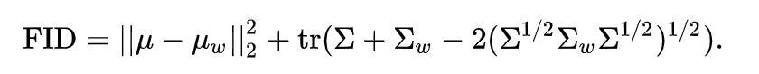

_Quoth Wikipedia:_

The **Fréchet inception distance** (FID) is a metric used to assess the quality of images created by a generative model, like a generative adversarial network (GAN). Unlike the earlier inception score (IS), which evaluates only the distribution of generated images, the FID **compares the distribution of generated images with the distribution of real images that were used to train the generator.**

The FID metric is the squared Wasserstein metric between two multidimensional Gaussian distributions:  \\\(\mathcal{N}(\mu,\Sigma) \\\) , the distribution of some neural network features of the images generated by the GAN and  \\\( \mathcal{N}(\mu_{w},\Sigma_{w}) \\\)  the distribution of the same neural network features from the "world" or real images used to train the GAN. As a neural network the Inception v3 trained on the ImageNet is commonly used. As a result, it can be computed from the mean and the covariance of the activations when the synthesized and real images are fed into the Inception network as: 

### In summary

FID score is the **distance between the distribution of the activations for some deep layers in a classifier, when comparing a sample of test images and one of generated images.** If activation distributions are similar, we can conclude the underlying image distributions are also alike. 

The Wasserstein metric is computed as the distance between the means plus a term that takes covariance matrices into account. This metric is used for computing the distance between two distributions, similar to KL-Divergence (I wonder how well they correlate?).

### Wasserstein vs Kullback-Leibler

"When considering the advantages of Wasserstein metric compared to KL divergence, then the most obvious one is that W is a metric whereas KL divergence is not, since KL is not symmetric, and does not satisfy the triangle inequality."
[Source: Mathstack](https://stats.stackexchange.com/questions/295617/what-is-the-advantages-of-wasserstein-metric-compared-to-kullback-leibler-diverg)

