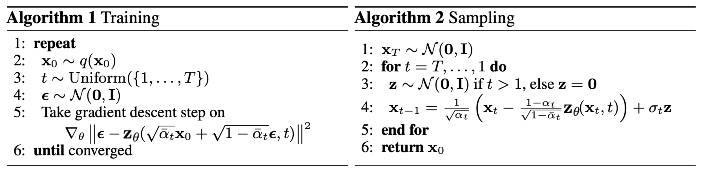
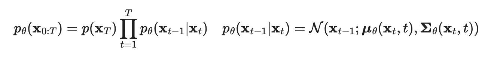
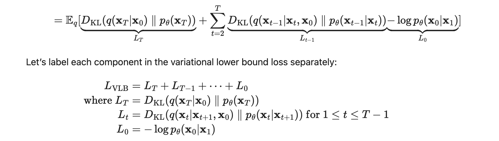

*[Link to GLIDE paper on Arxiv](https://arxiv.org/pdf/2112.10741.pdf)*

GLIDE combines a [diffusion model](/wiki/ddim) with [CLIP](/wiki/clip) embedding conditioning to generate high quality images, conditioned on text prompts, that compare favorably to DALL-E (a [VQVAE](/wiki/unsupervised-learning-berkeley#variational-autoencoders)) when judged by humans. 

One of the first text-to-image models, it has a much image poorer quality than [DALL-E 2](/DALL-E-2-prompt-guide) or [Stable Diffusion](/stable-diffusion-vs-dalle-2) but still makes images that look good. My experience is they tend to lack global coherence but contain good textures and usually represent what was asked in an indirect way (like showing snouts, fur and a tail for the prompt 'dog').

Images can also be initialized as a rough sketch in a zero-shot regime, and iteratively improved through extra prompts and "inpainting", where a piece of the image is masked and only that is filled.

In a **diffusion model**, an image is iteratively added Gaussian noise \~N(0, (1 − αt)I), and then a model is trained to reconstruct the slice of noise applied to the image resulting from step xt-1 given xt, iteratively (sharing weights) until x0 is the image. The loss function takes the distance between predicted and actual noise for each step.

The model is therefore trained to reconstruct all previous steps in the diffusion chain, starting from the noisiest one and up ot the original image, in reverse order. Usually the neural network chosen for this task is a U-NET, which combines convolutional layers to first reduce the dimensions of the input and then scale them back to the same leve, effectively making them go through a bottleneck (similar to an AutoEncoder).

{: loading="lazy"}
[Source](https://lilianweng.github.io/lil-log/2021/07/11/diffusion-models.html)

**Guided diffusion**, as opposed to denoising diffusion, additionally conditions reconstruction on a label *y*, using a classifier *φ* so that the predicted mean of the added noise becomes  \\\( µ_θ'(x_t\|y) = µ_θ(x_t\|y) + s · Σ_θ(x_t\|y)∇\_{x_t} · log p_φ(y\|x_t) \\\)  . 

**Classifier free guidance** additionally masks out X% of the labels for a null label (in CLIP this is replaced with the embedding for empty sequence) and trains on the difference between the classifier predicting y vs empty.

 \\\( e_θ(x_t\|c) = e_θ(x_t\|∅) + s · (e_θ(x_t\|c) − e_θ(x_t\|∅)) \\\) 

Where s is always >1.

In the case of GLIDE, the classifier is actually CLIP, so that we will effectively nudge the image towards one that maximizes its CLIP encoding's alignment with the one for the textual prompt, each step of the way.

For **CLIP guidance**, we do the same as in guided diffusion but use the cosine similarity between image encoding and text encoding instead of a classifier's log odds.

They get very good results and beat DALL-E.

## Additional Reading

- [Good explanation of diffusion models](https://lilianweng.github.io/posts/2021-07-11-diffusion-models/#reverse-diffusion-process)

In a diffusion model, you assume your noise sample N(0, I) corresponds to the result of a diffusion process: a markov chain where you added gaussian noise with a sd = beta \_t iteratively over the real sample. Then you fit a model (DDPM):

{: loading="lazy"}
{: loading="lazy"}

- [Denoising Diffusion Probabilistic Models](https://arxiv.org/pdf/2006.11239.pdf)

The gaussian added at each step of the Markov chain is predicted using a [PixelCNN++ neural network](https://arxiv.org/pdf/1701.05517.pdf) to generate the whole vector (which has the same dimensionality as the picture) given the input and conditioned on t.

Interestingly, DDIM makes the process faster by only taking some S steps out of the T diffusion iterations, and then multiplies by a whole jump (scaled by a hyperparameter) making everything faster. Better explanation under [DDIM](/wiki/ddim).

- [The Illustrated Stable Diffusion](https://jalammar.github.io/illustrated-stable-diffusion/) which explains Stable Diffusion but also has nice illustrations explaining diffusion models in general.

