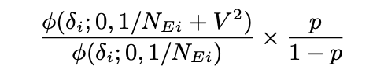

## P-value two-sample Hypothesis testing

We start with two samples, which we will call treatment and control, with their means and standard deviations known.

We call H0, the hypothesis 'there is no significant difference/effect' the null hypothesis. We purport to reject this hypothesis by a test.

The most basic formula to use here is the one for p-values:

> t = (μA - μB) / sqrt((σA^2/nA) + (σB^2/nB))

The value for t is then plugged into Welch's t-test.

## Fisher's Exact Test

For a simple test where we test one variable affecting two categories (e.g., a classic A/B test where convert/not-convert are the categories and treatment/control are the variable), the most common method to test for significance is [Fisher's exact test](https://en.wikipedia.org/wiki/Fisher%27s_exact_test). This yields an exact (as opposed to approximated) _p-value_, or the probability of obtaining such a result or a more extreme one under the null hypothesis (of no correlation between variable and categories).

The justification is actually combinatorial, pretty interesting.

A way to run this in Python, given a table with a, b, c, d values for the 4 samples is
`scipy.stats.fisher_exact(table=[[a,b],[c,d]], alternative="less")`
where a and b are the 'converted' counts and c, d the not converted ones, and a, c correspond to control and b, d to treatment (the opposite would also work).

> This value \[the p-value] can be interpreted as the sum of evidence provided by the observed data—or any more extreme table—for the null hypothesis (that there is no difference in the proportions of \[conversion/non-conversion] between \[treatment and control])

For a large enough sample it can be more convenient to use a chi-squared test, which is more powerful but only approximates the p-value -meaning it only works for a larger sample-. A heuristic is that you can start using the chi-squared test if all cells in your table have at least 10 elements.

### P-move

_[Source: Objective Bayesian Two Sample Hypothesis Testing for
Online Controlled Experiments, Deng et al., Microsoft](https://exp-platform.com/Documents/BayesianAB.pdf)._

Instead of slightly unintuitive p-values (which users tend to conflate with the posterior probability of H0), Deng et al. propose using a metric called P-move, or 'probability of H1 (such that effect is positive)'.

They start by estimating prior values for _p_ (P(H1)) and _V_ (variance of Cohen's _d_ in previous experiments).

They then do this:
- Calculate a posterior of H1 using the formula:

{alt="Bayesian EM expression for the posterior of H1" loading="lazy"}

- Under H1, the posterior of µ is N(Aδ, A/NE), where A = V2/(V2 + 1/NE), a shrinkage factor that goes to 1 as N grows. So in effect for sufficiently big N, our posterior of µ under H1 is normally distributed around δ with 1/NE (inverse of effective sample size or geometric mean of sample sizes) variance.

Then:

P(Flat) = P(H0\|Data)

P(Negative) = (1 − P(Flat)) × Φ(0; Aδ, A/NE) 

_(That is, the CDF evaluated to 0)_

and P(Positive) is the rest.

In effect, we're for sufficiently big N measuring how likely is the empirical data's effect size to come from a null-hypothesis (mean 0) distribution, given a prior on this being the case and on V's value.

For reasonable values of V this will converge nicely, and for any value of V it should be enough to set a high value of _p_ with non-zero effect size and enough data.

