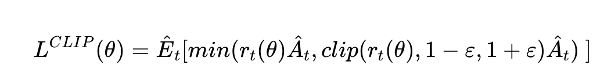

PPO is the current SotA in Reinforcement Learning in terms of sample efficiency, ease of implementation and quality of results. Developed by OpenAI, here are my notes on the article and the paper. 

The biggest change is how the loss is defined, adding a penalty to constrain how much the policy can vary between iterations.

<https://openai.com/blog/openai-baselines-ppo/>

> _"We’re releasing a new class of reinforcement learning algorithms, Proximal Policy Optimization (PPO), which perform comparably or better than state-of-the-art approaches while being much simpler to implement and tune. PPO has become the default reinforcement learning algorithm at OpenAI because of its ease of use and good performance."_

Getting good results via [policy gradient methods](/wiki/reinforcement-learning-sutton#policy-gradient-methods) is challenging because they are **sensitive to the choice of stepsize** — too small, and progress is hopelessly slow; too large and the signal is overwhelmed by the noise, or one might see catastrophic drops in performance.

They also often have **very poor sample efficiency**, taking millions (or billions) of timesteps to learn simple tasks.

## PPO (OpenAI Article)

The route to success in reinforcement learning isn’t as obvious as in Supervised Learning (where we simply specify a cost and run gradient descent to good results) — the **algorithms have many moving parts that are hard to debug**, and they **require substantial effort in tuning** in order to get good results.

PPO strikes a balance between ease of implementation, sample complexity, and ease of tuning, trying to compute an update at each step that minimizes the cost function while ensuring the deviation from the previous policy is relatively small.

The new variant uses a novel objective function not typically found in other algorithms:

{: loading="lazy"}

So we do the update taking as a loss the product of the advantage with the ratio of the probability under the new and old policies, respectively, clipped to be closer to 1 by a factor of epsilon. 

The advantage is defined as A(s,a) = Q(s,a) - V(s). This reduces variance in training.

This objective implements a way to do a Trust Region update which is compatible with Stochastic Gradient Descent, and simplifies the algorithm by removing the KL penalty and need to make adaptive updates. In tests, this algorithm has displayed the best performance on continuous control tasks and almost matches ACER’s performance on Atari, despite being far simpler to implement.

The code was also [released on github](https://github.com/openai/baselines).

## PPO paper
_The following are mostly excerpts from the [original paper](https://arxiv.org/pdf/1707.06347.pdf)._

Whereas standard policy gradient methods perform one gradient update per data sample, we propose a novel objective function that enables multiple epochs of minibatch updates. The new methods, which we call proximal policy optimization (PPO), have some of the benefits of trust region policy optimization (TRPO), but they are much simpler to implement, more general, and have better sample complexity (empirically).

We propose a novel objective with clipped probability ratios, which forms a pessimistic estimate (i.e., lower bound) of the performance of the policy.

TRPO is a previous method (Trust Region Policy Optimization) they improve on.

{: loading="lazy"}

The new loss they use (as previously shown, but with extra terms), is the following.

{: loading="lazy"}

Where L^CLIP refers to the loss shown in figure 1, PPO's big idea.

This is what the new algorithm looks like. Note we don't have to pick a beta value anymore.

{: loading="lazy"}

The rest of the algorithm is left similar to PG.

"These methods have the stability and reliability of trust-region methods but are much simpler to implement, requiring only few lines of code change to a vanilla policy gradient implementation, applicable in more general settings (for example, when using a joint architecture for the policy and value function), and have better overall performance."

