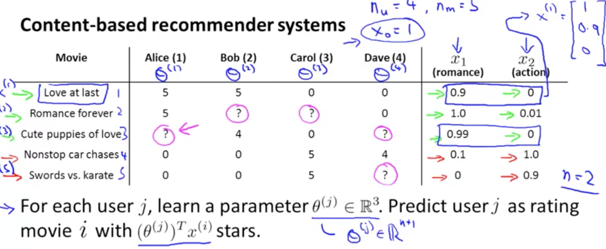
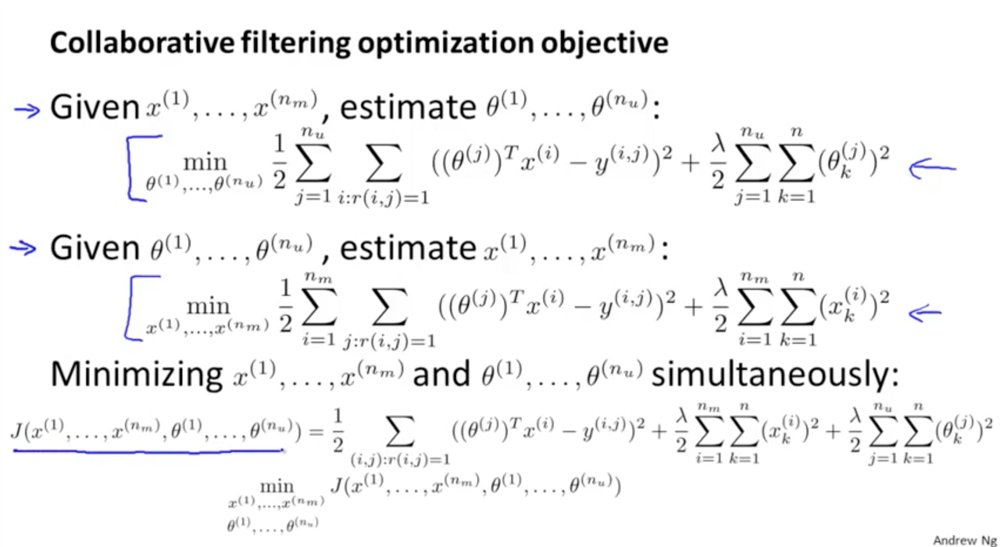

## Notes from the Google Recommendations Systems Course

[Original Google course](https://developers.google.com/machine-learning/recommendation)

**Did you know?**

- 40% of app installs on Google Play come from recommendations.
- 60% of watch time on YouTube comes from recommendations.

> "A great recommendation system helps users find things they wouldn't have thought to look for on their own."

## Primary Components of a Recommender System

A typical recommendation pipeline has three steps.

- **Candidate generation**: Starts from a potentially huge corpus and generates a much smaller subset of candidates. Uses quick filters.
- **Scoring**: Scores and ranks the candidates in order to select the set of items (on the order of 10) to display to the user. This may use a similarity measure.
- **Re-ranking**: additional constraints for the final ranking. Ensure diversity, freshness, and fairness, boost new items or punish disliked ones.

### Candidate Generation

{:  alt="" loading="lazy"}

Both map items and users to an [embedding space](/wiki/deep-learning-NLP.md).

### Similarity measures

A **similarity measure** is a function s:E×E→R that takes a **pair of embeddings** and returns **a scalar measuring their similarity**.

Most common similarity measures are:

- Cosine similarity.
- Dot product (monotonous to cosine similarity, sensitive to the norms. Prioritizes more popular or common items).
- Euclidean distance (sensitive to the norm).

## Content-based Filtering

Content-based filtering uses **item features** to recommend other items similar to what the user likes, based on their **previous actions or explicit feedback**. You can make the user fill questionnaires, or just use previous feedback as data.

The model should recommend items relevant to this user. To do so, you must first pick a **similarity metric** (for example, dot product). Then, you must set up the system to **score each candidate item** according to this similarity metric. Note that the recommendations are specific to this user, as the model did not use any information about other users.

### Advantages

- This model easily scales to a large number of users, since it doesn't use data from other users.
- The model can capture the specific interests of a user, and can recommend niche items that very few other users are interested in.

### Disadvantages

- Since the feature representations of the items are hand-engineered to some extent, this technique requires a lot of domain knowledge. Therefore, the model can only be as good as the hand-engineered features. Getting the users' values for those features can be costly as well.
- The model can only make recommendations based on existing interests of the user. In other words, the model has limited ability to expand on the users' existing interests. It's a self-fulfilling prophecy in a way. It also has the cold start problem: there is no relevant data to provide recommendations to a new user with.

## Collaborative Filtering

Collaborative filtering models can recommend an item to user A based on the interests of a similar user B (**serendipitous recommendations**).

The **embeddings can be learned automatically**, without relying on hand-engineering of features. See below for the algorithm.

### Objective Function

To generate the component matrices:

- You could only count errors on observed user,movie pairs, but then a matrix of all 1s would have minimal loss, and generalize very poorly.
- You could just do singular values decomposition in K dimensions, but then given how sparse the matrix is, you'd have most embeddings very close to 0 (and derive less valuable information).
- Better approach: **weighted matrix factorization**.

{: alt="" loading="lazy"}

W0 is tuned as a hyperparameter.

We can minimize this with

- SGD (as described by Andrew Ng, etc.).
- **Weighted Alternating Least Squares** (**WALS**), specialized to this particular objective.

### WALS

**WALS** works by **initializing the embeddings randomly, then alternating** between:

- Fixing *U* and solving for *V*.
- Fixing *V* and solving for *U*.

Each stage can be solved exactly (via solution of a linear system) and can be distributed. This technique is guaranteed to converge because each step is guaranteed to decrease the loss.

While less flexible in allowed loss functions, WALS converges faster, and can be parallelized efficiently, while handling negative cases gracefully.

### Advantages to Collaborative filtering:

- Automatic feature engineering (without domain knowledge).
- Serendipity (no need for the past to predict the future. Less self-fulfilling prophecies).

### Disadvantages to Collaborative filtering:

**Cold start problem**: Since **new items** are not in the training set, we don't have embeddings for them. Some possible ways to handle this are:

- **WALS Projection**: Leaving the user matrix fixed, if we have a **few interactions for this item** already, **minimize \| Ai0 - Ui0 \|** and solve. Analogous for a new user with few interactions without a latent representation. Weighting can be added as needed.
- **Content-based Heuristics**: if the item has **0 interactions**, we can use the **average vector from its item category** (if such a thing exists) or similar.

> "A fun property of machine learning is that this reasoning works in reverse too: If meaningful generalities can help you represent your data with fewer numbers, finding a way to represent your data in fewer numbers can often help you find meaningful generalities. Compression is akin to understanding and all that."

[Netflix Collaborative Filtering Recommendations](https://sifter.org/~simon/journal/20061211.html) -a great resource to learn more too-.

---

## Recommendation Algorithms - Hinton MOOC 

_These notes come from Hinton's Deep Learning course._

### Problem Statement

We have a matrix with rows for movies, columns for users. We have some ratings for a pair of coordinates u, m, and some tuples have no corresponding rating. 

We'd like to fill the unknown ratings with "coherent" ratings, for some definition of coherent.

For instance, we could cluster or categorize the movies, then give to a movie of category A the rating X for user U, where X is the mean rating for movies in that category for that user.

### Content Based Recommendation 

{: alt="" loading="lazy"}

For each user, we train a small linear regression from a set of precomputed features for each movie they rated, and use that to predict ratings for new movies. This shouldn't work for a user with no previous ratings, and is only as good as the features we use. 

You can train all the linear regressions at once using a matrix, and you can avoid the closed optimization using gradient descent.

### Collaborative Filtering

Collaborative Filtering does feature learning.

Imagine we don't have feature vectors for each movie, because they're intractable, expensive or hard to get.

Instead, we could ask the users to tell us which genres of movies they like, by rating K of them from 0 to 5. We could then make "user vectors", and try to fit a linear regression with K components for each movie, for each user that rated it, to predict said ratings. 

The coefficients in those linear regressions (one vector for each movie, with as many parameters as genres we chose for the users to rate) would make the feature vectors for each movie.

We are making one vector for each movie, so we end up running one linear regression over the M users that rated each movie.

### No starting features

Now let's take it one step further: we could start off with random user vectors for each user, and use them to make some half-baked movie vectors by fitting a linear regression. We then generate user vectors by fitting linear regressions from the movie vectors we just made. We repeat this for the movies, and so on, until convergence.

This actually works pretty well, though there are available improvements (especially in terms of time).

A way to improve this: You only have the ratings, and don't ask anything from the users or hand make any features. Instead you just make a set of x vectors (for users) and theta vectors (for movies) such that for each (movie, user) pair that actually has a rating, the **inner product** of both corresponding vectors yields the correct rating.

Note that this is equivalent to factoring the ratings matrix into two smaller matrices (one of user vectors, one of movie vectors) and that each have a dimension in common of arbitrary size (let's call it K), which is the "latent" dimension.

{: alt="" loading="lazy"}

### Things you can add to improve this:

If a user is watching movie i, you can do k-NN over the latent space for movie i to get the k closest movies and recommend them as "similar" movies.

If a user has never rated any movies, we can use mean normalization:  
- Compute the mean (ground truth, not predicted) rating for each movie.
- Subtract it from the ground-truth ratings for each movie (so each movie now has a mean-rating of 0).
- Retrain the model (recomputing the factor matrices) with the new normalized ratings. New prediction is: prediction of new model, plus mu_i (the mean ground-truth rating for that movie).
- Now for a user with no ratings, we're predicting the mean ground truth rating for each movie as a default, which is a lot better than nothing. We recommend the most popular movies to blank slate users until we know more about them. We could also ask them about what they like to improve the algorithm.

---

